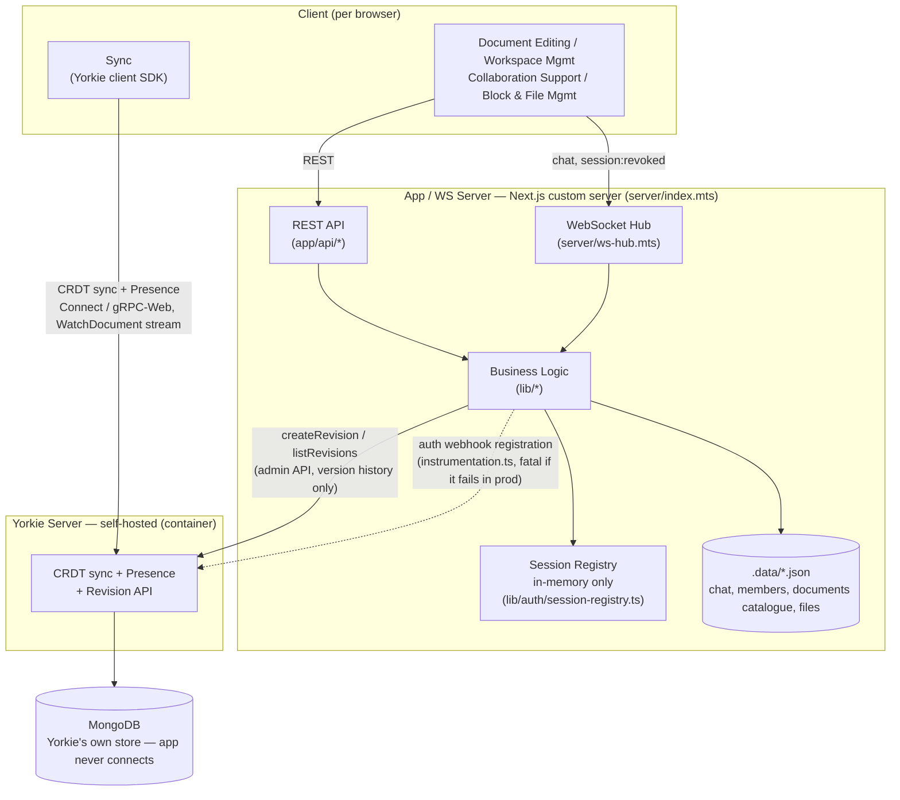

# System Architecture

Mermaid companion to the prose spec in [`docs/design/architecture.md`](docs/design/architecture.md) — read that for the interface contracts; this is the visual.

See also: the more detailed interactive version at [`docs/diagrams/runtime/`](docs/diagrams/runtime/).

## 설명

- 브라우저의 문서 편집/워크스페이스 관리/협업 지원/블록·파일 관리 UI는 REST API와 WebSocket으로 App/WS 서버(Next.js 커스텀 서버, `server/index.mts`)와 통신
- 실시간 CRDT 동기화와 Presence는 App/WS 서버를 거치지 않고 Yorkie SDK가 Yorkie 서버와 직접 Connect/gRPC-Web으로 통신 — `WatchDocument`는 소켓이 아니라 서버 스트리밍 응답
- REST·WebSocket 요청은 모두 `lib/*` 비즈니스 로직을 거쳐 처리되고, 그 결과가 `.data/*.json`(채팅, 멤버, 문서 카탈로그, 파일)에 저장됨
- 세션은 `lib/auth/session-registry.ts`에서 메모리에만 유지 — 디스크에 남기면 영구 베어러 토큰이 되므로, 컨테이너 재시작이 곧 전체 세션 무효화(revoke) 방법
- App/WS 서버는 Yorkie의 리비전 API(`createRevision`/`listRevisions`)로 버전 이력만 가져오고, 문서 본문 저장은 전적으로 Yorkie(MongoDB 기반)에 위임 — 앱은 Mongo에 직접 연결하지 않음
- `instrumentation.ts`가 서버 기동 시 Yorkie 인증 웹훅을 등록하며, 프로덕션에서 이 등록이 실패하면 서버가 즉시 종료됨 — 인증 없는 Yorkie가 LAN에 그대로 열리는 것을 막기 위함
- Docker Compose는 `app` / `yorkie` / `mongo` 3개 컨테이너로 구성되고, `app-data` / `mongo-data` 네임드 볼륨이 각각 `.data`와 MongoDB 저장소를 담당 — `docker compose down -v` 전에는 데이터가 보존됨
- `yorkie` 컨테이너는 `--mongo-connection-uri`로 기동해 MemDB 대신 MongoDB에 영속화하고, `app` 컨테이너는 `yorkie`가 `healthy` 상태가 될 때까지 기동을 대기(웹훅 등록 순서 때문)

## Notes

- **No internal persistence module for documents.** Yorkie owns document durability and reloads from MongoDB on its own restart — the app never opens a Mongo connection (ADR-002).
- **`.data/*.json` is the app's own store**, not Yorkie's: chat history and workspace members today, workspace metadata still to come. Writes go through a temp file + `rename` for atomicity; the chat repository serializes concurrent async writes through a promise chain, the sync stores don't need one.
- **Sessions are deliberately memory-only** — a session id on disk would be a permanent bearer token, so container restart is the documented revoke path.
- **Docker (`docker-compose.yml`)**: three containers — `app`, `yorkie` (`--mongo-connection-uri`, no MemDB), `mongo` (no published port, only Yorkie talks to it). Named volumes `app-data` and `mongo-data` back `DataFiles` and `Mongo` above; only `docker compose down -v` clears them. `app` depends on `yorkie` being `service_healthy` because startup must register the auth webhook before serving.
