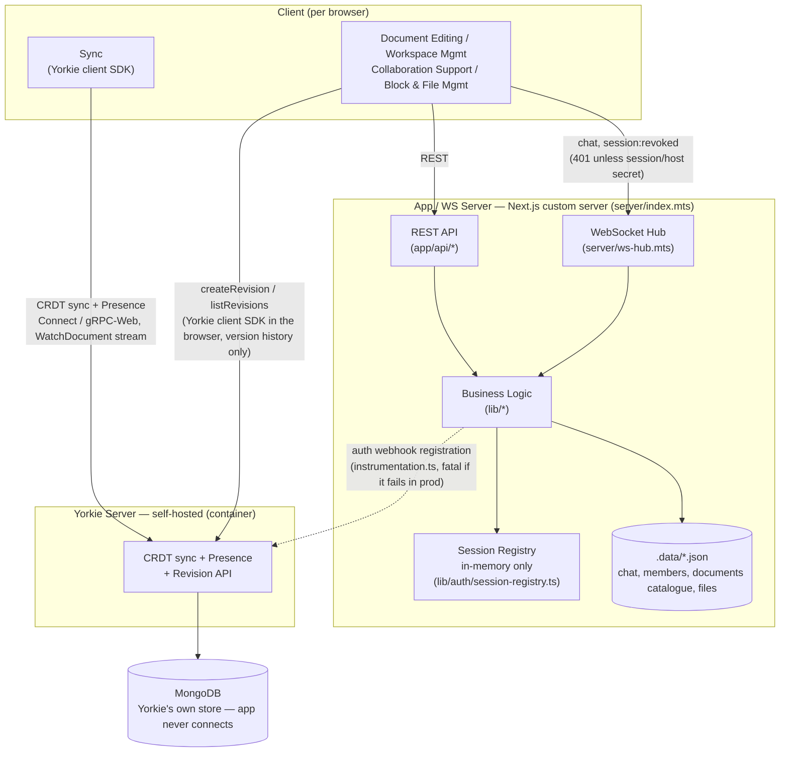

# System Architecture

Mermaid companion to the prose spec in [`docs/design/architecture.md`](docs/design/architecture.md) — read that for the interface contracts; this is the visual.

See also: the more detailed interactive version at [`docs/diagrams/runtime/`](docs/diagrams/runtime/).

```mermaid
graph TB
  subgraph Client["Client (per browser)"]
    UI["Document Editing / Workspace Mgmt<br/>Collaboration Support / Block & File Mgmt"]
    SyncSDK["Sync<br/>(Yorkie client SDK)"]
  end

  subgraph AppServer["App / WS Server — Next.js custom server (server/index.mts)"]
    REST["REST API<br/>(app/api/*)"]
    WSHub["WebSocket Hub<br/>(server/ws-hub.mts)"]
    BizLogic["Business Logic<br/>(lib/*)"]
    SessionReg["Session Registry<br/>in-memory only<br/>(lib/auth/session-registry.ts)"]
    DataFiles[(".data/*.json<br/>chat, members, documents catalogue, files")]
  end

  subgraph YorkieBox["Yorkie Server — self-hosted (container)"]
    YorkieCore["CRDT sync + Presence<br/>+ Revision API"]
  end

  Mongo[(MongoDB<br/>Yorkie's own store — app never connects)]

  UI -->|"REST"| REST
  UI -->|"chat, session:revoked<br/>(401 unless session/host secret)"| WSHub
  SyncSDK -->|"CRDT sync + Presence<br/>Connect / gRPC-Web, WatchDocument stream"| YorkieCore
  UI -->|"createRevision / listRevisions<br/>(Yorkie client SDK in the browser, version history only)"| YorkieCore

  REST --> BizLogic
  WSHub --> BizLogic
  BizLogic --> DataFiles
  BizLogic --> SessionReg
  BizLogic -.->|"auth webhook registration<br/>(instrumentation.ts, fatal if it fails in prod)"| YorkieCore

  YorkieCore --> Mongo
```

## Notes

- **No internal persistence module for documents.** Yorkie owns document durability and reloads from MongoDB on its own restart — the app never opens a Mongo connection (ADR-002).
- **`.data/*.json` is the app's own store**, not Yorkie's: see [`docs/design/architecture.md`](docs/design/architecture.md) for what it holds. How writes stay atomic: [`docs/design/chat.md`](docs/design/chat.md), "Repository pattern".
- **Sessions are memory-only**; why, and the revoke path, are in [`docs/design/api.md`](docs/design/api.md).
- **Both WebSocket upgrade paths gate entry, not just message content** — an unauthenticated client never reaches `WSHub` at all (ADR-006). The registration-race fix on top of that is detailed in `docs/conventions.md`'s `#26` note, not repeated here.
- **Docker**: `app`, `yorkie` and `mongo` containers; named volumes `app-data` and `mongo-data` back `DataFiles` and `Mongo` above, and only `docker compose down -v` clears them. See `docker-compose.yml`.
