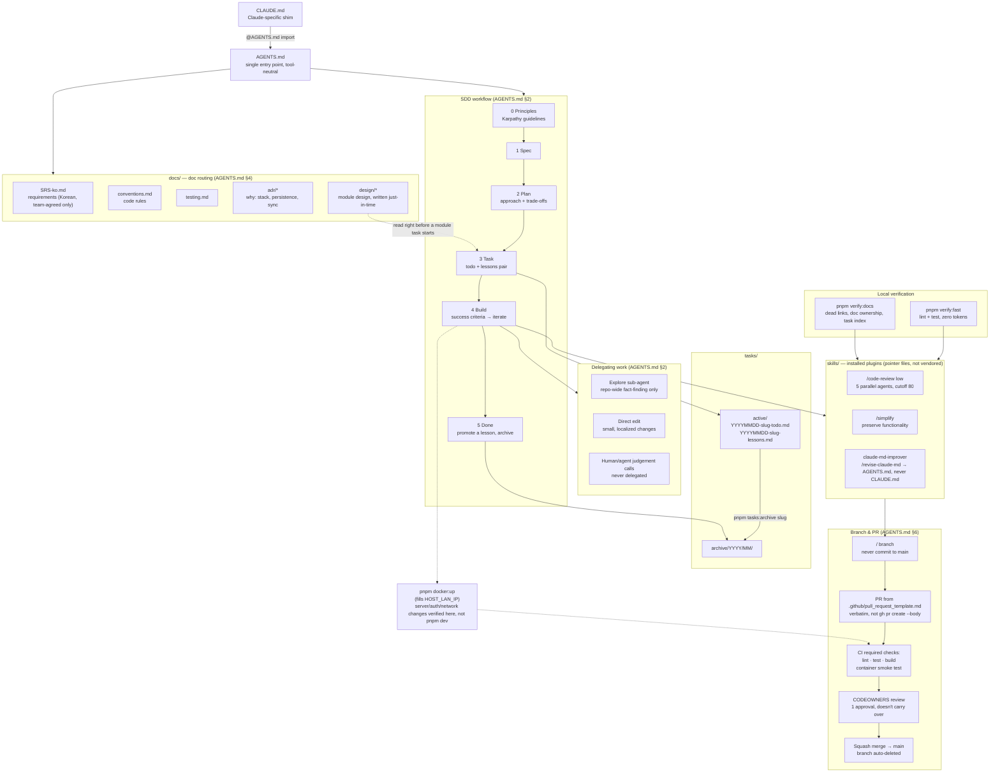

# Harness Architecture

How AI agents (and teammates) are meant to work in this repository — the SDD workflow, doc routing, and gates described in [`AGENTS.md`](AGENTS.md), as a diagram.

See also: the more detailed interactive version at [`docs/diagrams/harness/`](docs/diagrams/harness/).

## 설명

- 진입점은 `AGENTS.md`이고, `CLAUDE.md`는 `@AGENTS.md`를 임포트하는 한 줄짜리 셈(shim)일 뿐
- 개발 flow(SDD)는 원칙 확인 -> 스펙 확인 -> 계획 수립 -> 작업 등록(todo+lessons 쌍) -> 빌드 -> 완료(교훈 승격 및 아카이브) 순으로 진행
- 모듈 상세 설계 문서(`docs/design/*`)는 해당 모듈 작업이 `tasks/active`에 등록되기 직전, 필요한 시점에만 그때그때 작성됨
- 작업은 `tasks/active/`에 `YYYYMMDD-slug-todo.md` + `lessons.md` 쌍으로 등록되고, 완료되면 `pnpm tasks:archive`로 `tasks/archive/YYYY/MM/`로 이동
- 작업 위임 원칙: 저장소 전역 탐색(뭐가 어디 있는지)은 `Explore` 서브에이전트에게, 국소적인 작은 수정은 직접 처리, "무엇을 해야 하는가" 같은 판단은 절대 위임하지 않고 결정한 사람이 책임짐
- 필수 스킬 3종: `/code-review low`(5개 병렬 리뷰 에이전트, 신뢰도 컷오프 80점 미만은 버림), `/simplify`(기능 보존하며 코드 정리), `claude-md-improver`의 `/revise-claude-md`(세션 교훈을 `AGENTS.md`로 승격 — `CLAUDE.md`는 절대 건드리지 않음)
- `/code-review`와 `/simplify`는 반드시 Sonnet 세션에서 실행 — 서브에이전트가 실행 세션의 모델을 그대로 물려받기 때문에, Opus 세션에서 돌리면 5개의 Opus 리뷰어가 병렬로 뜨는 비용 폭탄이 됨
- 로컬 검증 순서: `pnpm verify:fast`(린트+테스트, 토큰 비용 0) 통과 -> `verify:docs`/`comments`에 새로운 항목이 없는지 확인(알려진 baseline인 dead link 7개는 의도적으로 남겨둔 것) -> `/simplify` -> `/code-review low` -> PR 오픈
- PR은 `.github/pull_request_template.md`를 그대로 시작점으로 사용(`gh pr create --body`로 건너뛰기 금지), 브랜치명은 `<type>/<slug>`
- 머지 전 CI 필수 체크: `lint · test · build`, 그리고 컨테이너 smoke test
- 리뷰는 `CODEOWNERS` 기준 1명 승인이 필요하고, 승인 후 커밋이 추가되면 그 승인은 이어지지 않음(재승인 필요)
- `main`은 squash merge만 허용되며 브랜치는 머지 후 자동 삭제됨
- 서버 시작/인증/네트워킹 관련 변경은 `pnpm dev`가 아니라 `pnpm docker:up`으로 컨테이너에서 검증 — 과거 이 차이 때문에 실제 버그가 난 적이 있음(`tasks/archive`의 host-guest-entry 교훈 참고)

## Notes

- **`CLAUDE.md` is a one-line `@AGENTS.md` import** — `AGENTS.md` is the tool-neutral entry point every agent reads first; editing session learnings into `CLAUDE.md` instead (e.g. an unguided `/revise-claude-md` run) breaks that split.
- **Delegation has a hard boundary**: repo-wide search goes to `Explore`; small localized edits are done directly; *judgement calls* — what a thing should do, which trade-off wins — are never delegated, only whoever decides stays accountable.
- **`/code-review` and `/simplify` must run from a Sonnet session** — sub-agents inherit the launching session's model, so running them from Opus fans out five Opus reviewers instead of the `low`-depth Sonnet pass this repo scoped them to.
- **Order matters**: `pnpm verify:fast` clean, `verify:docs`/`comments` showing nothing new (7 dead links are a known, deliberately-kept baseline) → `/simplify` → `/code-review low` → open the PR.
- **Container vs. dev server is a real gap, not paranoia**: `tasks/archive/2026/08/20260809-host-guest-entry-lessons.md` is a past bug caused by verifying auth/network changes against `pnpm dev` instead of the container.
