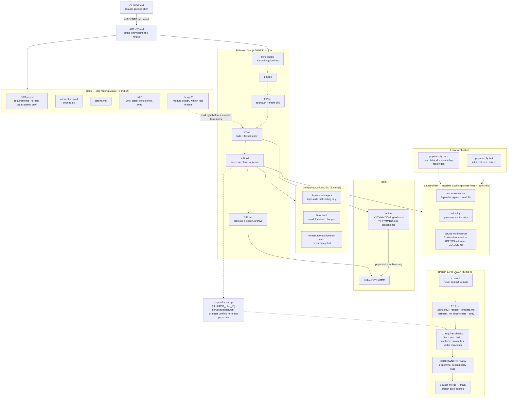

# Harness Architecture

How AI agents (and teammates) are meant to work in this repository — the SDD workflow, doc routing, and gates described in [`AGENTS.md`](AGENTS.md), as a diagram.

See also: the more detailed interactive version at [`docs/diagrams/harness/`](docs/diagrams/harness/).

```mermaid
graph TB
  CLAUDE["CLAUDE.md<br/>Claude-specific shim"] -->|"@AGENTS.md import"| AGENTS["AGENTS.md<br/>single entry point, tool-neutral"]

  subgraph Docs["docs/ — doc routing (AGENTS.md §4)"]
    SRS["SRS-ko.md<br/>requirements (Korean, team-agreed only)"]
    Conventions["conventions.md<br/>code rules"]
    Testing["testing.md"]
    ADR["adr/*<br/>why: stack, persistence, sync"]
    Design["design/*<br/>module design, written just-in-time"]
  end
  AGENTS --> Docs

  subgraph Workflow["SDD workflow (AGENTS.md §2)"]
    direction LR
    Principles["0 Principles<br/>Karpathy guidelines"] --> Spec["1 Spec"]
    Spec --> Plan["2 Plan<br/>approach + trade-offs"]
    Plan --> Task["3 Task<br/>todo + lessons pair"]
    Task --> Build["4 Build<br/>success criteria → iterate"]
    Build --> Done["5 Done<br/>promote a lesson, archive"]
  end
  AGENTS --> Workflow
  Design -.->|"read right before a module task starts"| Task

  subgraph Tasks["tasks/"]
    Active["active/<br/>YYYYMMDD-slug-todo.md<br/>YYYYMMDD-slug-lessons.md"]
    Archive["archive/YYYY/MM/"]
    Active -->|"pnpm tasks:archive slug"| Archive
  end
  Task --> Active
  Done --> Archive

  subgraph Delegation["Delegating work (AGENTS.md §2)"]
    Explore["Explore sub-agent<br/>repo-wide fact-finding only"]
    Direct["Direct edit<br/>small, localized changes"]
    Human["Human/agent judgement calls<br/>never delegated"]
  end
  Build --> Delegation

  subgraph Skills[".claude/skills/ — installed plugins (pointer files) + repo skills"]
    CodeReview["/code-review low<br/>5 parallel agents, cutoff 80"]
    Simplify["/simplify<br/>preserve functionality"]
    ClaudeMd["claude-md-improver<br/>/revise-claude-md → AGENTS.md, never CLAUDE.md"]
  end
  Build --> Skills

  subgraph Verify["Local verification"]
    VerifyFast["pnpm verify:fast<br/>lint + test, zero tokens"]
    VerifyDocs["pnpm verify:docs<br/>dead links, doc ownership, task index"]
  end
  VerifyFast --> Skills
  VerifyDocs --> Skills

  subgraph PRFlow["Branch & PR (AGENTS.md §6)"]
    Branch["<type>/<slug> branch<br/>never commit to main"]
    Template["PR from .github/pull_request_template.md<br/>verbatim, not gh pr create --body"]
    CI["CI required checks:<br/>lint · test · build<br/>container smoke test<br/>yorkie invariants"]
    CodeOwners["CODEOWNERS review<br/>1 approval, doesn't carry over"]
    Squash["Squash merge → main<br/>branch auto-deleted"]
  end
  Skills --> Branch --> Template --> CI --> CodeOwners --> Squash

  ContainerRun["pnpm docker:up<br/>(fills HOST_LAN_IP)<br/>server/auth/network changes verified here, not pnpm dev"]
  Build -.-> ContainerRun
  ContainerRun -.-> CI
```

## Notes

- **`CLAUDE.md` is a one-line `@AGENTS.md` import** — `AGENTS.md` is the tool-neutral entry point every agent reads first; editing session learnings into `CLAUDE.md` instead (e.g. an unguided `/revise-claude-md` run) breaks that split.
- **Rules, not restated here**: delegation, the Sonnet-session rule, check order, and the container-vs-dev gap are one-line rules in [`AGENTS.md`](AGENTS.md) §2 and §6; the reasoning is in [`.claude/skills/README.md`](.claude/skills/README.md).
