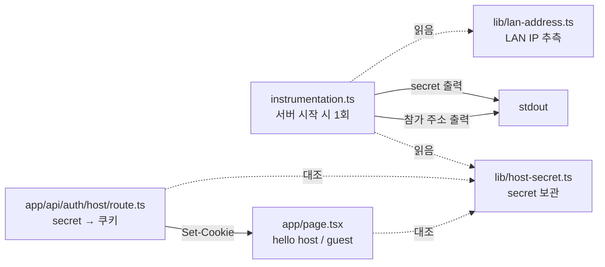

# 호스트 / 게스트 입장 — 무엇을 왜 이렇게 만들었나

> `feat/host-setup` 브랜치에서 진행한 작업 설명서입니다.
> 팀 규칙상 문서는 영어가 기본이지만([`AGENTS.md`](AGENTS.md) §5), 이 파일은 설명용으로 한국어로 씁니다.

## 목차

1. [배경 — 지금까지 저장소에 있던 것](#1-배경--지금까지-저장소에-있던-것)
2. [직관 — 핵심 아이디어 한 문장](#2-직관--핵심-아이디어-한-문장)
3. [코드 — 파일별로 무슨 일이 일어나는가](#3-코드--파일별로-무슨-일이-일어나는가)
4. [컨테이너에서만 드러난 버그 두 개](#4-컨테이너에서만-드러난-버그-두-개)
5. [검증한 것과 아직 못 한 것](#5-검증한-것과-아직-못-한-것)
6. [퀴즈](#6-퀴즈)

---

## 1. 배경 — 지금까지 저장소에 있던 것

이 브랜치 이전까지 저장소에 있던 **코드**는 딱 두 덩어리였습니다.

| 있던 것 | 무엇 |
| :--- | :--- |
| `server/watcher.mts`, `app/spike/`, `lib/pm-schema.ts` | Yorkie ↔ Git 영속성 스파이크. 끝났고 검증됨. |
| `app/page.tsx`, `app/layout.tsx` | `create-next-app` 기본 템플릿. Vercel 로고가 박혀 있던 그 화면. |

나머지 — HTTP 서버, 인증, 세션, 호스트/게스트 개념, 앱용 Dockerfile — 은 **전부 문서로만 존재**했습니다.
[`ROADMAP.md`](ROADMAP.md) Phase 0에 남은 마지막 항목이 바로 이것이었고요.

그리고 중요한 점: **호스트를 어떻게 식별할지는 이미 정해져 있었습니다.**
[`docs/design/api.md`](docs/design/api.md)의 "Authentication model" 표가 그 결정을 이렇게 적어 두었습니다.

> 서버가 시작할 때 bootstrap secret을 만들어 컨테이너 stdout에 참가 주소와 함께 출력한다.
> 컨테이너를 실행한 사람만 stdout을 읽을 수 있으므로, 그 secret을 가지고 있다는 사실이 곧 호스트임을 증명한다.

그래서 이번 작업은 **새로운 설계가 아니라, 이미 합의된 설계의 첫 구현**입니다.
`docs/SRS-ko.md`에서 관련된 요구사항은 이렇습니다.

- **FR-010-03 / HIR001** — 시스템은 참가용 접속 주소를 호스트 화면에 표시해야 한다.
- **UC-020 1~2단계** — 게스트가 호스트가 안내한 접속 주소를 브라우저에 입력하면 참가 화면이 뜬다.
- **§2.3.1** — 모든 사용자가 같은 LAN(핫스팟 또는 공유기 서브넷)에 있다고 가정한다.

### 이번 작업의 범위

이번에 만든 것은 **UC-010과 UC-020의 가장 얇은 한 겹**입니다.

```
호스트가 도커 이미지를 실행 → 서버가 호스트임을 증명해 줌 → "hello host!"
같은 서브넷의 게스트가 IP:포트 입력 → "hello guest!"
```

Yorkie 연동, 실시간 협업, 워크스페이스 생성 화면, 게스트 로그인은 **의도적으로 전부 뺐습니다.**
게스트 로그인(닉네임 + 워크스페이스 비밀번호, FR-020-01~05)이 바로 다음 작업입니다.

---

## 2. 직관 — 핵심 아이디어 한 문장

> **stdout을 읽을 수 있다 = 컨테이너를 실행한 사람 = 호스트.**

호스트를 판별하는 방법은 여러 가지가 있었는데, LAN 환경에서는 대부분 무너집니다.

| 후보 | 왜 안 되는가 |
| :--- | :--- |
| "첫 번째 방문자가 호스트" | 게스트가 먼저 접속하면 그 사람이 호스트가 됩니다. |
| 요청 IP가 `127.0.0.1`이면 호스트 | 컨테이너 안에서는 **모든 요청이 브릿지 IP**(`172.22.0.1` 같은)로 보입니다. 구분 자체가 불가능합니다. |
| 별도 관리자 계정 + 비밀번호 | 계정 시스템이 아직 없고, 만들면 이번 범위를 훨씬 넘습니다. |
| **stdout에 secret 출력** | 컨테이너를 실행한 터미널을 보고 있는 사람만 읽을 수 있습니다. 추가 인프라가 0입니다. |

### 그런데 왜 secret을 URL에 계속 두지 않고 쿠키로 바꾸나?

`api.md`가 그 이유를 짚어 둡니다. **UC-030 화면 공유** 때문입니다.
호스트가 화면을 공유하는 순간, 주소창에 떠 있는 secret이 참가자 전원에게 노출됩니다.

그래서 링크는 **한 번 쓰고 버리는 교환권**으로 씁니다.

```mermaid
sequenceDiagram
    participant T as 호스트 터미널
    participant B as 호스트 브라우저
    participant S as 서버 (컨테이너)

    S->>T: Host:  /api/auth/host?secret=d7e755…
    S->>T: Guest: http://192.168.0.14:3000
    Note over T: 호스트만 이 두 줄을 볼 수 있다

    B->>S: GET /api/auth/host?secret=d7e755…
    S->>S: secret 대조 (constant-time)
    S-->>B: 303 → Location: /<br/>Set-Cookie: role=…; HttpOnly
    B->>S: GET /
    S-->>B: hello host!
    Note over B: 주소창은 그냥 "/" — secret은 사라졌다
```

게스트 쪽은 **코드가 한 줄도 필요 없습니다.** 포트를 `3000:3000`으로 게시하고 `0.0.0.0`에 바인딩하면,
같은 서브넷의 아무 브라우저나 `http://192.168.0.14:3000`으로 들어와 쿠키 없이 `hello guest!`를 봅니다.

### 공짜로 따라온 성질: 재시작 = 전체 로그아웃

쿠키 값으로 **secret 그 자체**를 넣었습니다. 그래서 페이지는 이렇게 판단합니다.

```
쿠키 값 == 지금 이 프로세스의 secret ?  →  호스트
```

컨테이너를 재시작하면 secret이 새로 만들어지고, 기존 쿠키는 **자동으로 아무 의미가 없어집니다.**
`api.md`가 "revoke-all 엔드포인트는 만들지 않는다, 컨테이너 재시작이 그 경로다"라고 적어 둔 동작이
별도 코드 없이 그대로 나옵니다.

> **💡 왜 세션 토큰을 안 만들었나**
> `api.md`는 access 30분 / refresh 7일 토큰을 규정합니다. 하지만 이번 범위에는 지킬 세션 상태가 없습니다.
> 토큰이 필요해지는 시점(게스트 로그인)에 `POST /api/auth/host`로 바꾸면 됩니다.
> 지금은 그 자리를 `GET`이 대신하고 있고, 이 차이는 task 문서에 기록해 두었습니다.

---

## 3. 코드 — 파일별로 무슨 일이 일어나는가

전체 흐름을 파일로 보면 이렇습니다.



### 3.1 `lib/host-secret.ts` — secret 한 개

```ts
const cache = globalThis as { __hostSecret?: string };

const hostSecret = (cache.__hostSecret ??=
  process.env.HOST_SECRET ?? randomUUID());

export function isHostSecret(candidate: string | undefined): boolean {
  if (!candidate) return false;
  const given = Buffer.from(candidate);
  const expected = Buffer.from(hostSecret);
  return given.length === expected.length && timingSafeEqual(given, expected);
}
```

- `globalThis`에 캐시하는 이유: 개발 모드에서 모듈이 다시 로드돼도 secret이 두 개로 갈라지지 않게.
- `HOST_SECRET` 환경변수 우선: 나중에 서버가 여러 워커로 쪼개지면 이게 탈출구가 됩니다.
- 비교는 `===`가 아니라 `timingSafeEqual`. LAN에서 타이밍 공격이 현실적이진 않지만,
  인증 경로에서 굳이 아낄 두 줄이 아닙니다.

### 3.2 `instrumentation.ts` — 시작할 때 딱 한 번

Next.js가 서버 인스턴스를 띄울 때 `register()`를 **요청을 받기 전에 한 번** 호출합니다.
커스텀 서버를 따로 만들 필요 없이 "부팅 훅"이 생기는 셈입니다.
(실시간 협업용 WebSocket이 들어올 때는 커스텀 서버가 필요해지지만, 지금은 아직입니다.)

```ts
const joinAddress = override ?? (best && !isNatRange(best) ? best : null);

const lines = [
  `  Host:  http://localhost:${port}/api/auth/host?secret=${getHostSecret()}`,
  `  Guest: http://${joinAddress ?? "<the host machine's LAN IP>"}:${port}`,
];
```

### 3.3 `lib/lan-address.ts` — 참가 주소는 "추측"이다

여기가 이번 작업에서 제일 정직하게 타협한 부분입니다.

**컨테이너는 자기가 붙어 있는 도커 네트워크 주소(`172.22.0.2`)만 볼 수 있습니다.**
호스트 머신이 공유기에서 받은 진짜 주소(`192.168.0.14`)는 컨테이너 안에서 알 방법이 없습니다.

```ts
export function lanAddresses(): string[] {
  const override = process.env.HOST_LAN_IP;
  if (override) return [override];

  const external = /* 내부(loopback) 아닌 IPv4 전부 */;

  // 172.16/12 = 도커 브릿지 + WSL2 NAT 대역.
  // 버리지 않고 뒤로 미룬다 — 진짜 캠퍼스 LAN이 이 대역일 수도 있으니까.
  return [
    ...external.filter((a) => !isNatRange(a)),
    ...external.filter(isNatRange),
  ];
}
```

그래서 알아낼 수 없을 때는 **틀린 주소를 자신 있게 찍는 대신, 모른다고 말하고 방법을 알려줍니다.**

```
  Host:  http://localhost:3000/api/auth/host?secret=d7e755…
  Guest: http://<the host machine's LAN IP>:3000
         Only a Docker/NAT address (172.22.0.2) is visible from here,
         which guests on the LAN almost certainly cannot reach.
         Run `hostname -I` (Linux/macOS) or `ipconfig` (Windows) on the host
         machine, then restart with HOST_LAN_IP set to it (see docker-compose.yml).
```

`HOST_LAN_IP=192.168.0.14 docker compose up` 으로 실행하거나 `.env` 파일에 한 줄 넣으면
그 주소를 그대로 출력하고 안내 문구는 사라집니다.

> **⚠️ 알려진 한계**
> `172.16.0.0/12`을 "도커/NAT 대역"으로 취급하는 건 **휴리스틱**입니다.
> 캠퍼스 네트워크가 실제로 이 대역을 쓸 수도 있습니다. 그래서 버리지 않고 순위만 뒤로 미뤘고,
> `HOST_LAN_IP`가 항상 모든 걸 덮어씁니다. "참가 주소가 이상하다"는 제보가 오면 여기가 1순위 용의자입니다.

### 3.4 `app/api/auth/host/route.ts` — 교환 창구

```ts
export function GET(request: NextRequest) {
  const response = new NextResponse(null, {
    status: 303,
    headers: { Location: "/" },
  });

  // 틀린 secret은 에러 페이지를 띄울 일이 아니다 — 그 방문자는 그냥 게스트다.
  if (isHostSecret(request.nextUrl.searchParams.get("secret") ?? undefined)) {
    response.cookies.set("role", getHostSecret(), {
      httpOnly: true, sameSite: "lax", path: "/",
    });
  }
  return response;
}
```

`Location`이 왜 상대 경로인지는 [4장](#4-컨테이너에서만-드러난-버그-두-개)에서 설명합니다.

### 3.5 `app/page.tsx` — 전부 여기로 수렴

```tsx
export default async function Home() {
  const isHost = isHostSecret((await cookies()).get("role")?.value);
  return <h1>{isHost ? "hello host!" : "hello guest!"}</h1>;
}
```

Next.js 16에서 `cookies()`는 **async**이고, 이걸 쓰는 것만으로 이 페이지는 자동으로
정적 렌더링에서 빠져 요청마다 렌더됩니다. 별도 설정이 필요 없습니다.

### 3.6 도커 쪽

| 파일 | 역할 |
| :--- | :--- |
| `next.config.ts` | `output: "standalone"` — 빌드 결과를 `server.js` 하나 + 필요한 파일만으로 추려냅니다. |
| `Dockerfile` | 3단계(deps → build → runtime). 실행 이미지에는 pnpm 스토어도 devDependencies도 안 들어갑니다. `HOSTNAME=0.0.0.0`으로 LAN에서 접근 가능하게, `USER node`로 비-root 실행. |
| `docker-compose.yml` | `app` 서비스 추가(`3000:3000`, `HOST_LAN_IP` 전달). 기존 `yorkie` 서비스는 손대지 않았습니다. |
| `.dockerignore` | `node_modules`, `.next`, `.git`, `docs`, `tasks` 등 이미지에 들어갈 이유가 없는 것들. |

> `Dockerfile`에서 `patches/` 디렉터리를 `pnpm install`보다 **먼저** 복사해야 합니다.
> Yorkie 패키지 패치가 설치 과정에서 적용되기 때문입니다.

---

## 4. 컨테이너에서만 드러난 버그 두 개

이번 작업에서 가장 배울 게 많았던 부분입니다. **둘 다 `pnpm dev`에서는 멀쩡했고 이미지 안에서만 깨졌습니다.**

### 버그 1 — 리다이렉트가 쿠키를 버렸다

처음 코드는 교과서적인 형태였습니다.

```ts
NextResponse.redirect(new URL("/", request.url))   // ❌
```

standalone 서버에서 `request.url`은 **`Host` 헤더가 아니라 `HOSTNAME` 환경변수로 조립됩니다.**
컨테이너에서 `HOSTNAME=0.0.0.0`이므로 응답은 이렇게 나갔습니다.

```
303 See Other
location: http://0.0.0.0:3000/          ← 다른 오리진!
set-cookie: role=d7e755…; HttpOnly
```

브라우저 입장에서 `localhost:3000`과 `0.0.0.0:3000`은 **서로 다른 사이트**입니다.
방금 받은 쿠키를 리다이렉트 목적지로 보내지 않습니다. 결과는 `hello guest!` —
**호스트가 영원히 호스트가 될 수 없는** 상태였습니다.

```ts
const response = new NextResponse(null, {
  status: 303,
  headers: { Location: "/" },        // ✅ 브라우저가 실제 요청한 주소 기준으로 해석
});
```

> **💡 교훈**
> `next start`에서는 통과하고 이미지에서만 실패하는 버그였습니다.
> **인증·네트워킹 변경은 `pnpm dev`가 아니라 `docker compose up --build`로 검증해야 합니다.**

### 버그 2 — `??`가 빈 문자열을 통과시켰다

`docker-compose.yml`에 `HOST_LAN_IP: ${HOST_LAN_IP:-}`를 넣으면, 값을 안 줬을 때
Compose는 변수를 **빼는 게 아니라 빈 문자열로 넣습니다.**

```ts
process.env.HOST_LAN_IP ?? fallback   // "" 는 null도 undefined도 아니므로 그대로 통과
```

출력은 이렇게 됐습니다.

```
  Guest: http://:3000        ← 주소가 통째로 사라짐
```

여기서는 `??`가 아니라 `||`가 맞습니다. 그리고 이 실수는 **테스트로 고정해 두었습니다.**

```ts
test("an empty HOST_LAN_IP is not an override — compose passes one when unset", () => {
  process.env.HOST_LAN_IP = "";
  assert.notDeepEqual(lanAddresses(), [""]);
});
```

---

## 5. 검증한 것과 아직 못 한 것

`pnpm lint` · `pnpm test`(3개 통과) · `pnpm build` 모두 통과하고,
아래는 **실제 실행 중인 컨테이너**를 상대로 확인했습니다.

| 확인 항목 | 결과 |
| :--- | :--- |
| `docker compose up --build` 로 `Host:` / `Guest:` 두 줄 출력 | ✅ |
| `Host:` 링크 → `hello host!`, 주소창에 secret 없음 | ✅ |
| 쿠키 없이 접속 → `hello guest!` | ✅ |
| `?secret=` 이 틀리거나 없을 때 → `hello guest!`, 쿠키 미설정 | ✅ |
| `docker compose restart app` 후 기존 호스트 쿠키 → `hello guest!` | ✅ |
| `HOST_LAN_IP=192.168.0.14 docker compose up` → 그 주소 출력, 안내 문구 사라짐 | ✅ |
| `/spike/prosemirror` 무회귀 | ✅ |
| **같은 Wi-Fi의 다른 기기에서 `Guest:` 주소 접속** | ⏳ **미확인 — 기기 두 대가 필요** |

마지막 항목은 이 머신 한 대로는 증명할 수 없어서 열어 두었습니다.
서브넷 접근성 주장의 핵심이라 반드시 실제로 확인해야 합니다.

### 일부러 안 만든 것

워크스페이스 이름·비밀번호 설정 화면, 게스트 닉네임 로그인, 세션/리프레시 토큰,
`/health`, WebSocket, Yorkie 연동, 재시작 시 데이터 복원.
전부 다음 단계이고, task 문서에 왜 뺐는지 적어 두었습니다.

### 관련 문서

- [`tasks/active/20260809-host-guest-entry-todo.md`](tasks/active/20260809-host-guest-entry-todo.md) — 마일스톤과 인수 조건
- [`tasks/active/20260809-host-guest-entry-lessons.md`](tasks/active/20260809-host-guest-entry-lessons.md) — 삽질 기록
- [`docs/design/api.md`](docs/design/api.md) — 인증 모델의 출처

---

## 6. 퀴즈

각 문항의 정답과 해설은 접혀 있습니다. 먼저 골라 보고 펼치세요.

### Q1. 호스트 식별을 "요청 IP가 `127.0.0.1`이면 호스트"로 하지 않은 가장 결정적인 이유는?

1. `127.0.0.1`은 IPv6 환경에서 존재하지 않아서
2. 호스트가 자기 서버에 LAN IP로 접속할 수도 있어서
3. 컨테이너 안에서는 모든 요청이 도커 브릿지 IP로 보여 loopback 판별이 불가능해서
4. Next.js가 요청 IP를 노출하지 않아서

<details><summary>정답 보기</summary>

**정답: 3번**

앱이 컨테이너 안에서 도는 순간, 외부에서 들어온 요청이든 호스트 머신에서 들어온 요청이든
서버 눈에는 전부 `172.22.0.1` 같은 브릿지 게이트웨이 주소로 보입니다.
loopback인지 아닌지를 판별할 정보 자체가 없어집니다.

2번도 실제 문제이긴 하지만 부차적입니다 — 3번은 이 방식을 **원리적으로** 불가능하게 만듭니다.
4번은 사실이 아닙니다.
</details>

### Q2. `NextResponse.redirect(new URL("/", request.url))`이 컨테이너에서만 실패한 이유는?

1. standalone 서버에서 `request.url`이 `Host` 헤더가 아니라 `HOSTNAME` 환경변수로 조립되기 때문
2. `NextResponse.redirect`가 프로덕션 빌드에서 쿠키 설정을 지원하지 않기 때문
3. 컨테이너의 시계가 어긋나 쿠키가 즉시 만료됐기 때문
4. 도커가 `Set-Cookie` 헤더를 걸러내기 때문

<details><summary>정답 보기</summary>

**정답: 1번**

`HOSTNAME=0.0.0.0`이므로 `request.url`은 `http://0.0.0.0:3000/...`이 되고,
거기서 만든 `Location`도 `http://0.0.0.0:3000/`이 됩니다.
브라우저는 `localhost:3000`과 `0.0.0.0:3000`을 다른 오리진으로 보기 때문에,
방금 받은 쿠키를 리다이렉트 목적지로 보내지 않습니다.

`next start`에서는 `request.url`이 실제 요청 주소와 일치해서 아무 문제 없이 통과했습니다.
</details>

### Q3. 쿠키 값으로 secret 자체를 넣은 선택 덕분에 "공짜로" 얻은 성질은?

1. 여러 명이 동시에 호스트가 될 수 있다
2. 쿠키가 브라우저를 닫아도 유지된다
3. 게스트가 나중에 호스트로 승격될 수 있다
4. 컨테이너를 재시작하면 기존 호스트 세션이 전부 무효가 된다

<details><summary>정답 보기</summary>

**정답: 4번**

재시작하면 새 secret이 만들어지고, 예전 쿠키 값은 더 이상 어떤 것과도 일치하지 않습니다.
`api.md`가 "revoke-all 엔드포인트는 만들지 않는다, 컨테이너 재시작이 그 경로다"라고
규정한 동작이 추가 코드 없이 그대로 나옵니다.

1번은 사실이지만 이 설계의 의도된 이득이 아니라 현재 범위의 한계입니다.
</details>

### Q4. `172.16.0.0/12` 대역 주소를 후보에서 **버리지 않고 순위만 뒤로 미룬** 이유는?

1. 도커가 이 대역을 쓰지 않기 때문
2. 진짜 LAN이 이 대역을 쓸 수도 있어서, 그때는 그게 유일한 답이기 때문
3. `os.networkInterfaces()`가 이 대역을 정렬해서 돌려주기 때문
4. IPv6 주소와 충돌하기 때문

<details><summary>정답 보기</summary>

**정답: 2번**

`172.16.0.0/12`은 사설 대역이고, 도커 브릿지와 WSL2 NAT이 흔히 쓰지만
**캠퍼스나 회사 네트워크가 실제로 이 대역을 쓸 수도 있습니다.**
그래서 "도커일 것"이라는 추측만으로 버리면 멀쩡한 주소를 잃습니다.
순위를 미루면 더 나은 후보가 있을 땐 그걸 쓰고, 없으면 그거라도 쓸 수 있습니다.
그리고 `HOST_LAN_IP`가 언제나 최종 결정권을 갖습니다.
</details>

### Q5. `docker-compose.yml`에 `HOST_LAN_IP: ${HOST_LAN_IP:-}`를 쓸 때 `??` 대신 `||`가 필요한 이유는?

1. `??`는 TypeScript strict 모드에서 환경변수에 쓸 수 없어서
2. Compose가 변수를 대문자로 바꿔 전달해서
3. Compose가 값이 없을 때 변수를 빼는 대신 빈 문자열을 넣어서
4. `??`가 `||`보다 연산자 우선순위가 낮아서

<details><summary>정답 보기</summary>

**정답: 3번**

`??`는 `null`과 `undefined`에만 반응합니다. 빈 문자열 `""`은 둘 다 아니므로 그대로 통과해서
`Guest: http://:3000` 같은 출력이 나옵니다.
`||`는 빈 문자열도 falsy로 보고 넘어가므로 여기서는 `||`가 맞습니다.

"`??`가 항상 `||`보다 안전하다"는 습관이 정확히 여기서 어긋납니다 —
**빈 문자열을 '값 없음'으로 볼지가 갈림길입니다.**
</details>
