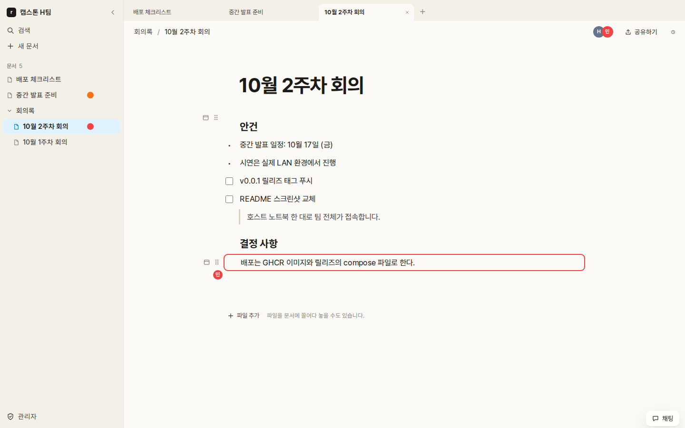
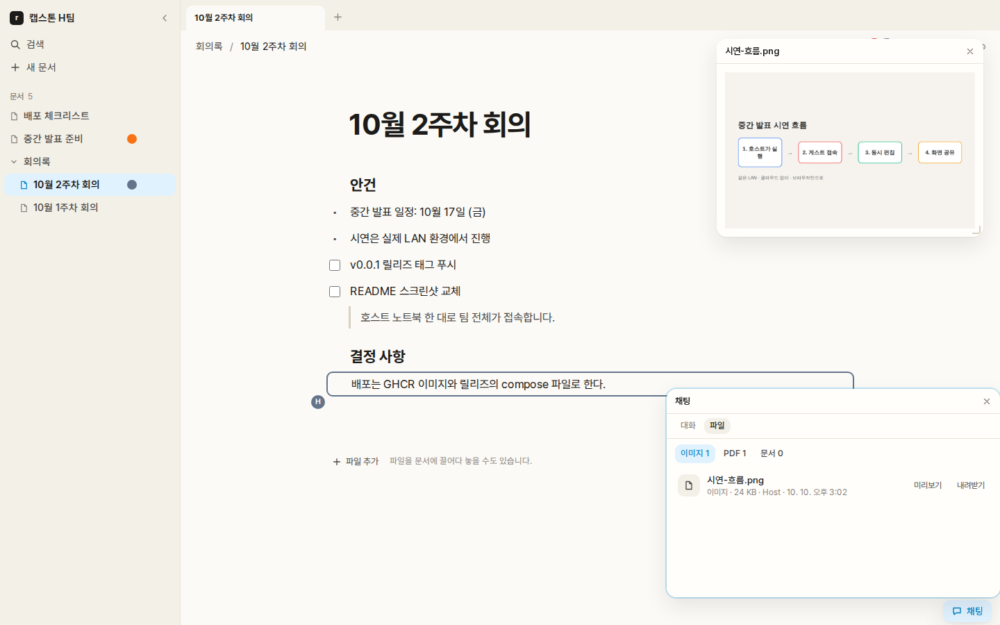
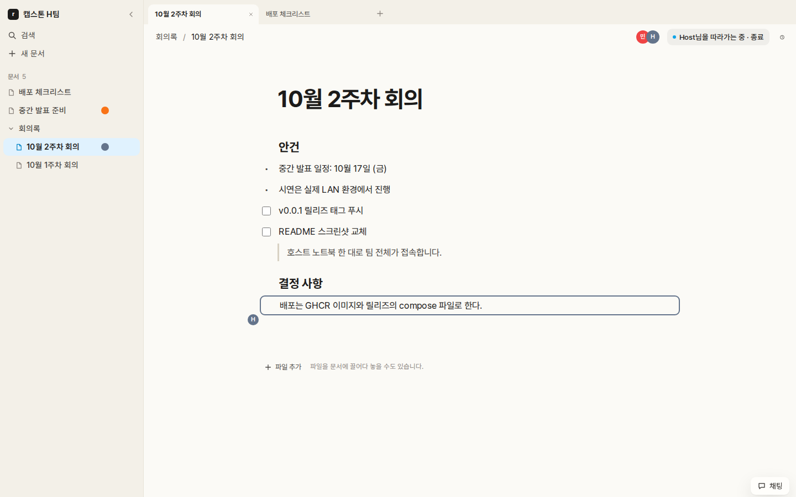
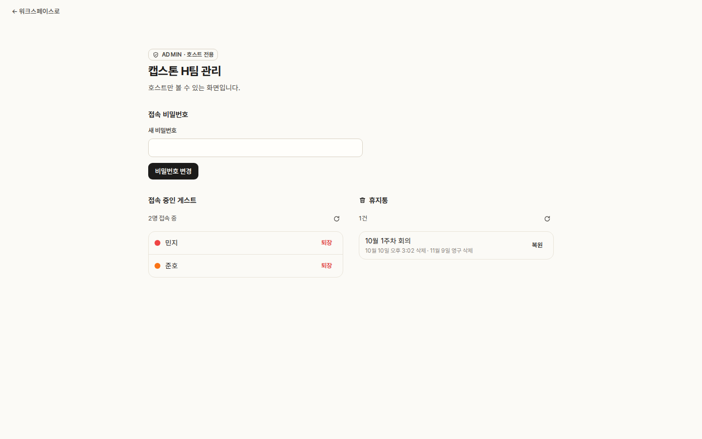

# RMF-Block

[English](README.md) · **한국어**

하나의 로컬 네트워크에 있는 팀을 위한 실시간 블록 에디터입니다. 클라우드 서비스도, 계정도 필요 없습니다.

한 사람, **호스트**가 RMF-Block을 Docker 컨테이너로 실행합니다. **같은 서브넷**에 있는 나머지
사람들은 브라우저로 링크를 열고, 닉네임과 워크스페이스 비밀번호로 참여해 같은 문서를 함께
편집합니다. 충북대학교 H팀 캡스톤 프로젝트입니다.

> 이 문서는 [`README.md`](README.md)의 번역입니다. 내용이 다르면 영문이 기준입니다.

## 기능

스크린샷을 누르면 원본 크기로 볼 수 있습니다.

| 기능 | 설명 | 스크린샷 |
| :--- | :--- | :--- |
| **문서 편집** | 텍스트, 제목, 목록, 체크리스트, 인용, 코드, 이미지, PDF, 파일, 다른 문서 링크를 `/` 메뉴나 Markdown 단축키로 만듭니다. 한글 조합 중인 글자까지 입력하는 즉시 모두에게 전달되고, 다른 사람이 있는 블록은 그 사람의 색으로 표시됩니다. 문서는 트리로 중첩되고 탭으로 열리며, 이름을 붙이고 복원할 수 있는 버전 기록이 남습니다. | <a href="docs/images/editing.png"></a> |
| **플로팅 뷰와 채팅** | 파일을 첨부할 수 있는 채팅과, 이미지·PDF·기타 파일로 묶인 파일 목록이 있습니다. 텍스트·이미지·PDF 블록이나 채팅의 파일을 문서를 옮겨 다녀도 그대로 떠 있는 창에 띄울 수 있습니다. | <a href="docs/images/floating.png"></a> |
| **화면 공유** | 문서에서 보고 있는 위치를 공유하면, 다른 사람이 클릭 한 번으로 참여해 스크롤과 문서 이동을 따라갑니다. 어느 쪽이든 종료할 수 있습니다. | <a href="docs/images/screen-share.png"></a> |
| **관리자** | 호스트 전용입니다. 이름과 비밀번호로 워크스페이스를 열고, 비밀번호를 바꾸고, 게스트를 퇴장시키고, 휴지통에서 삭제된 문서를 복원합니다. | <a href="docs/images/admin.png"></a> |

## 동작 방식

호스트 머신은 컨테이너 세 개를 실행합니다. 페이지·REST·WebSocket을 담당하는 Next.js 커스텀
서버인 앱, 그리고 MongoDB를 뒤에 둔 자체 호스팅 [Yorkie](https://yorkie.dev) 서버입니다.
Yorkie는 모든 문서를 CRDT로 동기화하고 내용과 기록을 보관하며, 앱은 자체 상태를 `.data/` 아래
JSON으로 보관합니다. 문서, 채팅, 업로드한 파일은 호스트에 저장되고 LAN으로 공유됩니다.

다이어그램은 [`ARCHITECTURE.md`](ARCHITECTURE.md)에, 계약은
[`docs/design/architecture.md`](docs/design/architecture.md)에 있습니다.

## 시작하기

Compose 2.20 이상이 포함된 Docker만 있으면 됩니다. 저장소 clone도, Node.js도 필요 없습니다. 각
[릴리즈](https://github.com/CBNU-TeamH/RMF-Block/releases)는 x86-64와 Apple Silicon용으로 함께
빌드된 공개 이미지를 실행합니다.

Linux 또는 macOS:

```bash
mkdir rmf-block && cd rmf-block
curl -LO https://github.com/CBNU-TeamH/RMF-Block/releases/latest/download/docker-compose.yml
curl -L -o .env https://github.com/CBNU-TeamH/RMF-Block/releases/latest/download/env.sample
```

Windows PowerShell 5.1:

```powershell
mkdir rmf-block
Set-Location rmf-block
curl.exe -LO https://github.com/CBNU-TeamH/RMF-Block/releases/latest/download/docker-compose.yml
curl.exe -L -o .env https://github.com/CBNU-TeamH/RMF-Block/releases/latest/download/env.sample
```

### 호스트의 LAN 주소 설정

`.env`의 `HOST_LAN_IP`에 게스트와 같은 LAN에서 쓰는 이 머신의 IPv4 주소를 넣습니다. 아래 명령은
이 머신이 인터넷에 나갈 때 쓰는 연결의 주소를 출력하며, 보통 그 주소가 맞습니다. 컨테이너 안이
아니라 **호스트 머신**에서 실행하세요.

Windows (WSL이 아닌 Windows의 PowerShell):

```powershell
(Get-NetIPConfiguration | Where-Object IPv4DefaultGateway).IPv4Address.IPAddress
```

Linux (`src` 뒤의 주소):

```bash
ip -4 route get 1.1.1.1
```

macOS:

```bash
ipconfig getifaddr "$(route -n get default | awk '/interface:/{print $2}')"
```

`1.1.1.1`로 실제 통신이 나가지는 않으며, 어느 경로를 쓰는지만 조회합니다. 아무것도 출력되지
않거나 VPN이 켜져 있어 VPN 주소가 나오면, 전체 주소를 나열해서 Wi-Fi 또는 이더넷 어댑터의 IPv4
주소를 고르세요. Windows는 `ipconfig`, Linux는 `ip -4 addr show scope global`, macOS는
`networksetup -listallhardwareports`로 장치 이름을 찾은 뒤 `ipconfig getifaddr <장치>`입니다.
Docker, WSL, VPN, loopback 인터페이스도 함께 보일 수 있지만 그 주소는 아닙니다.

예를 들어 LAN 주소가 `192.168.0.14`라면 `.env`에 이렇게 저장합니다(예시가 아닌 본인 주소를
쓰세요).

```dotenv
HOST_LAN_IP=192.168.0.14
```

이 Docker 실행 방식에서는 `HOST_LAN_IP`만 설정하고 나머지 설정은 그대로 두세요. 워크스페이스
이름과 비밀번호는 실행 후 브라우저에서 정합니다. 주석 처리된 Yorkie 주소는 네이티브 개발용이며,
Compose는 자체 내부 주소를 쓰고 `.env`의 그 값을 사용하지 않습니다.

릴리즈 파일은 호스트의 LAN IP를 자동으로 찾지 않습니다. clone한 저장소에서는 `pnpm docker:up`이
호스트에서 [`scripts/detect-host-ip.sh`](scripts/detect-host-ip.sh)를 실행해 주소를 찾고 `.env`에
기록하지만, 이 스크립트는 릴리즈에 포함되지 않습니다. LAN 주소가 바뀌면 `.env`를 고치고
`docker compose up -d`를 다시 실행하세요. 공유기에서 호스트에 DHCP 예약을 해 두면 주소가 바뀌지
않습니다.

### 포트 열기

게스트는 **TCP 3000**(앱)과 **TCP 8080**(실시간 편집을 전달하는 Yorkie)에 접속합니다. 페이지는
열리는데 편집 내용이 전혀 반영되지 않는다면 대개 8080이 막힌 것입니다.

- **Windows**: Wi-Fi 또는 이더넷 네트워크 프로필을 **개인(Private)**으로 설정하고, Windows Defender
  방화벽이 물으면 Docker Desktop을 허용하세요. 묻지 않았다면 관리자 권한 PowerShell에서 규칙을
  추가합니다.
  `New-NetFirewallRule -DisplayName "RMF-Block" -Direction Inbound -Protocol TCP -LocalPort 3000,8080 -Action Allow -Profile Private`
- **macOS**: 방화벽이 켜져 있다면(시스템 설정 → 네트워크 → 방화벽) Docker의 수신 연결을 허용하세요.
- **Linux**: `ufw`가 켜져 있다면 `sudo ufw allow 3000,8080/tcp`.

### 실행

```bash
docker compose up
```

실행 출력 중에 다음 두 줄이 있습니다.

```
rmf-app  |   Host:  http://localhost:3000/api/auth/host?secret=…
rmf-app  |   Guest: http://192.168.0.14:3000
```

- **`Host:` 링크는 직접 여세요.** 이 링크로 호스트가 되며, 주소창에서 secret이 지워집니다. 이 줄은
  자격 증명처럼 다루세요. 컨테이너가 재시작될 때까지 유효합니다.
- **처음 열면 설정 화면이 나옵니다.** 워크스페이스 이름과 접속 비밀번호를 정한 뒤 게스트에게
  비밀번호를 알려 주세요. 그 전까지는 실행 출력에 `host user의 workspace setting이 완료되지 않았습니다.`가
  나오고 게스트는 참여할 수 없습니다. 호스트에게만 보이는 사이드바 아래쪽의 **관리자** 링크(방패
  아이콘)에서 나중에 비밀번호를 바꾸거나 게스트를 퇴장시킬 수 있습니다. 설정은 볼륨에 남기 때문에
  `.env`를 비워도 초기화되지 않으며, 설정이 있으면 실행 시 `Workspace "<name>" — saved settings …`가
  출력됩니다. 설정 화면을 다시 보려면 스택을 멈추고 `app-data` 볼륨에서 `workspace.json`을 지우세요.
- **나머지 사람들에게는 `Guest:` 주소를 알려 주세요.**
- **컨테이너를 재시작하면 모두 로그아웃됩니다.** 게스트 한 명만 내보내려면 관리자 페이지의 퇴장을
  쓰세요([`docs/design/api.md`](docs/design/api.md)).
- **문서와 앱 상태는** named volume에 있어 재시작과 업그레이드 후에도 남고 멤버 색도 유지됩니다.
  `docker compose down -v`를 하면 지워집니다.

### 업그레이드

새 릴리즈의 `docker-compose.yml`을 기존 파일 위에 내려받고, `.env`는 그대로 둔 채 실행합니다.

```bash
docker compose pull && docker compose up -d
```

Windows PowerShell 5.1에서는 `pull`이 성공했을 때만 `up`을 실행합니다.

```powershell
docker compose pull
if ($LASTEXITCODE -eq 0) { docker compose up -d }
```

Compose 프로젝트 이름이 같으면 문서와 설정이 유지됩니다. 릴리즈 파일의 기본값은 `rmf-block`이며,
예전 설치는 폴더 이름을 프로젝트 이름으로 썼을 수 있습니다.

**clone한 저장소에서 릴리즈로 옮길 때:** 폴더를 바꾸거나 컨테이너를 지우기 전에 현재 프로젝트
이름을 확인하세요. Linux 또는 macOS:

```bash
docker inspect rmf-app --format '{{ index .Config.Labels "com.docker.compose.project" }}'
```

Windows PowerShell 5.1:

```powershell
docker inspect rmf-app | ConvertFrom-Json | ForEach-Object { $_.Config.Labels.'com.docker.compose.project' }
```

새 릴리즈의 `docker-compose.yml`을 별도 폴더에 내려받고, 기존 `.env`를 그 폴더로 복사해
`HOST_LAN_IP`와 다른 설정을 유지하세요. 그 위에 `env.sample`을 내려받지 마세요. 복사한 `.env`의
`COMPOSE_PROJECT_NAME`을 위에서 출력된 이름으로 설정합니다. 예:

```dotenv
COMPOSE_PROJECT_NAME=rmf-block
```

업그레이드 명령은 그 폴더에서 실행합니다. 이 폴더에는 `docker-compose.override.yml`이 없어야
합니다. clone의 override는 소스 빌드를 선택하기 때문입니다. 프로젝트 이름을 유지하면 기존 컨테이너와
`app-data`, `mongo-data` 볼륨을 그대로 씁니다. `docker compose down`만으로는 프로젝트 이름 사이에
데이터가 옮겨지지 않으며, 이름을 바꾸면 다른 볼륨을 쓰게 됩니다. 볼륨을 지우는 `down -v`는 쓰지
마세요.

**되돌리기(롤백):** 이전 릴리즈의 `docker-compose.yml`을 폴더에 다시 두고 같은 업그레이드 명령을
실행하면 됩니다. 볼륨은 유지됩니다. 새 버전이 저장 형식을 바꿨다면 이전 버전이 읽지 못할 수
있으니, 업그레이드 전에 `app-data`와 `mongo-data` 볼륨을 백업하세요.

각 릴리즈 파일은 자기 버전을 가리킵니다. 정확한 이미지로 고정하려면 릴리즈 노트의 digest를
붙이세요(`…:0.0.1@sha256:…`). 패키지 페이지의 digest는 아키텍처 하나만 고정하므로 쓰지 마세요.

### 게스트가 접속하지 못할 때

LAN에 있는 다른 기기(휴대폰도 됩니다)에서 `Guest:` 주소를 열어 확인하세요. 호스트에서 열리는 것은
네트워크에 대해 아무것도 보장하지 않습니다. 실패하면 다음 순서로 확인합니다.

1. **클라이언트/AP 격리.** 학교나 게스트 Wi-Fi는 같은 네트워크 안에서도 기기끼리의 통신을 막는
   경우가 많습니다. 공유기 설정이라 여기 있는 어떤 스크립트로도 알아낼 수 없습니다. 휴대폰 핫스팟
   같은 다른 네트워크로 시험해 보세요.
2. **포트와 방화벽.** 3000과 8080이 모두 열려 있어야 합니다([포트 열기](#포트-열기)).
3. **Windows 호스트.** Docker Desktop의 WSL2 백엔드는 포트를 `127.0.0.1`로만 전달할 수 있습니다.
   clone한 저장소에서는 `pnpm docker:up`이 WSL mirrored networking이 켜져 있는지 확인하고 설정
   방법을 안내합니다. mirrored networking은 Windows 11 22H2 이상에서 쓸 수 있으며, 그보다 오래된
   Windows에서는 포트를 호스트의 LAN 주소로 직접 전달하세요(`netsh interface portproxy`).
4. **`Guest:` 줄의 주소가 틀렸다면** `.env`의 `HOST_LAN_IP`를 고치고 `docker compose up -d`를 다시
   실행하세요.

## 문서

| 문서 | 내용 |
| :--- | :--- |
| [`AGENTS.md`](AGENTS.md) | 작업 규칙: 워크플로, 코딩 원칙, 어떤 문서가 무엇을 답하는지 |
| [`docs/SRS-ko.md`](docs/SRS-ko.md) · [`docs/SRS-en.md`](docs/SRS-en.md) | 요구사항: 팀이 합의한 한국어 원문과 영어 번역 |
| [`docs/design/`](docs/design/) · [`docs/adr/`](docs/adr/) | 모듈 설계와 아키텍처 결정 |
| [`ROADMAP.md`](ROADMAP.md) | 무엇이 만들어졌고 다음은 무엇인지 |

## 기여

개발 환경, 검사, 변경이 PR이 되는 과정은 [`CONTRIBUTING.md`](CONTRIBUTING.md)를 보세요.

## 라이선스

[MIT](LICENSE). 포함된 Pretendard 글꼴은 SIL Open Font License 1.1을 따릅니다
([`app/fonts/PretendardVariable.LICENSE.txt`](app/fonts/PretendardVariable.LICENSE.txt)).
