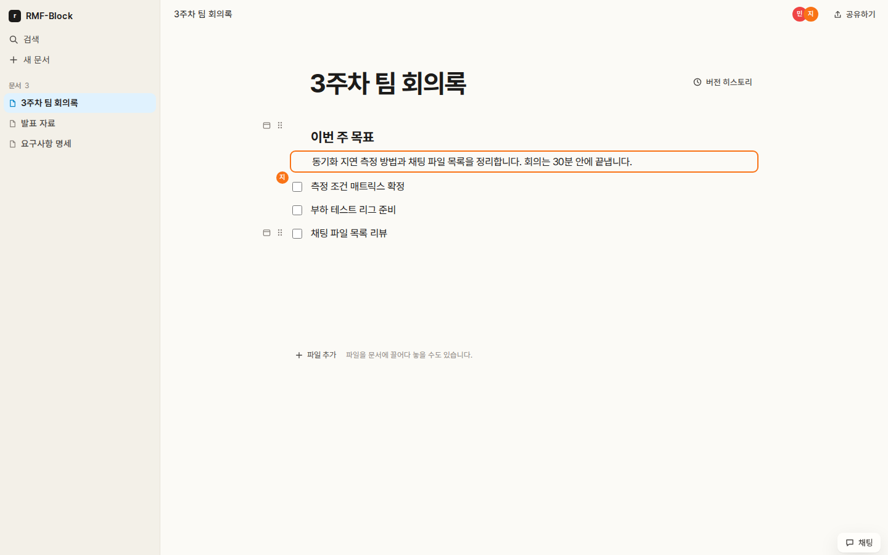
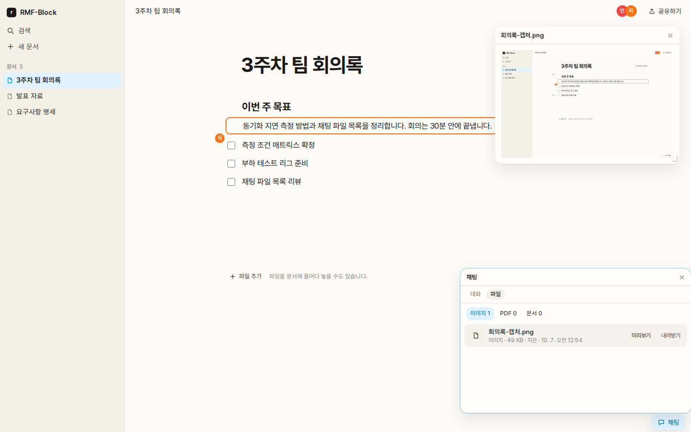

# RMF-Block

A real-time block editor for a team on one local network — no cloud service, no accounts.



One person, the **host**, runs RMF-Block as a Docker container. Everyone else on the **same
subnet** opens a link in their browser, joins with a nickname and the workspace password, and edits
the same documents together. CBNU Team H capstone project.

## Features

- **Block editor** — text, headings, lists, checklists, quotes, code, dividers, images, PDFs,
  files and links to other documents. A `/` menu and Markdown shortcuts (`# `, `- `, `[] `,
  `` ``` ``) create them.
- **Real-time co-editing** — edits reach everyone as they type, Hangul composition included, and
  the block someone is in is outlined in their colour.
- **Presence and focus following** — see who is connected, and share your screen position so
  others can follow it.
- **Document tree and version history** — nested documents; browse, name and restore past versions.
- **Chat with files** — messages and attachments, and a file list grouped into images, PDFs and
  other files.
- **Floating views** — pin a text, image or PDF block, or an image or PDF from chat, in a window
  that stays put while you move between documents.



## How it works

The host machine runs three containers: the app — a Next.js custom server for pages, REST and
WebSockets — and a self-hosted [Yorkie](https://yorkie.dev) server with MongoDB behind it. Yorkie
syncs every document as a CRDT and keeps its content and history; the app keeps its own state
(members, the document tree, chat) as JSON under `.data/`. Nothing leaves the LAN.

[`ARCHITECTURE.md`](ARCHITECTURE.md) has the diagram; [`docs/design/architecture.md`](docs/design/architecture.md)
the contracts.

## Getting started

You need Docker with Compose 2.20 or newer, and Node.js 24 with pnpm to run the start script — on
Linux or macOS, or on Windows from WSL.

```bash
cp .env.sample .env        # set WORKSPACE_PASSWORD (4+ characters); WORKSPACE_NAME is optional
pnpm docker:up
```

`pnpm docker:up` finds the host's LAN address, writes it to `.env` as `HOST_LAN_IP`, and starts the
stack. Among its startup output are these two lines:

```
rmf-app  |   Host:  http://localhost:3000/api/auth/host?secret=…
rmf-app  |   Guest: http://192.168.0.14:3000
```

- **Open the `Host:` link yourself.** It makes you the host and drops the secret from the address
  bar. Treat the line as a credential: it stays valid until the container restarts.
- **Give everyone else the `Guest:` address.**
- **Restarting the container signs everyone out** — that is how access is revoked. Documents and
  app state (members keep their colours) survive restarts and rebuilds on named volumes;
  `docker compose down -v` wipes them. Run the image, not `pnpm start`: that starts the app alone,
  without the Yorkie container behind it.

### If a guest cannot connect

- **Client/AP isolation.** Campus and guest Wi-Fi often block devices from reaching each other even
  on one network. Rule this out first — it is a router setting no script here can detect.
- **Windows hosts.** Docker Desktop's WSL2 backend may forward the port only to `127.0.0.1`.
  `pnpm docker:up` detects this and prints the fix: `networkingMode=mirrored` under `[wsl2]` in
  `%UserProfile%\.wslconfig`, then `wsl --shutdown` and restart Docker Desktop (`wsl --shutdown`
  closes every WSL session). Mirrored networking needs Windows 11 22H2+; on older Windows, forward
  the port to the host's LAN address yourself (`netsh interface portproxy`).
- **Wrong address detected**, or no default route to read: set `HOST_LAN_IP` in `.env` yourself
  (`ip -4 addr` on Linux, `ipconfig getifaddr en0` on macOS, `ipconfig` in Windows itself — not
  WSL's address) and run `docker compose up --build`.

## Documentation

| Read | For |
| :--- | :--- |
| [`AGENTS.md`](AGENTS.md) | The working rules — workflow, coding principles, which doc answers what. Start here to contribute. |
| [`docs/SRS-ko.md`](docs/SRS-ko.md) · [`docs/SRS-en.md`](docs/SRS-en.md) | Requirements: the agreed Korean text and its English translation |
| [`docs/design/`](docs/design/) · [`docs/adr/`](docs/adr/) | Module design and architecture decisions |
| [`ROADMAP.md`](ROADMAP.md) | What is built and what comes next |

## Contributing

See [`CONTRIBUTING.md`](CONTRIBUTING.md) for the development setup, the checks, and how a change
becomes a pull request.
