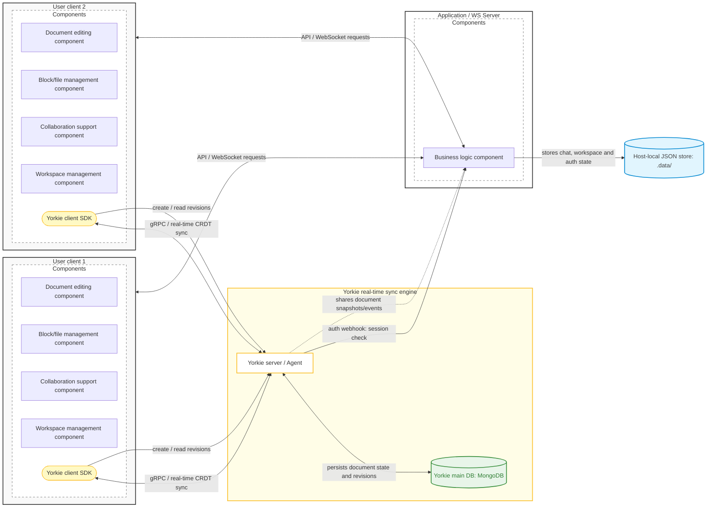
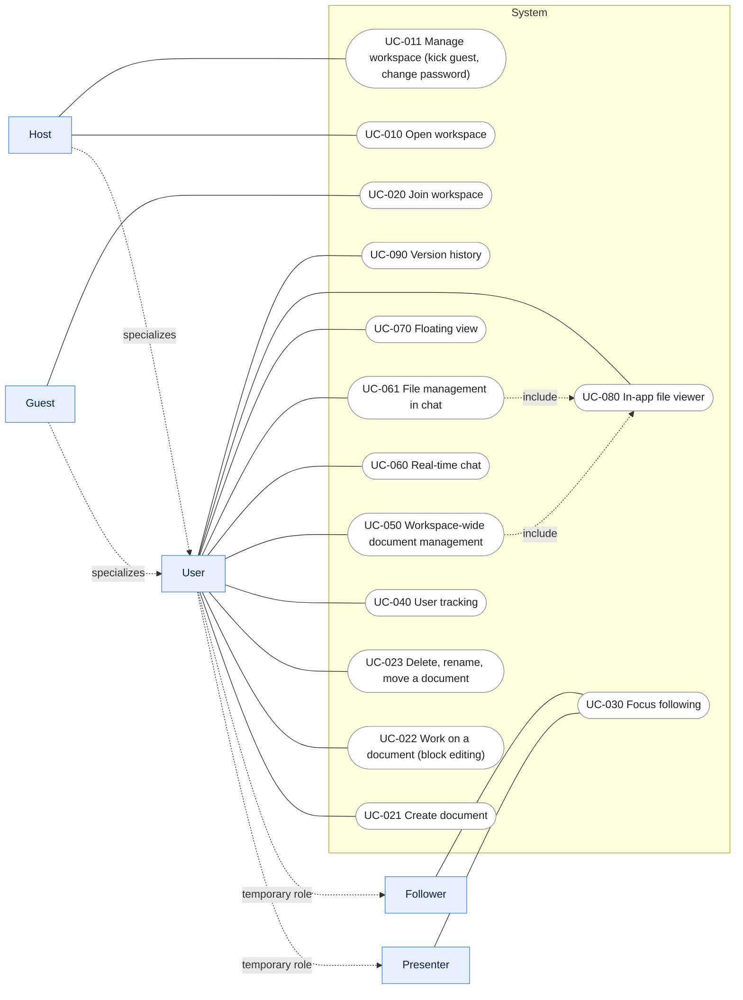

> **English translation of [`SRS-ko.md`](SRS-ko.md), for AI agents.** `SRS-ko.md` is the canonical, team-agreed text: where the two disagree, the Korean wins. Change both files in the same PR — `scripts/verify-srs-sync.mjs` fails CI otherwise. Requirement IDs are never translated; UI strings that appear in the app stay in Korean with an English gloss, so they can be searched for in code.

# Requirements Specification (1)

# Title: Use Case Specification for a Short-Range LAN-Based Real-Time Collaboration System

# 1. System Overview

## 1.1. Introduction to the System Under Development

This system is a real-time document collaboration system designed for collaborators who are physically in the same space.

It was planned to remove the internet dependency of existing cloud-based collaboration tools, and to support at the system level the collaboration needs that arise when people work in the same place.

**Purpose and feature overview**

The system is built around two core capabilities.

First, multiple users connected to the same LAN (Local Area Network) can edit the same document in real time.

Second, it provides the following features needed for short-range collaboration.

- Focus following: follow a specific user's editing position in real time, or synchronize the presenter's view to every participant
- Floating reference view: keep the current editing screen while referring to another document in a secondary view

**Use and operating environment**

- The main scenario is team members gathered in one place — a meeting room, a classroom, a shared office — writing or reviewing documents together.
- Once the Host starts the system, participants on the same LAN can connect with nothing but a web browser, with no software to install, and start collaborating immediately.

**Expected benefits**

- Collaboration over the LAN alone, even with no or unstable internet
- Document collaboration tailored to short-range environments

**Scope**

- The system is a single piece of software made of a Host-side server and participant clients (web browsers).
- It uses the LAN as its communication environment. The editor engine and the real-time synchronization infrastructure come from open-source libraries and are not implemented by this project.

## 1.2. Purpose of This Document

This document defines the functional requirements and main service flows of a real-time document collaboration system for teams that are physically in the same space.

**In scope**

It makes the following explicit.

- The core functional requirements the system must provide
- The non-functional requirements the system must meet
- The interactions between users and the system
- The interactions between the system and external components
- The system's scope and constraints
- A shared understanding among project participants

**Out of scope**

The following are not covered here; they are defined separately in the documents below.

| Item | Detailed in | When written |
| --- | --- | --- |
| Infrastructure layout | System architecture design | Design phase, before development |
| Detailed system design | Software detailed design | Design phase, before development |
| API specification | API design | During development |
| UI/UX and design structure | UI/UX design | Before UI development |
| Performance testing and quality verification | Test plan and performance verification documents | Before development, plus testing during development |
| Deployment and operations policy | Operations and deployment design | Packaging phase, after development |

This document therefore serves as the requirements specification that fixes the scope and functional goals of the requirements before system design begins.

## 1.3. Glossary

| Workspace | The shared work space in which users on the same network environment use collaboration features together — documents, files, chat |
| --- | --- |
| Focus following | A feature for following, in real time, a specific user's current working position and screen movement |
| Floating view | A feature that pins a specific block or piece of content in a separate window, so it can be referred to while working on another document |
| In-app file viewer | A feature for opening PDFs, images, text files and the like directly inside the application, without launching an external program |
| Conflict | The state that arises when several users modify the same document region at the same time |
| Block | The smallest atomic data model that makes up a document, and the basic unit of the UI
Every text, media and layout element in a document is treated as an individual block.
The concrete block types of this system are defined in '4.1. (Appendix) Block types'. |

# 2. System Under Development

## 2.1. Composition and Scope of the System Under Development

The system under development is a collaboration system that provides collaborative document writing in a LAN (Local Area Network) environment.

It provides its collaboration features using the real-time document synchronization of the CRDT library Yorkie and a change-history structure based on Yorkie revisions.

Most existing collaboration systems store data in the cloud and synchronize in real time over a WAN.

This system instead stores data locally on the Host user's machine, and assumes the Host runs the Yorkie server and the Application / WebSocket Server directly, inside the same LAN.

The system combines the following two structures.

- Yorkie-based real-time document synchronization and Presence state sharing
- Document persistence and revision-based change history on the Yorkie server (MongoDB backend)

The goal is to provide real-time collaboration and Yorkie revision-based change-log management at the same time.

---

**System scope**

The system under development covers the following.

- Workspace-based collaboration
- Yorkie-based real-time document synchronization and user state sharing
- Collaboration state relay and business logic on the Application / WS Server
- Document persistence and revision-based change history on the Yorkie server (MongoDB backend)
- Application state stored in host-local JSON files (`.data/`): chat, workspace metadata, auth records
- Block-level occupancy display
- User tracking and presentation mode
- File sharing within the workspace
- Real-time chat
- Floating view and in-app file viewer

The following are not in scope.

- Using external hosting services such as Yorkie Cloud
- Implementing an automatic merge algorithm
- Implementing a CRDT-based real-time synchronization algorithm
- Implementing a text editor
- LAN communication optimization

---

**System environment and interactions**

The system works through interactions between the client Yorkie-js-SDK, the Yorkie server, Yorkie's MongoDB store, and the Application / WS Server.

Users modify documents in the client application; real-time synchronization of document content and conflict resolution are performed through Yorkie. The Application / WS Server handles the business logic collaboration needs — workspace management, file management, permission decisions, application state management.

Document persistence and change history belong to the Yorkie server. Yorkie runs with MongoDB as its backend store and persists document state, and the system records and restores change history through Yorkie's revision API. Document bodies are therefore not written to separate files.

MongoDB is the Yorkie server's internal store, and the Application / WS Server never accesses it directly. State owned by the Application / WS Server (chat history, workspace metadata, auth records) is stored in host-local JSON files (`.data/`).

The system interacts with the following external environments.

| External system | Interaction |
| --- | --- |
| MongoDB (Yorkie's internal store) | Persists document state and revisions. Only the Yorkie server accesses it |
| LAN network | Communication between clients and the server |
| Application / WS Server | Business logic: workspaces, files, permissions, application state |
| Yorkie | Real-time document synchronization, CRDT-based conflict resolution, Presence state sharing, document persistence and revision-based version history |
| File system | Local storage of attachments and application-state JSON (`.data/`) |

**System components**

The system consists of the following main components.

1. Document editing component
    1. Create, move, modify and delete blocks
    2. Manage block occupancy state
2. Workspace management component
    1. Create and join workspaces
    2. Kick guests and change the access password (Host privilege)
    3. Create, delete, rename and move documents, and manage files
    4. Upload and download files
3. Collaboration support component
    1. User location tracking
    2. Presenter view sharing
    3. Chat
4. Block/file management component
    1. In-app file viewer
    2. Floating view
5. Synchronization component
    1. Synchronize data within a document
    2. Synchronize the state of every client
    3. Yorkie revision-based change-history management
    4. Restore a document to a revision

---

## 2.2. Main Features of the System Under Development

**Document collaboration**

- Block-level document editing
- Synchronization of documents and state between clients
- Conflict minimization
- Change-history management
- Rename, move and delete documents

**Workspace management**

- Kick guests
- Change the workspace access password

**User collaboration**

- User location tracking
- Presenter view sharing
- Live display of who is and is not connected to the workspace
- Real-time chat (text sharing, file sharing)

**File management**

- Upload and download workspace files
- In-app file preview
- File reference through the floating view

## 2.3. Assumptions and Dependencies

### 2.3.1. Assumptions

**1. Connection on the same LAN**

All users (the Host and participants) are assumed to be connected to the same LAN — a subnet formed by the Host's own hotspot or a router.
The system's low-latency real-time collaboration is designed on the premise of communication inside this LAN.
If this does not hold and users are on different networks, connecting to the server may be impossible or real-time synchronization is not guaranteed, so most of the collaboration requirements in this document no longer hold.

The server run by the Host is assumed to be running for the whole collaboration session.
The system is a server-client structure centred on a single server run by the Host, so if that server stops, real-time relay, Yorkie's document persistence and application state recording all stop.

### 2.3.2. Dependencies

**1. The Yorkie system**

The system's real-time document collaboration, persistent document storage and change-history management all depend on Yorkie, an open-source real-time synchronization engine.
The system does not use Yorkie's cloud service; it assumes self-hosting, with the Host running the Yorkie server directly as a container.

- Real-time synchronization of edits between clients and resolution of concurrent-edit conflicts depend on Yorkie's CRDT document model.
- Real-time sharing of user state — the connected-user list, user cursors and working positions, the presenter's view — depends on Yorkie's Presence and document event subscription.
- Clients communicate with the Yorkie server through the Yorkie client SDK.
- **Document persistence**: the Yorkie server runs with MongoDB as its backend store (`--mongo-connection-uri`). Document state whose conflicts were resolved by the CRDT during an editing session is persisted to MongoDB by Yorkie, and survives session end and server restarts. There is no separate file write or deferred-write step. Running Yorkie on its in-memory store (MemDB) loses documents on restart, so running on MongoDB is a precondition, not an option.
- **Version history**: document version history depends on Yorkie's revision API (`createRevision` / `listRevisions` / `getRevision`) and its automatic revision feature (`autoRevisionEnabled`). Revision snapshots are kept in YSON format, and revisions are also persisted in MongoDB. Restore does not use `restoreRevision`; the system reads the snapshot and rewrites the blocks as an ordinary edit (rationale: `docs/design/version-history.md`).
- MongoDB is the Yorkie server's internal store. The Application / WS Server never accesses MongoDB directly, and reaches document state and revisions only through Yorkie.

**2. The host-local file system**

The system depends on the host's local file system to persist state owned by the Application / WS Server.

- Chat history, workspace metadata and auth records are stored in host-local JSON files (`.data/`).
- This state is not a Yorkie CRDT document, so it is not stored in MongoDB and is fully separate from the document persistence path.
- Restoring a workspace after a server restart requires both the document side (Yorkie/MongoDB) and the application-state side (`.data/`) to be preserved.

## 2.4. Operational Constraints

**1. Scale limit**

→ This depends on the Host user's computing resources; it probably needs to be settled after load testing

The system is designed mainly for small collaboration environments of 8 users or fewer, on the same LAN.

**2. Web browsers**

Participants are assumed to connect to the Host server through a desktop or mobile web browser.

The system requires no separate application install, and supports the latest stable releases of Google Chrome, Microsoft Edge, Mozilla Firefox and Safari.

Browsers that do not support the web standards the system uses — WebSocket, ES6 JavaScript, Local Storage and so on — are outside the supported range.

The required browser versions are given in '4.2. (Appendix) Required web browser versions'.

# 3. Requirements

## 3.1. Use Cases

### 3.1.1. Overview

- Note
    
    Briefly outline the use cases presented in this document. Define the main actors here and, where needed, reintroduce the external components described in section 2.1. If a diagram helps show how the use cases relate, you may include one.
    

The system's use cases are organized around the process of real-time document collaboration.

The system is a workspace-based collaboration tool in which users on the same network environment can create and edit documents and collaborate in real time.

Users can open or join a workspace, and collaborate through block-based document editing, real-time chat, file management, user tracking, presentation and other features.

- Document (page): the unit of creation and editing
- Block: the unit of editing inside a document
- Document tree: the hierarchy of documents/folders (sidebar); files are not included
- Embedded file (attachment): a file embedded in a block of a document / attached in chat
- Workspace: the shared work space for collaborating in the same environment

| Actor | Kind | Definition | Related use cases |
| --- | --- | --- | --- |
| User | Parent role | Anyone collaborating in the workspace | UC-021, 022, 023, 040, 050, 060, 061, 070, 080, 090 |
| Host | A role of User | The user who opens and runs the server | UC-010, 011 |
| Guest | A role of User | A non-Host user who joined the workspace | UC-020 |
| Presenter | A temporary role of User | The user who started screen sharing | UC-030 |
| Follower | A temporary role of User | A user following the presenter's view | UC-030 |

The main use cases the system provides are opening and joining a workspace, creating and editing documents, presentation and user tracking, file management, real-time chat, the floating view, the in-app file viewer, and version history.

### 3.1.2. Use Case Scenarios

## UC-010

| Item | Content |
| --- | --- |
| Use case name | Open workspace |
| ID | UC-010 |
| Written | 2026-06-02 |
| Priority | High |

| Item | Content |
| --- | --- |
| Actor | Host |
| Summary | The Host opens a workspace and sets an access password, making it ready for users to join. |
| Preconditions |   • The project's Docker image for running the workspace server is available to the Host. |
| Basic flow |   1. The Host starts the server.
  2. The system shows the initial setup screen (workspace name and access password fields).
  3. The Host completes the setup and confirms opening.
  4. The system creates the workspace, shows the Host the join address, and switches the workspace to the 'joinable' state. |
| Alternative flows | **E1-1. Resume an existing workspace
  1.** If preserved workspace data exists, the system does not create a new one; it restores the existing workspace and switches it to the 'joinable' state.

**E1-2. Server start fails
  1.** The system shows the reason for the failure on the Host's screen. |
| Outcome |   • The workspace is opened (or resumed) and users can join it.
  • The Host has the address to share and the password they set. |
| Notes |   • Details of the container deployment itself are covered in the operations/deployment documents. |

## UC-011

| Item | Content |
| --- | --- |
| Use case name | Manage workspace (kick guest, change password) |
| ID | UC-011 |
| Written | 2026-08-01 |
| Priority | High |

| Item | Content |
| --- | --- |
| Actor | Host |
| Summary | The Host removes a guest from the workspace or changes the workspace access password. |
| Preconditions |   • The Host has opened and is running a workspace (UC-010). |
| Basic flow |   1. The Host selects a guest in the connected-user list and clicks "퇴장" (Kick).
  2. The system shows a confirmation popup for the kick.
  3. The Host confirms the kick.
  4. The system closes that guest's connection and removes them from the workspace.
  5. The system shows "워크스페이스에서 퇴장되었습니다" (You have been removed from the workspace) on the kicked guest's screen and sends them to the join screen.
  6. The system removes the kicked guest from other users' connected-user lists. |
| Alternative flows | **E1. Change password**
  1. The Host chooses "비밀번호 변경" (Change password) in the workspace settings and enters a new password.
  2. The system changes the workspace access password.
  3. The system keeps the sessions of currently connected users and does not ask them to re-authenticate.
  4. Users who were kicked or disconnected and try to join again must enter the changed password to enter the workspace (UC-020). |
| Outcome |   • A kicked guest is removed from the workspace and must go through the join procedure again to re-enter.
  • Existing connected users are unaffected by a password change; only newly joining users need the changed password. |
| Notes |   • Only the Host can kick guests or change the password. |

## UC-020

| Item | Content |
| --- | --- |
| Use case name | Join workspace |
| ID | UC-020 |
| Written | 2026-05-28 |
| Priority | Very high |

| Item | Content |
| --- | --- |
| Actor | Guest |
| Summary | A guest joins the workspace the Host opened, sees the document tree and the connected-user list, and is ready to start collaborating. |
| Preconditions |   • The Host has opened and is running a workspace (UC-010).
  • The user can reach the Host's address.
  • The user knows the address and the password. |
| Basic flow |   1. The guest enters the address the Host gave into a browser.
  2. The system shows the join screen (workspace name, username and password fields).
  3. The guest enters a username and password and presses '참가' (Join).
  4. If the password matches, the system admits the user into the workspace.
  5. The system shows the document tree and the connected-user list on the user's screen.
  6. The system adds the user's name and color tag to the connected-user lists of existing users. |
| Alternative flows | **E1. Cannot reach the server
  1.** The browser shows the connection failure on the guest's screen.

**E3. Wrong password
  1.** The system shows an error message on the guest's screen and asks them to re-enter it.

**E3a. Joining with an existing username (same user reconnecting)
  1.** If the entered username already exists, the system admits the guest as that user.
  2. The system updates that user's active indicators (list, location) to the current connection. |
| Outcome |   • The guest enters the workspace and can see the document tree and the connected-user list.
  • The guest is added to the connected-user list. |
| Notes |  |

## UC-021

| Item | Content |
| --- | --- |
| Use case name | Create document |
| ID | UC-021 |
| Written | 2026-06-01 |
| Priority | High |

| Item | Content |
| --- | --- |
| Actor | User |
| Summary | A user creates a new document in the workspace and is ready to start editing it. |
| Preconditions |   • The user is logged in to the workspace (UC-020). |
| Basic flow |   1. The user clicks '문서 생성' (Create document) in the sidebar.
  2. The system shows a document name input.
  3. The user enters a document name.
  4. If no document with the same name exists, the system creates the new document and adds its name to the workspace document tree.
  5. The system shows the editor for the created document on the user's editing screen.
  6. The system sends the created document's name, location and creation time to other connected users in real time.
  7. The system shows the new document in the workspace document tree on other users' screens. |
| Alternative flows | **E1a. Create a sub-document**
  1. The user chooses '새 하위 문서' (New sub-document) on an existing document/folder.

**E4a. Duplicate name**
  1. The system appends a non-colliding identifier to the duplicate name, creates the new document and adds its name to the workspace document tree. |
| Outcome |   • The new document appears in the creator's workspace document tree and the text editor is shown.
  • The created document's name appears in other connected users' trees. |
| Notes |   • A new document opens only for its creator; other connected users only see a node appear in the tree (no automatic navigation).
  • Every joined user can create documents. |

## UC-022

| Item | Content |
| --- | --- |
| Use case name | Work on a document (block editing) |
| ID | UC-022 |
| Written | 2026-06-01 |
| Priority | Very high |

| Item | Content |
| --- | --- |
| Actor | User 1, users other than user 1 |
| Summary | A user creates, modifies and moves blocks in a document, and the changes are shared with every user in real time. |
| Preconditions |   • The user is connected to the workspace. |
| Basic flow |   1. User 1 clicks a block or adds a new block with '/'.
  2. User 1 modifies the block's content.
  3. The system sends the modified block's text content, position and modification time to other users in real time.
  4. The system shows the modified block on other users' screens in real time. |
| Alternative flows | **E2-1. Reorder blocks**
  1. The user moves a block.
  2. The system sends the modified block order to other users in real time.
  3. The system shows the modified block order on other users' screens.

**E3. Delete a block**
  1. The system deletes the block.
  2. The system reflects the deleted block on other users' screens in real time.
 
**E4. Disconnected (within the grace period)
  1.** User 1's connection drops.
  2. User 1 keeps editing the block they had selected before the disconnect.
  3. User 1's connection recovers.
  4. User 1's changes reach the system.
  5. The system sends the modified block's text content, position and modification time to other users in real time.
  6. The system shows the modified block on other users' screens in real time.

**E5. Upload a file block**
  1. User 1 chooses a file block with '/' or drags and drops a file onto the document.
  2. The system shows a file picker (skipped for drag and drop).
  3. User 1 selects the file to upload.
  4. The system saves the file to the server file system and creates a block matching the file type (image/PDF/Word/PPT/Excel).
  5. The system sends the created file block to other users in real time.
  6. The system shows the created file block on other users' screens. |
| Outcome |  • The modified block's information (block position, text content, modification time) is shown on every user's screen in real time. |
| Notes |  • The grace period is set to 30000 ms (30 seconds). |

## UC-023

| Item | Content |
| --- | --- |
| Use case name | Delete, rename, move a document |
| ID | UC-023 |
| Written | 2026-08-01 |
| Priority | High |

| Item | Content |
| --- | --- |
| Actor | User |
| Summary | A user renames a document in the document tree, moves it to another location, or deletes it. |
| Preconditions |   • The user is connected to the workspace.
  • The target document exists in the workspace document tree. |
| Basic flow |   1. The user opens the target document's menu in the document tree.
  2. The system shows the rename, move and delete menu items.
  3. The user chooses "이름 변경" (Rename) and enters a new name.
  4. The system renames the document and reflects it in the document tree.
  5. The system sends the changed name to other connected users' document trees in real time. |
| Alternative flows | **E3-1. Move a document**
  1. The user chooses "이동" (Move) and picks a target folder.
  2. The system moves the document under the chosen folder and reflects it in the document tree.
  3. The system sends the changed location to other connected users' document trees in real time.

**E3-2. Delete a document**
  1. The user chooses "삭제" (Delete).
  2. The system shows a confirmation popup for the deletion.
  3. The user confirms the deletion.
  4. The system removes the document from the document tree, together with its sub-documents if it has any.
  5. The system reflects the deleted document in other connected users' document trees in real time.

**E4a. Duplicate name**
  1. If the new name duplicates another name in the same location, the system shows an error message and asks for a new one. |
| Outcome |   • The document's name, location or existence changes and is reflected in every connected user's document tree in real time. |
| Notes |   • Deleting a document that has sub-documents deletes the sub-documents too.
  • After a document is deleted, Yorkie revisions created before the deletion can still be fetched by ID. The revision list of a deleted document, however, can no longer be fetched — without keeping the revision IDs separately, they are unreachable. |

## UC-030

| Item | Content |
| --- | --- |
| Use case name | User tracking: focus following |
| ID | UC-030 |
| Written | 2026-05-28 |
| Priority | High |

| Item | Content |
| --- | --- |
| Actor | User (Presenter), User (Follower) |
| Summary | Fixes followers' view to the document the presenter is looking at. |
| Preconditions |   • Several users are connected to the same workspace. |
| Basic flow |   1. The presenter clicks "공유하기" (Share).
  2. The system creates a presentation session and stores the presenter's current document ID, screen position and scroll position.
  3. The system shows followers in the workspace the notice "발표자가 화면 공유를 시작했습니다" (The presenter started sharing) and a "참여하기" (Join) button.
  4. A follower clicks "참여하기" (Join).
  5. The system moves the follower's screen to the presenter's current document and screen position, and switches it to presentation mode.
  6. The system restricts document editing and independent navigation for users in presentation mode.
  7. The presenter moves to another document or changes the screen or scroll position.
  8. The system sends the changed document ID, screen position and scroll position to followers in real time.
  9. The system shows the follower's screen at the same position as the presenter's. |
| Alternative flows | **E3-1. Follower pauses**
  1. The follower clicks "일시 정지" (Pause).
  2. The system releases the follower's presentation mode.
  3. The system releases the follower's fixed view and allows document editing and navigation.
  4. The follower clicks "재개" (Resume).
  5. The system re-activates the follower's presentation mode.
  6. The system re-synchronizes the follower's screen with the presenter's current document and screen position.

**E3-2. Follower ends focus following**
  1. The follower clicks "종료" (End).
  2. The system ends the follower's presentation mode.
  3. The system releases the follower's fixed view and editing restriction.

**E3-3. Presenter disconnects**
  1. The presenter's connection ends, or the presenter ends the presentation.
  2. The system ends the presentation session.
  3. The system shows "공유가 종료되었습니다." (Sharing has ended.) on followers' screens.
  4. The system releases followers' fixed view and editing restriction.

**E3-4. Presenter tools**
  1. The presenter uses a presenter tool to highlight a document region or a block.
  2. The system sends the highlighted target's document ID, block position and highlight state to followers in real time.
  3. The system applies the highlight on followers' screens.
  4. When the presentation ends, the system removes the highlight metadata and clears the highlight from followers' screens. |
| Outcome |   • Followers can see where the presenter is in real time.
  • Communication cost during meetings goes down. |
| Notes |   • The presenter tools are text highlighting and underlining. |

## UC-040

| Item | Content |
| --- | --- |
| Use case name | User tracking |
| ID | UC-040 |
| Written | 2026-05-28 |
| Priority | Medium |

| Item | Content |
| --- | --- |
| Actor | User 1, user 2 |
| Summary | Quickly see where a collaborator is currently working, and return to where you were before looking. |
| Preconditions |   • Several users are connected to the same workspace. |
| Basic flow |   1. The system shows the list of users currently connected to the workspace and each user's current document.
  2. User 1 clicks user 2 in the user list.
  3. The system looks up user 2's current document ID, screen position and scroll position.
  4. The system moves user 1's screen to user 2's current document and screen position.
  5. The system shows user 2's current working position on user 1's screen.
  6. User 1 clicks the back button.
  7. The system moves user 1's screen back to the document they were working on. |
| Alternative flows | **E1. User 2 disconnects**
  1. The system shows user 2's icon dimmed and makes it unclickable. |
| Outcome |   • A colleague's current working position can be seen immediately.
  • Less time is spent wandering through documents looking for a colleague. |
| Notes |   • Positions are visualized with user color tags.
  • Where users are connected can be seen from the user tags in the workspace index. |

## UC-050

| Item | Content |
| --- | --- |
| Use case name | Workspace-wide document management |
| ID | UC-050 |
| Written | 2026-05-28 |
| Priority | High |

| Item | Content |
| --- | --- |
| Actor | User |
| Summary | Gathers the files embedded in every document of the workspace in one place to view and download them, and to jump to where they came from. |
| Preconditions |   • The user is connected to the same workspace. |
| Basic flow |   1. The user clicks the workspace file management menu.
  2. The system looks up the files embedded in the workspace's documents.
  3. The system shows each file's name, type (image/PDF, etc.), size and source document, grouped by file type.
  4. The user clicks a file in the list.
  5. The system looks up the selected file's ID and storage path.
  6. The system shows a preview of the file on the user's screen. |
| Alternative flows | **E3-1. Download**
  1. The user clicks the download button.
  2. The system sends the selected file's original data to the user.
  3. The system downloads the file to the user's local storage.

**E3-2. Source deleted**
  1. The system checks whether the source block containing the file still exists.
  2. If the source block was deleted, the system removes the file from the list.

**E3-3. Jump to the source**
  1. The user clicks "원본 위치 이동" (Go to source).
  2. The system looks up the document ID and block position containing the file.
  3. The system moves the user's screen to that document and block.
  4. The system shows the block containing the file on the user's screen. |
| Outcome |   • Files scattered across the workspace can be browsed, viewed and downloaded in one place. |
| Notes |   • The document each file belongs to is shown with it.
  • It behaves much like UC-061 (file management in chat) but is processed differently, so it is a separate use case. |

## UC-060

| Item | Content |
| --- | --- |
| Use case name | Real-time chat in the workspace |
| ID | UC-060 |
| Written | 2026-05-28 |
| Priority | High |

| Item | Content |
| --- | --- |
| Actor | User 1, users other than user 1 |
| Summary | Exchange text, URLs, files and block links in real time inside the workspace while collaborating, without a separate messenger. |
| Preconditions |   • The user is connected to the same workspace. |
| Basic flow |   1. User 1 types text or a URL into the chat box, or attaches a file.
  2. User 1 clicks the send button.
  3. The system creates the message content, attachment information, sender information and send time.
  4. The system stores the chat data in the workspace chat history.
  5. The system sends the message content, attachment information, sender information and send time to other connected users in real time.
  6. The system shows the sent message and file information in the chat box on other users' screens.
  7. Other users see the message, attachments and URLs in the chat box. |
| Alternative flows | **E1-1. Send fails**
  1. An error occurs while sending the message or file.
  2. The system shows a send-failure message on the user's screen.
  3. The system offers a resend button for the failed message.
  4. The user clicks the resend button.
  5. The system retries sending the message (basic flow 5, 6).

**E7a. Select a block/document link**
  1. The user clicks a block or document link in a chat message.
  2. The system looks up the document ID and block position in the link.
  3. The system moves the user's screen to that document and block.
  4. The system shows the linked block or document on the user's screen. |
| Outcome |   • The chat history is stored in the workspace record.
  • Users can communicate while collaborating.
  • Text, URLs and files that are hard to convey verbally can be shared immediately. |
| Notes |   • Document block links can be attached in chat.
  • The system shows notifications in chat.
  • For details see UC-061 |

## UC-061

| Item | Content |
| --- | --- |
| Use case name | File management in chat |
| ID | UC-061 |
| Written | 2026-06-01 |
| Priority | Medium |

| Item | Content |
| --- | --- |
| Actor | User |
| Summary | Gathers the files, images and links exchanged in chat by type, to view and download them and jump to the original message. |
| Preconditions |   • The user is connected to the workspace.
  • A file has been shared in chat. |
| Basic flow |   1. The user clicks the attachment management menu in the chat panel.
  2. The system looks up the files and links shared in chat.
  3. The system shows the file name, type (image/PDF/document), sender and send time, grouped into tabs by type.
  4. The user clicks preview on a file in the list.
  5. The system looks up the selected file's ID and storage path.
  6. The system shows a preview of the file on the user's screen. |
| Alternative flows | **E3. Download a file**
  1. The user clicks the download button.
  2. The system sends the selected file's original data to the user.
  3. The system downloads the file to the user's local storage. |
| Outcome |   • Files and links scattered across chat can be browsed, viewed and downloaded in one place. |
| Notes |   • A sub-use case of UC-060 (chat).
  • Files can be uploaded only through chat messages (UC-060). |

## UC-070

| Item | Content |
| --- | --- |
| Use case name | Floating view |
| ID | UC-070 |
| Written | 2026-05-28 |
| Priority | Medium |

| Item | Content |
| --- | --- |
| Actor | User |
| Summary | Pins a file or block in a floating view so it can be referred to continuously while working on a document. |
| Preconditions |   • The user must be connected to the workspace. |
| Basic flow |   1. The user clicks "플로팅 뷰로 열기" (Open in floating view) on the block or file to refer to.
  2. The system looks up the selected block's or file's document ID, block position and content.
  3. The system creates a floating view containing that block or file on the user's screen.
  4. The system pins the floating view above the current work screen.
  5. The user moves to another document or changes the screen position.
  6. The system keeps the floating view regardless of document moves and screen changes.
  7. The user writes or edits the current document while referring to the floating view. |
| Alternative flows | **E4-1. Source block modified**
  1. Another user modifies the source block or file.
  2. The system receives the modified block content, file information and modification time in real time.
  3. The system reflects the change in the floating view in real time.

**E4-2. Source block deleted**
  1. Another user deletes the source block or file.
  2. The system confirms that the source data was deleted.
  3. The system deactivates that floating view.
  4. The system shows "원본 블록이 삭제되었습니다." (The source block was deleted.) on the user's screen. |
| Outcome |   • The user can work while referring to several documents at once.
  • Less time is spent searching for information during collaboration. |
| Notes |   • For file blocks, images, PDF, Word, PPT and Excel are supported.
  • More than one floating block can be shown at the same time. |

## UC-080

| Item | Content |
| --- | --- |
| Use case name | In-app file viewer |
| ID | UC-080 |
| Written | 2026-05-28 |
| Priority | Medium |

| Item | Content |
| --- | --- |
| Actor | User |
| Summary | See a file's content immediately inside the application, without launching an external program. |
| Preconditions |   • The user must be connected to the workspace. |
| Basic flow |   1. The user clicks a file block in a document or a file in the file management screen.
  2. The system looks up the selected file's ID, format and storage path.
  3. The system checks whether the file format supports preview.
  4. The system activates the in-app file viewer on the user's screen and shows the file's content.
  5. The user reads the file's content in the in-app file viewer.
  6. The user clicks the in-app viewer's close button.
  7. The system deactivates the in-app file viewer and returns to the previous work screen. |
| Alternative flows | E3. Unsupported file format
  1. The system determines that the selected file's format does not support preview.
  2. The system shows "미리보기 불가" (Preview unavailable) on the user's screen.
  3. The system offers a file download. |
| Outcome |   • The user can see a file's content without switching to an external program.
  • The document-based collaboration flow is kept. |
| Notes |   • PDF, Word, PPT and Excel files are supported. |

## UC-090

| Item | Content |
| --- | --- |
| Use case name | Version history |
| ID | UC-090 |
| Written | 2026-10-01 |
| Priority | Medium |

| Item | Content |
| --- | --- |
| Actor | User, other users |
| Summary | A user looks up and previews past versions of a document, saves the current state under a name, or restores the document to a past version. |
| Preconditions |   • The user is connected to the workspace.
  • The user has the target document open. |
| Basic flow |   1. The user clicks "버전 히스토리" (Version history) on the document screen.
  2. The system shows the document's version list, newest first, grouped by day. By default the list shows only named versions and before-restore versions.
  3. The user selects a version in the list.
  4. The system shows that version's document content read-only.
  5. The user clicks "이 버전으로 복원" (Restore this version).
  6. The system shows a confirmation popup for the restore.
  7. The user confirms the restore.
  8. The system saves the document's state just before the restore as a '복원 전' (Before restore) version.
  9. The system replaces the document's blocks with the content of the selected version.
  10. The system reflects the restored document on other connected users' screens in real time. |
| Alternative flows | **E2-1. Include automatic versions**
  1. The user selects "자동 저장 포함" (Include auto-saves).
  2. The system shows automatic versions in the list as well.

**E2-2. Load older versions**
  1. The user clicks "더 보기" (Load more) at the end of the list.
  2. The system shows the next page of versions, and indicates when the oldest version has been reached.

**E3-1. Manual save**
  1. The user clicks "수동 저장" (Manual save) and enters a version name.
  2. The system saves the current document state as a version with that name and adds it to the list.
  3. If the entered name has a system-reserved form, the system refuses to save and shows the reason.

**E8. Save or restore fails**
  1. The system shows a failure message and leaves the document unchanged. |
| Outcome |   • The document is restored to the selected version's content, and the restore is reflected on every connected user's screen.
  • The state just before the restore remains as a '복원 전' (Before restore) version, so the restore itself can be undone. |
| Notes |   • Automatic versions are recorded by Yorkie at each document snapshot (every 500 changes).
  • Every user can restore. Instead of restricting access, the system records the name of the user who made each named version and each before-restore version.
  • Versions cannot be deleted or renamed (Yorkie provides no API for it).
  • The version list of a deleted document cannot be fetched (UC-023 Notes). |

## 3.2. Interface Requirements

### 3.2.1. User Interface

| Item | Content |
| --- | --- |
| Requirement ID | SIR001 |
| Name | Workspace opening interface |
| Category | Interface |
| Related use case | Open workspace (UC-010) |
| Importance | High |
| Description | Provides an interface through which a user starts the workspace server and performs the initial setup, creating a collaboration workspace others can join. |
| Details |   • The system shall provide an initial setup screen with a workspace name field and an access password field.
  • The user shall be able to complete the workspace setup and request its creation.
  • After creating the workspace, the system shall give the user the join address.
  • The system shall show the workspace's state as 'joinable'. |
| Other considerations |   • If existing workspace data is present, a restore function shall be provided.
  • Docker container deployment details are managed in the operations/deployment documents. |
| Output data |   • Workspace name
  • Access password
  • Join address
  • Workspace state |

| Item | Content |
| --- | --- |
| Requirement ID | SIR002 |
| Name | Workspace joining interface |
| Category | Interface |
| Related use case | Join workspace (UC-020) |
| Importance | High |
| Description | Provides an interface through which a user enters a workspace the Host opened, sees the documents and the connected-user list, and starts collaborating. |
| Details |   • The system shall provide a join screen with the workspace name, a username field, a password field and a join button.
  • The user shall be able to reach the workspace join screen through the address.
  • The system shall verify the entered password and admit the user into the workspace.
  • The system shall show the document tree and the current connected-user list on the user's screen.
  • The system shall show a newly connected user's name and color tag in every connected user's user list in real time. |
| Other considerations |   • If the server cannot be reached, the browser shall show a connection-failure message.
  • On a wrong password, an error message and a way to re-enter shall be provided. |
| Output data |   • Workspace name
  • Access password
  • Join address
  • Workspace state |

| Item | Content |
| --- | --- |
| Requirement ID | SIR003 |
| Name | Real-time document collaboration interface |
| Category | Interface |
| Related use case | Create document (UC-021), Work on a document (UC-022), Delete, rename, move a document (UC-023) |
| Importance | High |
| Description | Provides a block-based real-time collaboration interface so users can edit the same document at the same time. |
| Details |   • The user shall be able to create a block by clicking a block or typing '/'.
  • The user shall be able to modify content according to the block types in (Appendix) 4.1.
  • The user shall be able to modify and move blocks.
  • The system shall show block occupancy in real time.
  • Block occupancy does not mean an edit lock; it does not stop other users from editing that block.
  • The system shall reflect modified block content and positions on other users' screens in real time.
  • The system shall show the structure of documents in the workspace.
  • The user shall be able to access every document in the workspace.
  • The user shall be able to rename, move and delete documents in the document tree. |
| Other considerations |   • Concurrent-edit conflict resolution depends on Yorkie's CRDT document model.
  • Block occupancy shall be shown distinctly per user.
  • When a user selects a block or places the cursor in it, it is shown as occupied; when the user moves to another block or deselects, the occupancy is released.
  • The system shall ask for confirmation before deleting a document. |
| Output data |   • User name
  • User color tag
  • Connection state
  • Document tree |

| Item | Content |
| --- | --- |
| Requirement ID | SIR004 |
| Name | Presentation and focus following interface |
| Category | Interface |
| Related use case | User tracking: focus following (UC-030) |
| Importance | High |
| Description | Provides an interface that synchronizes the presenter's screen position and document state to participants' screens. |
| Details |   • The presenter shall be able to start screen sharing.
  • The system shall provide presenter tools to the presenter.
  • Participants shall be able to join presentation mode. |
| Other considerations |   • Participants shall be able to pause and resume.
  • When the presentation ends, participants' editing restriction shall be released. |
| Output data |   • Document ID
  • Screen position
  • Scroll position
  • Block position
  • Text metadata |

| Item | Content |
| --- | --- |
| Requirement ID | SIR005 |
| Name | File management interface |
| Category | Interface |
| Related use case | Workspace-wide document management (UC-050) |
| Importance | Medium |
| Description | Provides users with an interface for managing files embedded in documents. |
| Details |   • The system shall provide a workspace file management screen.
  • The system shall show files grouped by type (image, PDF, document, etc.).
  • The system shall show the file name, file type, source document and uploading user.
  • The user shall be able to preview and download files. |
| Other considerations |   • When the source block is deleted, the system shall remove the file from the list.
  • The system shall provide a way to jump to a file's source location. |
| Output data |   • File information
  • File location
  • File creation information
  • Related document ID |

| Item | Content |
| --- | --- |
| Requirement ID | SIR006 |
| Name | Real-time chat interface |
| Category | Interface |
| Related use case | Real-time chat in the workspace (UC-060) |
| Importance | High |
| Description | Provides a chat interface through which users share text, files and links in real time. |
| Details |   • The user shall be able to send text, URLs and files.
  • The system shall provide navigation through block/document links. |
| Other considerations |   • The system shall provide resend when sending a message fails. |
| Output data |   • Message content
  • Attachment information
  • Send time |

| Item | Content |
| --- | --- |
| Requirement ID | SIR007 |
| Name | Floating view interface |
| Category | Interface |
| Related use case | Floating view (UC-070) |
| Importance | Medium |
| Description | Provides an interface through which a user pins a specific block or file on screen as an independent floating view, to refer to it while working on another document. |
| Details |   • The system shall provide "플로팅 뷰로 열기" (Open in floating view) for blocks and files.
  • The system shall show the selected block's or file's content in a separate floating window. |
| Other considerations |   • When the source block or file is deleted, the floating view shall be deactivated.
  • The system shall tell the user that the source was deleted. |
| Output data |   • Document ID
  • Block position
  • File information
  • Modification state |

| Item | Content |
| --- | --- |
| Requirement ID | SIR008 |
| Name | In-app file viewer interface |
| Category | Interface |
| Related use case | In-app file viewer (UC-080) |
| Importance | Medium |
| Description | Provides an in-app file viewer interface for previewing, inside the application, a file selected from a document or the file management screen. |
| Details |   • The user shall be able to choose a file preview from a document's blocks and from the file management screen.
  • The system shall provide a preview window for the file.
  • The system shall provide a way to close the file viewer.
  • The system shall show a notice for file formats that cannot be previewed. |
| Other considerations |   • Unsupported file formats may offer download only. |
| Output data |   • File ID
  • File format
  • File preview data |

| Item | Content |
| --- | --- |
| Requirement ID | SIR009 |
| Name | User tracking interface |
| Category | Interface |
| Related use case | User tracking (UC-040) |
| Importance | Medium |
| Description | Provides an interface through which a user sees where other users in the workspace are currently working and can move there. |
| Details |   • The system shall show the list of currently connected users and each user's current document.
  • The user shall be able to select another user in the list and move to that user's working position.
  • The user shall be able to return to where they were before moving. |
| Other considerations |   • The system shall show disconnected users as inactive (dimmed) and block selecting them. |
| Output data |   • User list
  • Each user's current document
  • Screen position |

| Item | Content |
| --- | --- |
| Requirement ID | SIR010 |
| Name | File management in chat interface |
| Category | Interface |
| Related use case | File management in chat (UC-061) |
| Importance | Medium |
| Description | Provides an interface that gathers the files and links exchanged in chat by type, for viewing and download. |
| Details |   • The system shall show the files and links shared in chat in tabs by type.
  • The system shall show the file name, type, sender and send time in the file list.
  • The user shall be able to preview and download files. |
| Other considerations |   • Files can be uploaded only through chat messages (UC-060). |
| Output data |   • File information
  • Sender information
  • Send time |

| Item | Content |
| --- | --- |
| Requirement ID | SIR011 |
| Name | Workspace management interface |
| Category | Interface |
| Related use case | Manage workspace (UC-011) |
| Importance | High |
| Description | Provides an interface through which the Host kicks a guest from the connected-user list or changes the workspace access password. |
| Details |   • The system shall give the Host a "퇴장" (Kick) button per connected user.
  • The system shall show a confirmation popup before kicking a guest.
  • The system shall give the Host a password-change field. |
| Other considerations |   • This interface shall not be shown to users who are not the Host. |
| Output data |   • Connected-user list
  • Workspace password |

### 3.2.2. Hardware Interface

- Note
    
    If the software under development interacts with hardware inside or outside the system, describe that hardware's physical and logical characteristics and the conditions of the interface for interacting with it. Where concrete interface information is needed, figures or diagrams will help the reader.
    

| Item | Content |
| --- | --- |
| Requirement ID | HIR001 |
| Name | Server interface |
| Category | Hardware interface |
| Importance | High |
| Description | Provides the server execution environment interface for running the workspace server. |
| Details |   • The system shall support running the server in a Docker container.
  • The system shall provide user connections through a network interface.
  • The system shall store document data and file data on a storage device.
  • The system shall show the server's running state and address on the Host's screen. |
| Other considerations |  |

### 3.2.3. Software Interface

- Note
    
    If the project under development interacts with an external software system, describe the requirements for how that interaction works.
    

| Item | Content |
| --- | --- |
| Requirement ID | SOIR001 |
| Name | Web browser interface |
| Category | Software interface |
| Importance | High |
| Description | The system shall work with web browsers to provide users with collaboration features and real-time data exchange. |
| Details |   • The system shall receive user connection requests and workspace join requests from web browsers.
  • The system shall send document data, chat data and user-list information to web browsers.
  • The system shall synchronize document changes and user state to browsers in real time through real-time communication. Document changes and user state are delivered by Yorkie's gRPC-Web server streaming (WatchDocument); other workspace-level notifications use the App/WS server's WebSocket.
  • The web browser shall render the data it receives from the system on the user's screen. |
| Other considerations |   • Reconnection shall be supported when the browser's network connection drops.
  • Modern web browsers shall be supported. |

| Item | Content |
| --- | --- |
| Requirement ID | SOIR002 |
| Name | Docker interface |
| Category | Software interface |
| Importance | High |
| Description | The system shall work with the Docker runtime to run and manage the workspace server. |
| Details |   • Docker shall create and run the system's server container.
  • The system shall receive the server's running state from the Docker environment.
  • The system shall manage document data and user session data inside the Docker container.
  • The system shall be able to restore existing workspace data when the Docker environment stops or restarts. |
| Other considerations |  |

| Item | Content |
| --- | --- |
| Requirement ID | SOIR003 |
| Name | Version history interface |
| Category | Software interface |
| Related use case | Version history (UC-090) |
| Importance | High |
| Description | The system shall work with the Yorkie server's revision API to persist document state and manage document version history. |
| Details |   • The system shall be able to persist document state through the Yorkie server (MongoDB backend).
  • The system shall be able to manage a document's version history through Yorkie's revision API (`createRevision` / `listRevisions` / `getRevision`).
  • The system shall check session validity for revision API calls (`CreateRevision` / `GetRevision` / `ListRevisions` / `RestoreRevision`) through Yorkie's auth webhook. |
| Other considerations |   • `restoreRevision` is not used, because it reads a block's `type` key as a CRDT element discriminator and fails to restore. The system restores by reading `getRevision`'s snapshot and rewriting it as an ordinary edit.
  • `createRevision` records the state the server holds, so the client must sync before calling it. |

## 3.3. Functional Requirements

- Note
    
    Based on the use case scenarios and interface requirements above, define the behaviour of the system under development, and for each behaviour define functional requirements on its input/output relationship. Number each functional requirement in the form FX-XXX for traceability. For a single function, write the requirements for each condition and detail concretely.
    

Each functional requirement is numbered FR-[UC number]-[sequence] for traceability.

---

### 3.3.1. Workspace Opening

| ID | Functional requirement | Related UC |
| --- | --- | --- |
| FR-010-01 | The system shall provide the Host with an opening screen for entering a workspace name and an access password. | UC-010 |
| FR-010-02 | The Host shall be able to set a workspace name and an access password and ask the system to open the workspace. | UC-010 |
| FR-010-03 | The system shall show the opened workspace's join address on the Host's screen. | UC-010 |
| FR-010-04 | The system shall switch the opened workspace to the 'joinable' state. | UC-010 |
| FR-010-05 | If preserved workspace data exists, the system shall restore the existing workspace and switch it to the 'joinable' state. | UC-010 |
| FR-010-06 | When the server fails to start, the system shall show the reason on the Host's screen. | UC-010 |

---

### 3.3.2. Workspace Management

| ID | Functional requirement | Related UC |
| --- | --- | --- |
| FR-011-01 | The Host shall be able to select a guest in the connected-user list and remove them from the workspace. | UC-011 |
| FR-011-02 | The system shall ask for confirmation before kicking a guest. | UC-011 |
| FR-011-03 | The system shall close a kicked guest's connection and remove them from other users' connected-user lists. | UC-011 |
| FR-011-04 | The Host shall be able to change the workspace access password. | UC-011 |
| FR-011-05 | The system shall keep the sessions of currently connected users when the password changes. | UC-011 |
| FR-011-06 | After a password change, the system shall require the changed password from users newly trying to join. | UC-011 |
| FR-011-07 | The system shall refuse a kick or password-change request from a user who is not the Host. | UC-011 |

---

### 3.3.3. Workspace Joining

| ID | Functional requirement | Related UC |
| --- | --- | --- |
| FR-020-01 | The system shall give a guest who entered the join URL a join screen with the workspace name, a username field and a password field. | UC-020 |
| FR-020-02 | The guest shall be able to enter a username and password and request to join the workspace. | UC-020 |
| FR-020-03 | The system shall verify the password the guest entered and determine whether it matches. | UC-020 |
| FR-020-04 | The system shall admit a guest whose password matches into the workspace. | UC-020 |
| FR-020-05 | On a wrong password, the system shall show the guest an error message and ask them to re-enter it. | UC-020 |
| FR-020-06 | The system shall show the document tree and the connected-user list on the screen of a guest who entered. | UC-020 |
| FR-020-07 | The system shall reflect a newly entered guest's username and color tag in every user's connected-user list in real time. | UC-020 |
| FR-020-08 | If the entered username already exists, the system shall admit the guest as that user and update the user's active state to the current connection. | UC-020 |

---

### 3.3.4. Document Creation

| ID | Functional requirement | Related UC |
| --- | --- | --- |
| FR-021-01 | The user shall be able to ask the system to create a new document. | UC-021 |
| FR-021-02 | The user shall be able to create a document under an existing document or folder. | UC-021 |
| FR-021-03 | When creating a document, the system shall check whether the name duplicates another in the same location. | UC-021 |
| FR-021-04 | If the name the user entered is a duplicate, the system shall create the document with a non-colliding identifier "(number)" appended. | UC-021 |
| FR-021-05 | The system shall add the created document to the document tree and show the editor on the creator's screen. | UC-021 |
| FR-021-06 | The system shall reflect the created document's name and location in other connected users' document trees in real time. | UC-021 |

---

### 3.3.5. Document Work

| ID | Functional requirement | Related UC |
| --- | --- | --- |
| FR-022-01 | The user shall be able to create document blocks. | UC-022 |
| FR-022-02 | The user shall be able to modify a document block's content. | UC-022 |
| FR-022-03 | The user shall be able to delete document blocks. | UC-022 |
| FR-022-04 | The user shall be able to change the order of blocks. | UC-022 |
| FR-022-06 | The system shall show, on other users' screens in real time, the occupancy of the block a user selected or placed the cursor in, and which user occupies it. Occupancy does not mean an edit lock. | UC-022 |
| FR-022-09 | The system shall reflect created, modified, deleted and moved blocks on other users' screens in real time. | UC-022 |
| FR-022-12 | The user shall be able to keep editing the selected block while the network is down, and the system shall resynchronize those edits through Yorkie on reconnect. | UC-022 |
| FR-022-13 | The user shall be able to upload a file and add it to the document as a file block. | UC-022 |
| FR-022-14 | The system shall create a block matching the uploaded file's type (image/PDF/Word/PPT/Excel). | UC-022 |

The gaps in numbering (05, 07, 08, 10, 11) are confirmed intentional — no requirement is missing.

---

### 3.3.6. Document Delete, Rename and Move

| ID | Functional requirement | Related UC |
| --- | --- | --- |
| FR-023-01 | The user shall be able to rename a document. | UC-023 |
| FR-023-02 | If the new name duplicates another in the same location, the system shall show an error and ask for a new one. | UC-023 |
| FR-023-03 | The user shall be able to move a document to another folder. | UC-023 |
| FR-023-04 | The user shall be able to delete a document. | UC-023 |
| FR-023-05 | The system shall ask for confirmation before deleting a document. | UC-023 |
| FR-023-06 | When deleting a document that has sub-documents, the system shall delete the sub-documents too. | UC-023 |
| FR-023-07 | The system shall reflect a document's rename, move or deletion in other connected users' document trees in real time. | UC-023 |

---

### 3.3.7. Presentation

| ID | Functional requirement | Related UC |
| --- | --- | --- |
| FR-030-01 | The presenter shall be able to start screen sharing. | UC-030 |
| FR-030-02 | The system shall create a presentation session and store the presenter's current document, screen position and scroll position. | UC-030 |
| FR-030-03 | When a presentation starts, the system shall notify other users and give them a way to join. | UC-030 |
| FR-030-04 | A follower shall be able to join an ongoing presentation. | UC-030 |
| FR-030-05 | When a follower joins, the system shall move the follower's screen to the presenter's current document and screen position. | UC-030 |
| FR-030-06 | The system shall restrict a follower's document editing and independent navigation. | UC-030 |
| FR-030-07 | The system shall reflect the presenter's document, screen and scroll position changes on followers' screens in real time. | UC-030 |
| FR-030-08 | A follower shall be able to pause and resume following the presentation. | UC-030 |
| FR-030-09 | A follower shall be able to stop following the presentation. | UC-030 |
| FR-030-10 | When a follower pauses or stops, the system shall release that follower's navigation and editing restrictions. | UC-030 |
| FR-030-11 | When the presenter disconnects or ends the presentation, the system shall end the session, tell followers it ended, and release the restrictions. | UC-030 |
| FR-030-12 | The presenter shall be able to highlight a document region or a block with presenter tools. | UC-030 |
| FR-030-13 | The system shall reflect the presenter's highlights on followers' screens in real time. | UC-030 |
| FR-030-14 | When the presentation ends, the system shall delete the highlights and related metadata stored on the presenter's and followers' side. | UC-030 |

---

### 3.3.8. User Tracking

| ID | Functional requirement | Related UC |
| --- | --- | --- |
| FR-040-01 | The system shall show the list of currently connected users and each user's current document. | UC-040 |
| FR-040-02 | The user shall be able to move to the current document and screen position of another user selected in the connected-user list. | UC-040 |
| FR-040-03 | The user shall be able to return to where they were before moving through FR-040-02. | UC-040 |
| FR-040-04 | The system shall show disconnected users as inactive (dimmed) and block selecting them. | UC-040 |

---

### 3.3.9. Workspace-Wide Document Management

| ID | Functional requirement | Related UC |
| --- | --- | --- |
| FR-050-01 | The system shall list the files embedded in workspace documents, grouped by type. | UC-050 |
| FR-050-02 | The system shall show each file's name, type, size and source document in the file list. | UC-050 |
| FR-050-03 | The user shall be able to preview a file selected in the list. | UC-050 |
| FR-050-04 | The user shall be able to download the selected file. | UC-050 |
| FR-050-05 | The user shall be able to move to the source document and block where the selected file was uploaded. | UC-050 |
| FR-050-06 | The system shall remove from the file list any file whose source block was deleted. | UC-050 |

---

### 3.3.10. Real-Time Chat

| ID | Functional requirement | Related UC |
| --- | --- | --- |
| FR-060-01 | The user shall be able to send text and URLs to other users through chat. | UC-060 |
| FR-060-02 | The user shall be able to attach files in chat and send them to other users. | UC-060 |
| FR-060-03 | The user shall be able to attach document or block links in chat. | UC-060 |
| FR-060-04 | The system shall deliver sent chat messages and attachments to other users in real time. | UC-060 |
| FR-060-05 | The system shall store chat messages in the workspace chat history. | UC-060 |
| FR-060-06 | When a document or block link in a chat message is selected, the system shall move the screen to that location. | UC-060 |
| FR-060-07 | When sending a chat message fails, the system shall show the user a failure message. | UC-060 |

---

### 3.3.11. File Management in Chat

| ID | Functional requirement | Related UC |
| --- | --- | --- |
| FR-061-01 | The system shall list the files and links shared in chat, grouped by type. | UC-061 |
| FR-061-02 | The system shall show each file's name, type, sender and send time in the chat file list. | UC-061 |
| FR-061-03 | The user shall be able to preview a file selected in the chat file list. | UC-061 |
| FR-061-04 | The user shall be able to download a file selected in the chat file list. | UC-061 |

---

### 3.3.12. Floating View

| ID | Functional requirement | Related UC |
| --- | --- | --- |
| FR-070-01 | The user shall be able to open a block or file in a floating view. | UC-070 |
| FR-070-02 | The system shall pin the floating view above the work screen. | UC-070 |
| FR-070-03 | The system shall keep the floating view regardless of the user's document moves and screen changes. | UC-070 |
| FR-070-04 | The system shall reflect changes to the source block or file in the floating view in real time. | UC-070 |
| FR-070-05 | When the source block or file is deleted, the system shall deactivate the floating view and show a source-deleted notice. | UC-070 |
| FR-070-06 | The system shall be able to show two or more floating views at the same time. | UC-070 |

---

### 3.3.13. In-App File Viewer

| ID | Functional requirement | Related UC |
| --- | --- | --- |
| FR-080-01 | The user shall be able to preview, inside the application, a file selected from a file block or the file management screen. | UC-080 |
| FR-080-02 | The system shall check whether the selected file's format supports preview. | UC-080 |
| FR-080-03 | The system shall show the content of files in supported formats in the in-app viewer. | UC-080 |
| FR-080-04 | The user shall be able to close the in-app file viewer and return to the previous screen. | UC-080 |
| FR-080-05 | For formats that do not support preview, the system shall show a notice and provide a way to download. | UC-080 |

---

### 3.3.14. Version History

| ID | Functional requirement | Related UC |
| --- | --- | --- |
| FR-090-01 | The user shall be able to view a document's version list. | UC-090 |
| FR-090-02 | The system shall show the version list newest first, grouped by day, page by page, and indicate when the oldest version has been reached. | UC-090 |
| FR-090-03 | The system shall record an automatic version as document changes accumulate (at each Yorkie snapshot). | UC-090 |
| FR-090-04 | The system shall leave automatic versions out of the default list, and show them too when the user chooses. | UC-090 |
| FR-090-05 | The user shall be able to preview a selected version's document content read-only. | UC-090 |
| FR-090-06 | The user shall be able to save the current document state as a named version. | UC-090 |
| FR-090-07 | The system shall refuse a version name in a reserved form that would be indistinguishable from an automatic or before-restore version. | UC-090 |
| FR-090-08 | The user shall be able to restore a document to a selected version, and the system shall ask for confirmation before restoring. | UC-090 |
| FR-090-09 | The system shall save the document's state just before a restore as a '복원 전' (Before restore) version, then restore. | UC-090 |
| FR-090-10 | The system shall reflect the result of a restore on other connected users' screens in real time. | UC-090 |
| FR-090-11 | The system shall record the name of the user who made each named version and each before-restore version, and show it in the list. | UC-090 |
| FR-090-12 | The system shall refuse version view, save and restore requests from users without a valid session. | UC-090 |
| FR-090-13 | When saving a version or restoring fails, the system shall show a failure message and leave the document unchanged. | UC-090 |

## 3.4. Non-Functional Requirements

### 3.4.1. Performance Requirements

| ID | Requirement | Related UC |
| --- | --- | --- |
| NFR-PER-001 | The system shall work correctly with up to 8 concurrent users. | - |
| NFR-PER-002 | The system shall reflect block modifications on other users' screens within 1 second. | UC-022 |
| NFR-PER-003 | The system shall show the document tree and the connected-user list within 3 seconds of a workspace join request. | UC-020 |
| NFR-PER-004 | The system shall deliver a chat message to other users within 1 second of sending. | UC-060 |
| NFR-PER-005 | The system shall reflect the presenter's screen and scroll position changes on participants' screens within 1 second. | UC-030 |
| NFR-PER-006 | In a typical collaboration environment, the system's client memory usage shall not exceed 500MB. | - |

### 3.4.2. Safety Requirements

| ID | Requirement | Related UC |
| --- | --- | --- |
| NFR-SAF-001 | The system shall save document changes automatically to prevent unintended data loss. | UC-022 |
| NFR-SAF-002 | The system shall ask for confirmation before deleting a document or file. | UC-022, UC-023 |
| NFR-SAF-003 | After an abnormal termination, the system shall be able to recover documents from the state Yorkie last persisted to MongoDB. | UC-022 |

### 3.4.3. Security Requirements

| ID | Requirement | Related UC |
| --- | --- | --- |
| NFR-SEC-001 | The system shall perform password authentication when joining a workspace. | UC-020 |
| NFR-SEC-002 | The system shall block unauthenticated users from accessing the workspace. | UC-020 |
| NFR-SEC-003 | The system shall validate user input to prevent malicious script input. | UC-020, UC-021, UC-060 |
| NFR-SEC-004 | The system shall restrict uploads of disallowed file formats. | UC-050, UC-061 |
| NFR-SEC-005 | The system shall block unauthorized access to data inside the workspace. | - |

### 3.4.4. Other Non-Functional Requirements

| ID | Requirement | Related UC |
| --- | --- | --- |
| NFR-REL-001 | The system shall resynchronize state automatically after the network connection recovers. | UC-022, UC-030, UC-060 |
| NFR-REL-002 | The system shall be able to restore existing workspace information when the server restarts. | UC-010 |
| NFR-REL-003 | The system shall guarantee data integrity during file upload and download. | UC-050, UC-061 |
| NFR-REL-004 | The system shall show users' connected and disconnected state accurately. | UC-020, UC-040 |

### 3.4.5. Usability Requirements

| ID | Requirement | Related UC |
| --- | --- | --- |
| NFR-USA-001 | Users shall be able to use the system with only a web browser, without installing any program. | - |
| NFR-USA-002 | The system shall provide a user interface with intuitive access to the main features. | - |
| NFR-USA-003 | The system shall show block occupancy and user location in a visually distinct way. | UC-022, UC-040 |
| NFR-USA-004 | When an error occurs, the system shall show an error message the user can understand. | - |
| NFR-USA-005 | The system shall support the latest stable versions of Chrome, Edge, Firefox and Safari. | - |

### 3.4.6. Maintainability Requirements

| ID | Requirement | Related UC |
| --- | --- | --- |
| NFR-MAI-001 | The system shall structure document editing, synchronization, chat and file management as independent modules. | - |
| NFR-MAI-002 | The system shall log major system events and errors. | - |
| NFR-MAI-003 | The system shall provide an extensible structure for adding new block types. | UC-022 |
| NFR-MAI-004 | The system shall be designed so that adding a new collaboration feature has minimal impact on existing features. | - |

## 3.5. Other Requirements

- Note
    
    Freely describe here any requirement conditions needed to define the software under development that are not covered by the functional and non-functional requirements above — for example, legal regulation or relationships with other projects' features. This part is optional; fill it in only when needed.
    

# 4. References and Appendices

## 4.1. (Appendix) Block Types

| Block type | Description |
| --- | --- |
| Text block | The basic block for writing ordinary sentences and paragraphs |
| Heading block | A heading (H1–H3) block for expressing the document's hierarchy |
| List block | A block for ordered and unordered lists. Items can be indented to nest (sub-lists) |
| Checklist block | A task-list block whose items can be marked done |
| Quote block | A quotation block for emphasizing external material or specific content |
| Code block | A block for writing source code or fixed-width text |
| Divider block | A block for visually separating regions of a document |
| File block | A block for embedding an external file in a document |
| Image block | A block for inserting an image file into a document |
| PDF block | A block for showing a PDF file as a preview inside a document |
| Document link block | A link block that navigates to another document in the workspace |
| Block link block | A link block that references a specific block's location |

## 4.2. (Appendix) Web Browser Versions

| Browser | Minimum supported version |
| --- | --- |
| Google Chrome | 145 or later |
| Microsoft Edge | 145 or later |
| Mozilla Firefox | 148 or later |
| Safari | 26 or later |

| Browser | Recommended version |  |
| --- | --- | --- |
| Google Chrome | Latest stable release |  |
| Microsoft Edge | Latest stable release |  |
| Mozilla Firefox | Latest stable release |  |
| Safari | Latest stable release |  |
