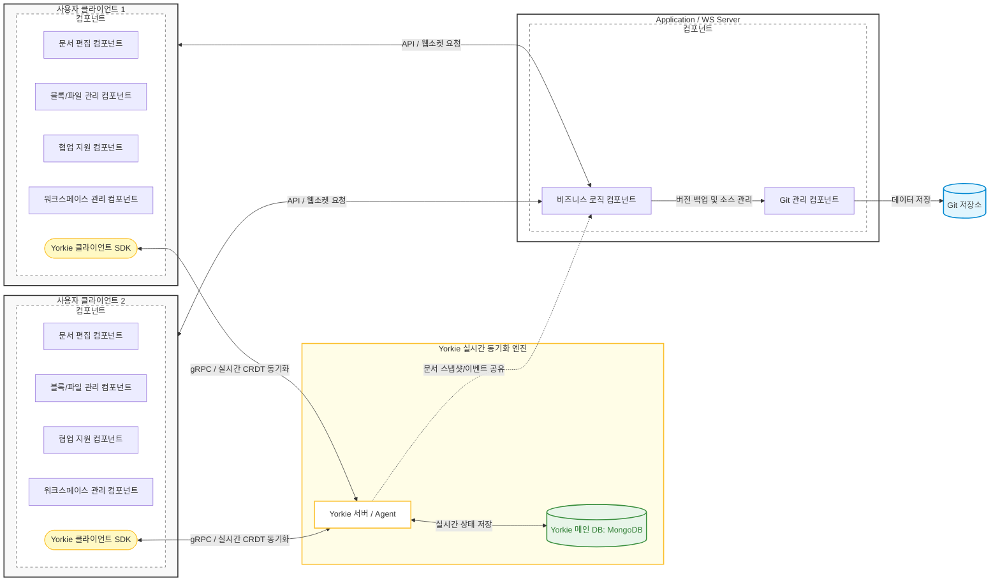
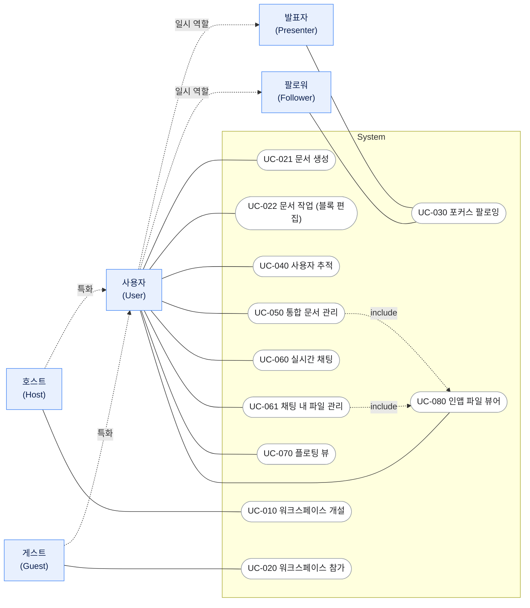
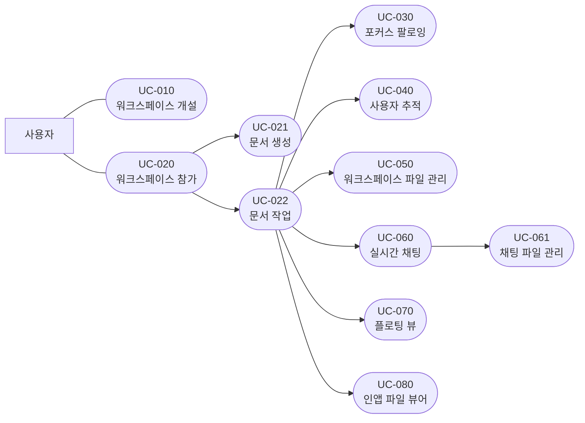
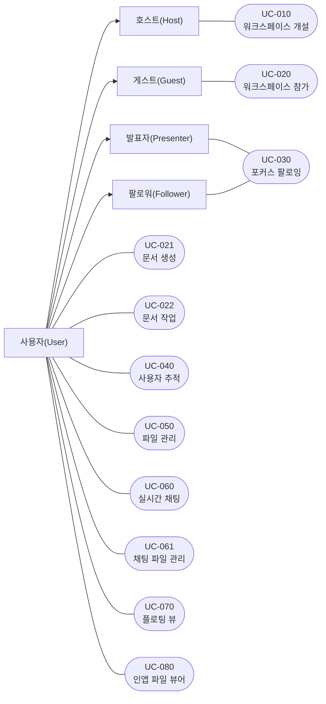

# 요구사항 정의서 (1)

# 제목: 근거리 LAN 기반 실시간 협업 시스템 유즈케이스 명세서

# 1. 시스템 개요

## 1.1. 개발 대상에 대한 소개

본 시스템은 물리적으로 같은 공간에 있는 협업 환경을 전제로 설계한 실시간 문서 협업 시스템이다.

기존 클라우드 기반 협업 도구의 인터넷 의존성 문제를 해결하고, 동일한 공간에서 작업하는 환경에서 발생하는 협업 요구를 시스템 수준에서 지원하고자 기획 되었다.

**개발 목적 및 기능 개요**

본 시스템은 크게 두 가지 핵심 기능으로 구성된다.

첫 번째, 같은 LAN(Local Network Area)에 접속한 다수의 사용자가 동일 문서를 실시간 편집할 수 있다.

두 번째, 근거리 협업에서 필요한 아래의 주요 기능들을 제공한다.

- 포커스 팔로잉: 특정 사용자의 편집 위치를 실시간으로 따라가거나 발표자 시점을 모든 참여자에게 동기화
- 플로팅 참조 뷰: 현재 편집 화면을 유지하면서 다른 문서를 부가 화면으로 참조

**용도 및 사용 환경**

- 회의실, 강의실, 공유 사무 공간 등 팀원이 같은 장소에 모여 문서를 함께 작성하거나 검토하는 상황을 주요 사용 시나리오로 한다.
- Host가 본 시스템을 구동하면 동일 LAN에 연결된 참여자들이 별도 소프트웨어설치 없이 웹 브라우저만으로 접속해 즉시 협업을 시작할 수 있다.

**기대효과**

- 인터넷이 없거나 불안정한 환경에서도 LAN만으로 협업 가능
- 근거리 환경에 특화된 문서 협업 가능

**범위**

- 본 시스템은 Host 측 서버와 참여자 클라이언트(웹 브라우저)로 구성된 단일 소프트웨어이다.
- LAN 네트워크를 통신 환경으로 사용하며, 에디터 엔진 및 실시간 동기화 인프라는 오픈소스 라이브러리를 활용하고 직접 구현 대상에서 제외한다.

## 1.2. 문서의 목적

본 문서는 물리적으로 같은 공간에 있는 팀을 위한 실시간 문서 협업 시스템의 기능적 요구사항과 주요 서비스 흐름을 정의하는 것을 목적으로 한다.

**포함 범위**

다음과 같은 내용을 명확히 한다.

- 시스템이 제공해야 하는 핵심 기능 요구사항 정의
- 시스템이 제공해야 하는 비기능 요구사항 정의
- 사용자와 시스템 간 상호작용 정의
- 시스템과 외부 구성요소 간 상호작용 정의
- 시스템 범위 및 제약사항 정의
- 프로젝트 참여자 간 공통 이해 확보

**제외 범위**

다음 항목은 본 문서의 범위에 포함하지 않으며, 해당 내용은 아래 문서에서 별도로 정의한다.

| 항목 | 상세 정의 문서 | 작성 시기 |
| --- | --- | --- |
| 인프라 구성 | 시스템 아키텍처 설계서 | 개발 전 설계 단계 |
| 시스템 상세 설계 | 소프트웨어 상세 설계서 | 개발 전 설계 단계 |
| API 명세 | API 설계서 | 개발 중 |
| UI/UX 및 디자인 구조 | UI/UX 설계서 | UI 개발 전 |
| 성능 테스트 및 품질 검증 | 테스트 계획서 및 성능 검증 문서 | 개발 전 + 개발 중 테스트 진행 |
| 시스템 배포 및 운영 정책 | 시스템 운영 및 배포 설계서 | 개발 완료 후 패키징 단계 |

따라서 본 문서는 시스템 설계 이전 단계에서 요구사항의 범위와 기능적 목표를 명확히 정의하기 위한 요구사항 명세 문서로 사용된다.

## 1.3. 용어 정의

| 워크스페이스 | 사용자가 동일한 네트워크 환경에서 문서, 파일, 채팅 등의 협업 기능을 함께 사용하는 공유 작업 공간 |
| --- | --- |
| 포커스 팔로잉 | 특정 사용자의 현재 작업 위치 및 화면 이동을 실시간으로 따라가며 확인할 수 있는 기능 |
| 플로팅 뷰 | 특정 블록이나 콘텐츠를 독립된 창 형태로 고정하여 다른 문서를 작업하면서 동시에 참조할 수 있는 기능 |
| 인앱 파일 뷰어 | 외부 프로그램 실행 없이 애플리케이션 내부에서 PDF, 이미지, 텍스트 파일 등을 바로 열람할 수 있는 기능 |
| 충돌 | 동일 문서 영역을 여러 사용자가 동시에 수정하여 발생하는 상태 |
| 블록 | 문서(document)를 구성하는 가장 작은 원자적 데이터 모델이자 UI의 기본 단위
문서 내의 모든 텍스트, 미디어, 레이아웃 요소는 모두 개별 블록으로 취급된다.
본 시스템의 구체적인 블록 종류는 ‘4.1. (부록)블록의 종류’에서 정의한다. |

# 2. 개발대상

## 2.1. 개발대상의 구성과 범위

본 개발대상은 LAN(Local Area Network) 환경에서 협업 문서 작성 기능을 제공하는 협업 시스템이다.

본 시스템은 self-hosted Yorkie 기반 실시간 문서 동기화 구조와 서버 로컬 Git 저장소 기반 변경 이력 관리 구조를 함께 활용하여 협업 기능을 제공한다.

기존 협업 시스템은 대부분 클라우드 또는 중앙 서버 기반의 실시간 동기화 구조를 사용한다. 본 시스템은 동일 LAN 안에서 호스트가 Yorkie 서버와 Application / WS Server를 직접 구동하는 구조를 전제로 한다.

본 시스템은 다음 두 가지 구조를 결합하여 사용한다.

- Yorkie 기반 실시간 문서 동기화 및 Presence 상태 공유
- 서버 로컬 Git 저장소 기반 문서 변경 이력 기록

이를 통해 실시간 협업 기능과 로컬 Git commit 기반 변경 로그 관리 기능을 동시에 제공하는 것을 목표로 한다.

---

**시스템 범위**

본 개발대상은 다음 기능 범위를 포함한다.

- 워크스페이스 기반 협업
- Yorkie 기반 실시간 문서 동기화 및 사용자 상태 공유
- Application / WS Server 기반 협업 상태 relay 및 비즈니스 로직 처리
- 서버 로컬 Git 저장소 기반 문서 저장 및 변경 이력 기록
- 블록 단위 점유 상태 표시
- 사용자 추적 및 발표 모드
- 워크스페이스 내 파일 공유
- 실시간 채팅
- 플로팅 뷰 및 인앱 파일 뷰어

반면 다음 항목은 개발 범위에 포함하지 않는다.

- GitLab, GitHub 등 원격 Git 저장소 서버 구현
- Git 기반 사용자 간 실시간 동기화 구현
- 자동 병합 알고리즘 구현
- CRDT 기반 실시간 동기화 알고리즘 직접 구현
- 텍스트 에디터 구현
- LAN 기반 통신 최적화

---

**시스템 환경 및 상호작용**

본 시스템은 클라이언트, Yorkie 서버, Application / WS Server, 서버 로컬 Git 저장소 간 상호작용을 통해 동작한다.

사용자는 클라이언트 애플리케이션에서 문서를 수정하며, 문서 내용의 실시간 동기화와 충돌 해소는 Yorkie를 통해 수행된다. Application / WS Server는 워크스페이스 관리, 파일 관리, 권한 판단, Git 기록 등 협업에 필요한 비즈니스 로직을 처리한다.

문서 데이터는 실시간 편집 경로에서 직접 Git으로 동기화되지 않는다. 시스템은 Yorkie의 문서 상태를 일정 시점에 서버 파일 시스템에 지연 쓰기하고, 해당 변경분을 서버 로컬 Git 저장소에 commit하여 변경 이력 로그로 보존한다.

시스템은 다음 외부 환경과 상호작용한다.

| 외부 시스템 | 상호작용 내용 |
| --- | --- |
| 서버 로컬 Git 저장소 | 문서 변경 이력 commit 및 복구 기준 보존 |
| LAN 네트워크 | 클라이언트와 서버 간 통신 |
| Application / WS Server | 워크스페이스, 파일, 권한, Git 기록 등 비즈니스 로직 처리 |
| Yorkie | 실시간 문서 동기화, CRDT 기반 충돌 해소, Presence 상태 공유 |
| 파일 시스템 | 문서 및 첨부 파일의 로컬 저장 |

**시스템 구성 요소**

본 시스템은 다음과 같은 주요 컴포넌트로 구성된다.

1. 문서 편집 컴포넌트
    1. 블록 생성, 이동, 수정, 삭제 기능 제공
    2. 블록 점유 상태 관리
2. Git 관리 컴포넌트
    1. 서버 파일 시스템에 기록된 문서 변경분 감지
    2. 로컬 Git 저장소 commit 생성
    3. 변경 이력 관리
    4. 마지막 commit 기준 문서 복구 지원
3. 워크스페이스 관리 컴포넌트
    1. 워크스페이스 생성 및 참가
    2. 문서 및 파일 관리
    3. 파일 업로드 및 다운로드
4. 협업 지원 컴포넌트
    1. 사용자 위치 추적
    2. 발표자 시점 공유
    3. 채팅 기능 제공
5. 블록/파일 관리 컴포넌트
    1. 인앱 파일 뷰어 제공
    2. 플로팅 뷰 제공
6. 동기화 컴포넌트
    1. 문서 내 데이터 동기화
    2. 모든 클라이언트의 상태 동기화

---

## 2.2. 개발 대상의 주요 기능

**문서 협업 기능**

- 블록 단위 문서 편집
- 클라이언트 간 문서 및 상태 동기화
- 충돌 최소화
- 변경 이력 관리

**사용자 협업 기능**

- 사용자 위치 추적
- 발표자 시점 공유
- 실시간 채팅(텍스트 공유, 파일 공유)

**파일 관리 기능**

- 워크스페이스 파일 업로드 및 다운로드
- 인앱 파일 미리보기
- 플로팅 뷰 기반 파일 참조

**문서 협업 기능**

- 글자 단위 타이핑의 실시간 문서 렌더링
- 사용자 상태 정보 제공
- 워크스페이스 접속/비접속 상태 실시간 반영
- 발표자 시점 브로드캐스트

## 2.3. 가정과 의존 관계

### 2.3.1. 가정 사항

**1. 동일한 LAN 환경 접속**

모든 사용자(Host 및 참여자)가 동일한 LAN(자체 핫스팟 또는 공유기로 구성된 서브넷)에 연결되어 있다고 가정한다.
본 시스템의 저지연 실시간 협업은 이 LAN 내부 통신을 전제로 설계되었다.
이 가정이 성립하지 않아 사용자가 서로 다른 네트워크에 있으면 서버 접속 자체가 불가능하거나 실시간 동기화가 보장되지 않으므로 본 문서의 협업 관련 요구사항 대부분이 성립하지 않는다.

협업이 진행되는 동안 Host가 실행하는 서버가 동작 중이라고 가정한다.
본 시스템은 Host가 운영하는 단일 서버를 중심으로 한 서버-클라이언트 구조이므로 서버가 중단되면 실시간 중계와 Git 영속이 모두 멈춘다.

### 2.3.2. 의존 관계

**1. Git 저장소 시스템**

본 시스템은 문서의 영속 저장과 변경 이력 관리를 위해 Git에 의존한다.

- 편집 세션 중의 문서 상태는 Yorkie의 CRDT 문서 모델을 통해 충돌이 해소된 뒤 서버에 유지되며, 시스템은 이 상태를 Markdown(.md) 파일로 서버 파일 시스템에 기록한다.
- 파일 기록은 편집 시점마다 즉시 수행하지 않고 지연 쓰기 방식으로 일정 시점에 수행한다.
- 기록된 파일은 Git 저장소에 commit되어 변경 이력으로 보존된다.
- 따라서 Git은 사용자 간 실시간 동기화 경로가 아니라, 세션 종료 및 서버 재시작 이후 문서를 복원하기 위한 영속 계층이자 버전 이력 관리 수단으로 사용된다.

**2. Yorkie 시스템**

본 시스템의 실시간 문서 협업 기능은 오픈소스 실시간 동기화 엔진인 Yorkie에 의존한다.
본 시스템은 Yorkie가 제공하는 클라우드 서비스를 사용하지 않으며, 호스트가 Yorkie 서버를 컨테이너로 직접 구동하는 셀프 호스팅 방식을 전제로 한다.

- 문서 편집 내용의 클라이언트 간 실시간 동기화와 동시 편집 충돌 해소는 Yorkie의 CRDT 문서 모델에 의존한다.
- 접속자 목록, 사용자 커서 및 작업 위치, 발표자 시점 등 실시간 사용자 상태 공유는 Yorkie의 Presence 및 문서 이벤트 구독 기능에 의존한다.
- 클라이언트는 Yorkie 클라이언트 SDK를 통해 Yorkie 서버와 통신한다.

## 2.4. 운영에 관한 제약사항

**1. 운영 규모 제한**

→ 호스트 유저의 컴퓨팅 자원에 의존해서 이거는 부하 테스트를 적용 후 정리해야할 것 같음

본 시스템은 사용자 8명 이하의 소규모 협업 환경 및 동일 LAN 환경을 주요 대상으로 설계되었다.

**2. 웹 브라우저**

참여자는 데스크톱 또는 모바일 웹 브라우저를 통해 Host 서버에 접속할 수 있다고 가정한다.

본 시스템은 별도의 애플리케이션 설치를 요구하지 않으며, 최신 안정 버전(Stable Release)의 Google Chrome, Microsoft Edge, Mozilla Firefox, Safari 브라우저를 지원한다.

WebSocket, ES6 JavaScript, Local Storage 등 본 시스템이 사용하는 웹 표준 기술을 지원하지 않는 브라우저는 지원 범위에서 제외한다.

웹 브라우저의 요구 버전은 ‘4.2. (부록)웹브라우저 요구 버전’에서 제공한다.

# 3. 요구사항 정의

## 3.1. 유즈케이스

### 3.1.1. 개요

- 참고
    
    본 문서에서 제시하는 유즈케이스들에 대한 개요를 간단히 쓰시기 바랍니다. 여기에서 주요 액터를 정의하고, 필요한 경우, 2.1절에서 설명한 외부 구성요소를 다시 소개하기 바랍니다. 유즈케이스 간의 관계를 시각적으로 표현하는 것이 유용하다고 생각될 경우, 다이어그램을 제시하여도 좋습니다.
    

본 시스템의 유즈케이스는 실시간 문서 협업에 과정을 중심으로 구성된다.

본 시스템은 동일한 네트워크 환경에 있는 사용자가 문서를 생성, 편집하고 실시간으로 협업할 수 있는 워크스페이스 기반 협업 도구이다.

사용자는 워크스페이스를 개설하거나 참가할 수 있으며 블록 기반 문서 편집, 실시간 채팅, 파일 관리, 사용자 추적, 발표 기능 등을 활용하여 협업을 수행할 수 있다.

- 문서(페이지): 생성·편집 단위
- 블록: 문서 내 편집 단위
- 문서 트리: 문서/폴더의 계층(사이드바) 파일 미포함
- 임베딩 파일(첨부 파일): 문서 내의 블록에 임베딩 / 채팅에 첨부된 파일
- 워크스페이스: 동일 환경에서 협업하는 공유 작업 공간

| 액터 | 구분 | 정의 | 관련 유즈케이스 |
| --- | --- | --- | --- |
| 사용자(User) | 상위 주체 | 워크스페이스에서 협업하는 모든 주체 | UC-021, 022, 040, 050, 060, 061, 070, 080 |
| 호스트(Host) | 사용자의 역할 | 서버를 개설·운영하는 사용자 | UC-010 |
| 게스트(Guest) | 사용자의 역할 | 워크스페이스에 참가한 비-호스트 사용자 | UC-020 |
| 발표자(Presenter) | 사용자의 일시 역할 | 화면 공유를 시작한 사용자 | UC-030 |
| 팔로워(Follower) | 사용자의 일시 역할 | 발표자의 시점을 따라가는 사용자 | UC-030 |

본 시스템에서 제공하는 주요 유즈케이스는 워크스페이스 개설 및 참가, 문서 생성 및 편집, 발표 및 사용자 추적, 파일 관리, 실시간 채팅, 플로팅 뷰, 인앱 파일 뷰어 기능으로 구성된다.

**UC다이어그램으로업데이트**

정확한 사용자의 기능별 분류

### 3.1.2. 유즈케이스 시나리오

## UC-010

| 항목 | 내용 |
| --- | --- |
| 유즈케이스명 | 워크스페이스 개설 |
| ID | UC-010 |
| 작성일 | 2026-06-02 |
| 우선순위 | 높음 |

| 항목 | 내용 |
| --- | --- |
| 액터 | 호스트 |
| 개요 | 호스트가 워크스페이스를 개설하고 접근 비밀번호를 설정하여 사용자가 참가할 수 있는 상태로 만든다. |
| 사전 조건 |   • 호스트가 워크스페이스 서버를 구동을 위한 본 프로젝트의 Docker 이미지 파일이 준비 되어 있다. |
| 기본 흐름 |   1. 호스트가 서버를 활성화한다.
  2. 시스템은 초기 설정 화면(워크스페이스 이름, 접근 비밀번호 입력란)을 표시한다.
  3. 호스트가 설정을 완료하고 개설을 확정한다.
  4. 시스템은 워크스페이스를 생성하고 참가용 접속 주소를 호스트에게 표시 후 워크스페이스를 '참가 가능' 상태로 전환한다. |
| 대안 흐름 | **E1-1. 기존 워크스페이스 재개
  1.** 보존된 워크스페이스 데이터가 존재하면 시스템은 새로 생성하지 않고 기존 워크스페이스를 복원하여 해당 워크스페이스를 '참가 가능' 상태로 전환한다.

**E1-2. 서버 시작 실패
  1.** 시스템은 실패 사유를 호스트 화면에 표시한다. |
| 결과 |   • 워크스페이스가 개설(또는 재개)되어 사용자가 참가 가능한 상태가 된다.
  • 호스트가 공유할 접속 주소와 설정한 비밀번호를 갖는다. |
| 비고 |   • 컨테이너 배포 자체의 상세는 운영/배포 문서에서 다룬다. |

## UC-020

| 항목 | 내용 |
| --- | --- |
| 유즈케이스명 | 워크스페이스 참가 |
| ID | UC-020 |
| 작성일 | 2026-05-28 |
| 우선순위 | 매우 높음 |

| 항목 | 내용 |
| --- | --- |
| 액터 | 게스트 |
| 개요 | 게스트가 호스트가 개설한 워크스페이스에 참가하여 문서 트리와 접속자 목록을 보고 협업을 시작할 수 있는 상태가 된다. |
| 사전 조건 |   • 호스트가 워크스페이스를 개설해 운영 중이다(UC-010).
  • 사용자가 호스트의 접속 주소에 도달할 수 있다.
  • 사용자가 접속 주소와 비밀번호를 알고 있다. |
| 기본 흐름 |   1. 게스트가 호스트가 안내한 접속 주소를 브라우저에 입력한다.
  2. 시스템은 참가 화면(워크스페이스 이름, 유저네임, 비밀번호 입력란)을 표시한다.
  3. 게스트가 유저네임과 비밀번호를 입력하고 '참가'를 누른다.
  4. 시스템은 비밀번호가 일치하면 사용자를 워크스페이스에 입장시킨다.
  5. 시스템은 사용자 화면에 문서 트리와 접속자 목록을 표시한다.
  6. 시스템은 기존 접속자들의 접속자 목록에 해당 사용자의 이름과 색상 태그를 추가해 표시한다. |
| 대안 흐름 | **E1. 서버 접속 실패
  1.** 브라우저가 접속 실패를 게스트 화면에 표시한다.

**E3. 비밀번호 불일치
  1.** 시스템은 오류 메시지를 게스트 화면에 표시하고 재입력을 요청한다.

**E3a. 기존 유저네임으로 참가(동일 사용자 재접속)
  1.** 시스템은 입력된 유저네임이 이미 존재하면 게스트를 해당 사용자로 입장시킨다.
  2. 시스템은 그 사용자의 활성 표시(목록, 위치)를 현재 연결 기준으로 갱신한다. |
| 결과 |   • 게스트가 워크스페이스에 입장해 문서 트리와 접속자 목록을 볼 수 있다.
  • 접속자 목록에 해당 게스트가 추가된다. |
| 비고 |  |

## UC-021

| 항목 | 내용 |
| --- | --- |
| 유즈케이스명 | 문서 생성 |
| ID | UC-021 |
| 작성일 | 2026-06-01 |
| 우선순위 | 높음 |

| 항목 | 내용 |
| --- | --- |
| 액터 | 사용자 |
| 개요 | 사용자가 워크스페이스에 새 문서를 만들어 편집을 시작할 수 있는 상태가 된다. |
| 사전 조건 |   • 사용자가 워크스페이스에 로그인한 상태다(UC-020). |
| 기본 흐름 |   1. 사용자가 사이드바에서 '문서 생성'을 클릭한다.
  2. 시스템은 문서 이름 입력 창을 표시한다.
  3. 사용자가 문서 이름을 입력한다.
  4. 시스템은 동일한 이름의 문서가 없으면 시스템은 새 문서를 생성하고 문서 이름을 워크스페이스 문서 트리에 추가한다.
  5. 시스템은 생성된 문서의 편집기를 사용자 편집 화면에 표시한다.
  6. 시스템은 생성된 문서의 이름, 위치 정보, 생성 시간 정보를 다른 접속 사용자에게 실시간으로 전달한다.
  7. 시스템은 다른 사용자 화면의 워크스페이스 문서 트리에 새 문서를 표시한다. |
| 대안 흐름 | **E1a. 하위 문서 생성**
  1. 사용자가 기존 문서/폴더에서 '새 하위 문서'를 선택한다.

**E4a. 이름 중복**
  1. 시스템은 중복된 이름 뒤에 겹치지 않는 식별자를 더하여 새로운 문서를 생성하고 문서 이름을 워크스페이스 문서 트리에 추가한다. |
| 결과 |   • 새 문서가 생성자의 워크스페이스 문서 트리에 나타나고 텍스트 편집기가 표시된다.
  • 다른 접속자의 트리에 생성된 문서의 이름이 표시된다. |
| 비고 |   • 새 문서는 생성자에게만 열리고, 다른 접속자는 트리에 노드만 나타난다(자동 이동 없음).
  • 모든 참가 사용자가 문서를 생성할 수 있다. |

## UC-022

| 항목 | 내용 |
| --- | --- |
| 유즈케이스명 | 문서 작업 (블록 편집) |
| ID | UC-022 |
| 작성일 | 2026-06-01 |
| 우선순위 | 매우 높음 |

| 항목 | 내용 |
| --- | --- |
| 액터 | 사용자 1, 사용자 1 외 다른 사용자 |
| 개요 | 사용자가 문서 내 블록을 생성/수정/이동하며 변경이 모든 사용자에게 실시간 공유된다. |
| 사전 조건 |   • 사용자가 워크스페이스에 접속 중이다. |
| 기본 흐름 |   1. 사용자 1이 블록을 클릭하거나 '/'로 새 블록을 추가한다.
  2. 사용자 1이 블록 내용을 수정한다.
  3. 시스템은 수정된 블록의 텍스트 내용, 블록 위치 정보, 수정 시간 정보를 다른 사용자에게 실시간으로 전달한다.
  4. 시스템은 다른 사용자 화면에 수정된 블록 정보를 실시간으로 표시한다. |
| 대안 흐름 | **E2-1. 블록 순서 변경**
  1. 사용자가 블록을 이동한다.
  2. 시스템은 수정된 블록의 순서 정보를 다른 사용자에게 실시간으로 전달한다.
  3. 시스템은 다른 사용자 화면에 수정된 블록의 순서를 변경하여 표시한다.

**E3. 블록 삭제**
  1. 시스템은 블록을 삭제한다.
  2. 시스템은 삭제된 블록 정보를 다른 사용자의 화면에 실시간으로 반영한다.
 
**E4. 연결 끊김 (유예 시간 이내)
  1.** 사용자 1의 연결이 끊긴다.
  2. 사용자 1는 연결 끊김 전 선택 중이던 블록을 계속 편집한다.
  3. 사용자 1의 연결이 복구된다.
  4. 사용자 1의 변경 내용이 시스템에게 전달한다.
  5. 시스템은 수정된 블록의 텍스트 내용, 블록 위치 정보, 수정 시간 정보를 다른 사용자에게 실시간으로 전달한다.
  6. 시스템은 다른 사용자 화면에 수정된 블록 정보를 실시간으로 표시한다. |
| 결과 |  • 수정된 블록의 정보(블록 위치, 블록의 텍스트 내용, 수정 시간 정보)를 모든 사용자의 화면에 실시간으로 표시한다. |
| 비고 |  • 유예 시간은 n ms로 설정한다. |

## UC-030

| 항목 | 내용 |
| --- | --- |
| 유즈케이스명 | 사용자 추적 포커스 팔로잉 |
| ID | UC-030 |
| 작성일 | 2026-05-28 |
| 우선순위 | 높음 |

| 항목 | 내용 |
| --- | --- |
| 액터 | 사용자(발표자), 사용자(참여자) |
| 개요 | 발표자가 바라보고 있는 문서로 시점을 고정시킨다. |
| 사전 조건 |   • 다수의 사용자가 동일 워크스페이스에 접속 중이다. |
| 기본 흐름 |   1. 발표자가 "공유하기" 버튼을 클릭한다.
  2. 시스템은 발표 세션을 생성하고 발표자의 현재 문서 ID, 화면 위치 정보, 스크롤 위치 정보를 저장한다.
  3. 시스템은 워크스페이스 참여자 화면에 "발표자가 화면 공유를 시작했습니다" 알림과 "참여하기" 버튼을 표시한다.
  4. 참여자 "참여하기" 버튼을 클릭한다.
  5. 시스템은 참여자의 화면을 발표자의 현재 문서 및 화면 위치로 이동시키고 발표 모드 상태로 전환한다.
  6. 시스템은 발표 모드에 참여한 사용자의 문서 수정 기능과 개별 화면 이동 기능을 제한한다.
  7. 발표자가 문서를 이동하거나 화면 위치 및 스크롤 위치를 변경한다.
  8. 시스템은 변경된 문서 ID, 화면 위치 정보, 스크롤 위치 정보를 참여자에게 실시간으로 전달한다.
  9. 시스템은 참여자 화면을 발표자의 화면 위치와 동일하게 표시한다. |
| 대안 흐름 | **E3-1. 참여자의 일시 정지**
  1. 참여자가 "일시 정지" 버튼을 클릭한다.
  2. 시스템은 참여자의 발표 모드 상태를 해제한다.
  3. 시스템은 참여자의 화면 시점 고정을 해제하고 문서 수정 및 화면 이동 기능을 허용한다.
  4. 참여자가 "재개" 버튼을 클릭한다.
  5. 시스템은 참여자의 발표 모드 상태를 다시 활성화한다.
  6. 시스템은 참여자의 화면을 발표자의 현재 문서 및 화면 위치 정보와 다시 동기화한다.

**E3-2. 참여자의 포커스 팔로잉 종료**
  1. 참여자가 "종료" 버튼을 클릭한다.
  2. 시스템은 참여자의 발표 모드 상태를 종료한다.
  3. 시스템은 참여자의 시점 고정 및 문서 수정 제한을 해제한다.

**E3-3. 발표자의 접속 종료**
  1. 발표자의 연결이 종료되거나 발표자가 발표를 종료한다.
  2. 시스템은 발표 세션을 종료한다.
  3. 시스템은 참여자 화면에 "공유가 종료되었습니다." 메시지를 표시한다.
  4. 시스템은 참여자의 화면 시점 고정 및 문서 수정 제한 상태를 해제한다.

E**3a. 발표자 도구**
  1. 발표자가 발표 도구를 사용하여 특정 문서 영역 또는 블록을 강조한다.
  2. 시스템은 강조 대상의 문서 ID, 블록 위치 정보, 강조 상태 정보를 참여자에게 실시간으로 전달한다.
  3. 시스템은 참여자 화면에 강조 표시를 적용한다.
  4. 발표가 종료되면 시스템은 강조 관련 메타데이터를 제거하고 참여자 화면의 강조 표시를 해제한다. |
| 결과 |   • 참여자는 발표자의 발표 위치를 실시간으로 확인할 수 있다.
  • 회의 중 커뮤니케이션 비용이 감소한다. |
| 비고 |   • 발표자 도구는 텍스트 하이라이팅, 밑줄 도구가 제공된다. |

## UC-040

| 항목 | 내용 |
| --- | --- |
| 유즈케이스명 | 사용자 추적 |
| ID | UC-040 |
| 작성일 | 2026-05-28 |
| 우선순위 | 보통 |

| 항목 | 내용 |
| --- | --- |
| 액터 | 사용자1, 사용자2 |
| 개요 | 협업 참여자의 현재 작업 위치를 빠르게 확인하고 확인 전 위치로 복귀할 수 있다. |
| 사전 조건 |   • 다수의 사용자가 동일 워크스페이스에 접속 중이다. |
| 기본 흐름 |   1. 시스템은 현재 워크스페이스에 접속 중인 사용자 목록과 각 사용자의 현재 작업 문서 정보를 표시한다.
  2. 사용자1이 사용자 목록에서 사용자2를 클릭한다.
  3. 시스템은 사용자2의 현재 작업 문서 ID, 화면 위치 정보, 스크롤 위치 정보를 조회한다.
  4. 시스템은 사용자1의 화면을 사용자2의 현재 작업 문서 및 화면 위치로 이동시킨다.
  5. 시스템은 사용자1 화면에 사용자2의 현재 작업 위치를 표시한다.
  6. 사용자1이 뒤로가기 버튼을 클릭한다.
  7. 시스템은 사용자1 화면을 기존 작업 문서로 이동시킨다. |
| 대안 흐름 | **E1. 사용자2의 접속 종료**
  1. 시스템은 사용자2의 아이콘이 흐림 상태로 표시하고 클릭 불가능 상태로 만든다. |
| 결과 |   • 동료의 현재 작업 위치를 즉시 확인할 수 있다.
  • 동료를 찾기 위해 문서를 헤매는 탐색 비용이 감소한다. |
| 비고 |   • 사용자 색상 태그로 위치를 시각화한다.
  • 워크스페이스 인덱스에서 사용자 태그로 접속 위치 확인이 가능하다. |

## UC-050

| 항목 | 내용 |
| --- | --- |
| 유즈케이스명 | 워크스페이스 통합 문서 관리 |
| ID | UC-050 |
| 작성일 | 2026-05-28 |
| 우선순위 | 높음 |

| 항목 | 내용 |
| --- | --- |
| 액터 | 사용자 |
| 개요 | 워크스페이스 내 모든 문서에 임베딩된 파일을 한곳에 모아 열람/다운로드하고 원본 위치로 이동한다. |
| 사전 조건 |   • 사용자가 동일 워크스페이스에 접속 중이다. |
| 기본 흐름 |   1. 사용자가 워크스페이스 파일 관리 메뉴를 클릭한다.
  2. 시스템은 워크스페이스 문서에 임베딩된 파일 목록을 조회한다.
  3. 시스템은 파일의 이름, 파일 종류(이미지/PDF 등), 파일 크기, 생성 문서 정보를 파일 종류별로 분류하여 표시한다.
  4. 사용자가 파일 목록에서 특정 파일을 클릭한다.
  5. 시스템은 선택한 파일의 파일 ID 및 저장 경로 정보를 조회한다.
  6. 시스템은 사용자 화면에 파일 미리보기를 표시한다. |
| 대안 흐름 | **E3-1. 다운로드**
  1. 사용자가 다운로드 버튼을 클릭한다.
  2. 시스템은 선택한 파일의 원본 파일 데이터를 사용자에게 전송한다.
  3. 시스템은 사용자 로컬 저장소에 파일 다운로드를 수행한다.

**E3-2. 원본 삭제됨**
  1. 시스템은 파일이 포함된 원본 블록의 존재 여부를 확인한다.
  2. 원본 블록이 삭제된 경우 시스템은 해당 파일을 파일 목록에서 제외한다.

**E3-3. 원본으로 위치 이동**
  1. 사용자가 "원본 위치 이동" 버튼을 클릭한다.
  2. 시스템은 해당 파일이 포함된 문서 ID 및 블록 위치 정보를 조회한다.
  3. 시스템은 사용자 화면을 해당 문서 및 블록 위치로 이동시킨다.
  4. 시스템은 사용자 화면에 파일이 포함된 블록 위치를 표시한다. |
| 결과 |   • 워크스페이스에 흩어진 파일을 한곳에서 탐색/열람/다운로드할 수 있다. |
| 비고 |   • 파일이 속해있는 문서 정보를 함께 표시한다.
  • UC-061(채팅 파일 관리)과 동작은 유사하나 처리 과정이 달라 별개 유즈케이스이다. |

## UC-060

| 항목 | 내용 |
| --- | --- |
| 유즈케이스명 | 워크스페이스 내 실시간 채팅 |
| ID | UC-060 |
| 작성일 | 2026-05-28 |
| 우선순위 | 높음 |

| 항목 | 내용 |
| --- | --- |
| 액터 | 사용자1, 사용자1 외 다른 사용자 |
| 개요 | 협업 중 별도 메신저 없이 워크스페이스 내부에서 텍스트/URL/파일/블록 링크를 실시간으로 주고받는다. |
| 사전 조건 |   • 사용자가 동일 워크스페이스에 접속 중이다. |
| 기본 흐름 |   1. 사용자1이 채팅창에 텍스트 또는 URL을 입력하거나 파일을 첨부한다.
  2. 사용자1이 전송 버튼을 클릭한다.
  3. 시스템은 메시지 내용, 첨부 파일 정보, 전송 사용자 정보, 전송 시간 정보를 생성한다.
  4. 시스템은 생성된 채팅 데이터를 워크스페이스 채팅 기록에 저장한다.
  5. 시스템은 메시지 내용, 첨부 파일 정보, 전송 사용자 정보, 전송 시간 정보를 다른 접속 사용자에게 실시간으로 전달한다.
  6. 시스템은 다른 사용자 화면의 채팅창에 전송된 메시지 및 파일 정보를 표시한다.
  7. 다른 사용자가 채팅창에서 메시지, 첨부 파일, URL 정보를 확인한다. |
| 대안 흐름 | **E1-1. 전송 실패**
  1. 메시지 또는 파일 전송 과정에서 오류가 발생한다.
  2. 시스템은 사용자 화면에 전송 실패 메시지를 표시한다.
  3. 시스템은 실패한 메시지에 대해 재전송 버튼을 제공한다.
  4. 사용자가 재전송 버튼을 클릭한다.
  5. 시스템은 메시지 전송(기본 흐름 5, 6)을 다시 시도한다.

**E7a. 블록/문서 링크 선택**
  1. 사용자가 채팅 메시지 내의 블록 또는 문서 링크를 클릭한다.
  2. 시스템은 링크에 포함된 문서 ID 및 블록 위치 정보를 조회한다.
  3. 시스템은 사용자 화면을 해당 문서 및 블록 위치로 이동시킨다.
  4. 시스템은 사용자 화면에 연결된 블록 또는 문서를 표시한다. |
| 결과 |   • 채팅 내역이 워크스페이스 기록에 저장된다.
  • 사용자 간 협업 커뮤니케이션이 가능해진다.
  • 구두로 전달하기 어려운 텍스트/URL/파일을 즉시 공유할 수 있다. |
| 비고 |   • 문서 블록 링크를 채팅에 첨부할 수 있다.
  • 시스템은 알림을 채팅에 표시한다.
  • 세부 사항은 UC-061 참조 |

## UC-061

| 항목 | 내용 |
| --- | --- |
| 유즈케이스명 | 채팅 내 파일 관리 |
| ID | UC-061 |
| 작성일 | 2026-06-01 |
| 우선순위 | 보통 |

| 항목 | 내용 |
| --- | --- |
| 액터 | 사용자 |
| 개요 | 채팅으로 주고받은 파일/이미지/링크를 종류별로 모아 열람/다운로드하고 원본 메시지로 이동한다. |
| 사전 조건 |   • 사용자가 워크스페이스에 접속 중이다.
  • 채팅에 파일이 공유된 적이 있다. |
| 기본 흐름 |   1. 사용자가 채팅 패널에서 첨부 파일 관리 메뉴를 클릭한다.
  2. 시스템은 채팅에 공유된 파일 및 링크 목록을 조회한다.
  3. 시스템은 파일 이름, 파일 종류(이미지/PDF/문서), 전송 사용자 정보, 전송 시간 정보를 종류별 탭으로 분류하여 표시한다.
  4. 사용자가 파일 목록에서 특정 파일의 미리보기를 클릭한다.
  5. 시스템은 선택한 파일의 파일 ID 및 저장 경로 정보를 조회한다.
  6. 시스템은 사용자 화면에 해당 파일의 미리보기를 표시한다. |
| 대안 흐름 | **E3. 파일 다운로드**
  1. 사용자가 다운로드 버튼을 클릭한다.
  2. 시스템은 선택한 파일의 원본 파일 데이터를 사용자에게 전송한다.
  3. 시스템은 사용자 로컬 저장소에 파일 다운로드를 수행한다. |
| 결과 |   • 채팅에 흩어진 파일/링크를 한 곳에서 탐색/열람/다운로드할 수 있다. |
| 비고 |   • UC-060(채팅)의 세부 유즈케이스이다.
  • 파일 업로드는 채팅 메시지(UC-060)를 통해서만 가능하다. |

## UC-070

| 항목 | 내용 |
| --- | --- |
| 유즈케이스명 | 플로팅 뷰 |
| ID | UC-070 |
| 작성일 | 2026-05-28 |
| 우선순위 | 보통 |

| 항목 | 내용 |
| --- | --- |
| 액터 | 사용자 |
| 개요 | 파일, 블록을 플로팅 뷰로 고정하여 문서 작업 중에도 지속적으로 참조 가능하다. |
| 사전 조건 |   • 워크스페이스에 사용자가 접속 중이어야 한다. |
| 기본 흐름 |   1. 사용자가 참조할 블록 또는 파일에서 "플로팅 뷰로 열기" 버튼을 클릭한다.
  2. 시스템은 선택한 블록 또는 파일의 문서 ID, 블록 위치 정보, 콘텐츠 데이터를 조회한다.
  3. 시스템은 사용자 화면에 해당 블록 또는 파일 내용을 포함한 플로팅 뷰를 생성한다.
  4. 시스템은 플로팅 뷰를 현재 작업 화면 위에 고정하여 표시한다.
  5. 사용자가 다른 문서로 이동하거나 화면 위치를 변경한다.
  6. 시스템은 문서 이동 및 화면 전환과 관계없이 플로팅 뷰를 유지한다.
  7. 사용자는 플로팅 뷰의 내용을 참조하며 현재 문서를 작성 또는 수정한다. |
| 대안 흐름 | **E4-1. 원본 블록 수정**
  1. 다른 사용자가 원본 블록 또는 파일 내용을 수정한다.
  2. 시스템은 수정된 블록 내용, 파일 정보, 수정 시간 정보를 실시간으로 수신한다.
  3. 시스템은 변경된 내용을 플로팅 뷰에 실시간으로 반영한다.

**E4-2. 원본 블록 삭제**
  1. 다른 사용자가 원본 블록 또는 파일을 삭제한다.
  2. 시스템은 원본 데이터 삭제 상태를 확인한다.
  3. 시스템은 해당 플로팅 뷰를 비활성화한다.
  4. 시스템은 사용자 화면에 "원본 블록이 삭제되었습니다." 메시지를 표시한다. |
| 결과 |   • 사용자는 여러 문서를 동시에 참조하며 작업할 수 있다.
  • 협업 중 정보 탐색 시간이 감소한다. |
| 비고 |   • 파일 블록의 경우 이미지, PDF, Word, PPT, Excel을 지원한다.
  • 1개 이상의 플로팅 블록을 동시에 띄울 수 있다. |

## UC-080

| 항목 | 내용 |
| --- | --- |
| 유즈케이스명 | 인앱 파일 뷰어 |
| ID | UC-080 |
| 작성일 | 2026-05-28 |
| 우선순위 | 보통 |

| 항목 | 내용 |
| --- | --- |
| 액터 | 사용자 |
| 개요 | 외부 프로그램 실행 없이 애플리케이션 내부에서 파일 내용을 즉시 확인한다. |
| 사전 조건 |   • 워크스페이스에 사용자가 접속 중이어야 한다. |
| 기본 흐름 |   1. 사용자가 문서의 파일 블록 또는 파일 관리 화면의 파일을 클릭한다.
  2. 시스템은 선택한 파일의 파일 ID, 파일 형식, 저장 경로 정보를 조회한다.
  3. 시스템은 파일 형식의 미리보기 지원 여부를 확인한다.
  4. 시스템은 사용자 화면에 인앱 파일 뷰어를 활성화하고 파일 내용을 표시한다.
  5. 사용자가 인앱 파일 뷰어에서 파일 내용을 확인한다.
  6. 사용자가 인앱 뷰어 종료 버튼을 클릭한다.
  7. 시스템은 인앱 파일 뷰어를 비활성화하고 이전 작업 화면으로 복귀시킨다. |
| 대안 흐름 | E3. 지원하지 않는 파일 형식
  1. 시스템은 선택한 파일의 형식이 미리보기 미지원 형식임을 확인한다.
  2. 시스템은 사용자 화면에 "미리보기 불가" 메시지를 표시한다.
  3. 시스템은 파일 다운로드 기능을 제공한다. |
| 결과 |   • 사용자는 외부 프로그램 전환 없이 파일 내용을 확인할 수 있다.
  • 문서 기반 협업 흐름이 유지된다. |
| 비고 |   • 파일은 PDF, Word, PPT, Excel을 지원한다. |

## 3.2. 인터페이스 요구사항

### 3.2.1. 유저 인터페이스

| 항목 | 내용 |
| --- | --- |
| 요구사항 고유번호 | SIR001 |
| 요구사항 명칭 | 워크스페이스 개설 인터페이스 |
| 요구사항 분류 | 인터페이스 |
| 관련 유즈케이스 | 워크스페이스 개설(UC-010) |
| 중요도 | 높음 |
| 요구사항 상세설명 | 사용자가 워크스페이스 서버를 활성화하고 초기 설정을 수행하여 참가 가능한 협업 워크스페이스를 생성할 수 있는 인터페이스를 제공한다. |
| 세부 내용 |   • 시스템은 워크스페이스 이름 입력란과 접근 비밀번호 입력란을 포함한 초기 설정 화면을 제공해야 한다.
  • 용자는 워크스페이스 개설 설정을 완료하고 생성 요청을 수행할 수 있어야 한다.
  • 시스템은 워크스페이스 생성 후 참가용 접속 주소를 사용자에게 제공해야 한다.
  • 시스템은 워크스페이스 상태를 '참가 가능' 상태로 표시해야 한다. |
| 기타 고려 사항 |   • 기존 워크스페이스 데이터 존재 시 복원 기능을 제공해야 한다.
  • Docker 컨테이너 배포 상세는 운영/배포 문서에서 관리한다. |
| 산출 정보 |   • 워크스페이스 이름
  • 접근 비밀번호
  • 참가용 접속 주소
  • 워크스페이스 상태 정보 |

| 항목 | 내용 |
| --- | --- |
| 요구사항 고유번호 | SIR002 |
| 요구사항 명칭 | 워크스페이스 참가 인터페이스 |
| 요구사항 분류 | 인터페이스 |
| 관련 유즈케이스 | 워크스페이스 참가(UC-020) |
| 중요도 | 높음 |
| 요구사항 상세설명 | 사용자가 호스트가 개설한 워크스페이스에 접속하여 문서와 접속자 목록을 확인하고 협업을 시작할 수 있는 인터페이스를 제공한다. |
| 세부 내용 |   • 시스템은 워크스페이스 이름, 유저네임 입력란, 비밀번호 입력란, 참가 버튼을 포함한 참가 화면을 제공해야 한다.
  • 사용자는 접속 주소를 통해 워크스페이스 참가 화면에 접근할 수 있어야 한다.
  • 시스템은 입력된 비밀번호를 검증하고 사용자를 워크스페이스에 입장시켜야 한다.
  • 시스템은 사용자 화면에 문서 트리와 현재 접속자 목록을 표시해야 한다.
  • 시스템은 새로 접속한 사용자의 이름 및 색상 태그를 모든 접속자의 사용자 목록에 실시간으로 표시해야 한다. |
| 기타 고려 사항 |   • 서버 접속 실패 시 브라우저는 접속 실패 메시지를 제공해야 한다.
  • 비밀번호 불일치 시 오류 메시지와 재입력 기능을 제공해야 한다. |
| 산출 정보 |   • 워크스페이스 이름
  • 접근 비밀번호
  • 참가용 접속 주소
  • 워크스페이스 상태 정보 |

| 항목 | 내용 |
| --- | --- |
| 요구사항 고유번호 | SIR003 |
| 요구사항 명칭 | 실시간 문서 협업 인터페이스 |
| 요구사항 분류 | 인터페이스 |
| 관련 유즈케이스 | 문서 생성(UC-021), 문서 작업(UC-022) |
| 중요도 | 높음 |
| 요구사항 상세설명 | 사용자가 동일 문서를 동시에 편집할 수 있도록 블록 기반 실시간 협업 인터페이스를 제공한다. |
| 세부 내용 |   • 사용자는 블록 클릭 또는 '/' 입력으로 블록을 생성할 수 있어야 한다.
  • 사용자는 (부록)4.1. 블록의 종류에 따라 내용을 수정할 수 있어야 한다.
  • 사용자는 블록을 수정, 이동할 수 있어야 한다.
  • 시스템은 블록 점유 상태를 실시간으로 표시해야 한다.
  • 블록 점유 상태는 편집 차단을 의미하지 않으며, 다른 사용자가 해당 블록을 편집하는 것을 막지 않는다.
  • 시스템은 수정된 블록 내용 및 위치 정보를 다른 사용자 화면에 실시간 반영해야 한다.
  • 시스템은 워크스페이스 내 문서 구조를 표시해야 한다.
  • 사용자는 워크스페이스 내 모든 문서에 접근할 수 있어야 한다. |
| 기타 고려 사항 |   • 동시 편집 충돌 해소는 Yorkie의 CRDT 문서 모델에 의존한다.
  • 블록 점유 상태는 사용자별로 구분되어 표시되어야 한다.
  • 사용자가 블록을 선택하거나 커서를 해당 블록에 두면 점유 상태로 표시하고, 다른 블록으로 이동하거나 선택을 해제하면 점유 상태를 해제한다. |
| 산출 정보 |   • 사용자 이름
  • 사용자 색상 태그
  • 접속 상태 정보
  • 문서 트리 정보 |

| 항목 | 내용 |
| --- | --- |
| 요구사항 고유번호 | SIR004 |
| 요구사항 명칭 | 발표 및 포커스 팔로잉 인터페이스 |
| 요구사항 분류 | 인터페이스 |
| 관련 유즈케이스 | 사용자 추적 포커스 팔로잉(UC-030) |
| 중요도 | 높음 |
| 요구사항 상세설명 | 발표자의 화면 위치와 문서 상태를 참여자 화면에 동기화하는 인터페이스를 제공한다. |
| 세부 내용 |   • 발표자는 화면 공유를 시작할 수 있어야 한다.
  • 시스템은 발표자에게 발표자 도구를 제공해야 한다.
  • 참여자는 발표 모드에 참여할 수 있어야 한다. |
| 기타 고려 사항 |   • 참여자는 일시 정지 및 재개 기능을 사용할 수 있어야 한다.
  • 발표 종료 시 참여자의 수정 제한 상태를 해제해야 한다. |
| 산출 정보 |   • 문서 ID
  • 화면 위치 정보
  • 스크롤 위치 정보
  • 블록 위치 정보
  • 텍스트 메타 정보 |

| 항목 | 내용 |
| --- | --- |
| 요구사항 고유번호 | SIR005 |
| 요구사항 명칭 | 파일 관리 인터페이스 |
| 요구사항 분류 | 인터페이스 |
| 관련 유즈케이스 | 워크스페이스 통합 문서 관리(UC-050) |
| 중요도 | 보통 |
| 요구사항 상세설명 | 사용자에게 문서에 임베딩 된 파일을 관리할 수 있는 인터페이스를 제공한다. |
| 세부 내용 |   • 시스템은 워크스페이스 파일 관리 화면을 제공해야 한다.
  • 시스템은 파일을 종류별(이미지, PDF, 문서 등)로 분류하여 표시해야 한다.
  • 시스템은 파일 이름, 파일 종류, 생성 문서, 업로드 사용자 정보를 표시해야 한다.
  • 사용자는 파일 미리보기 및 다운로드 기능을 수행할 수 있어야 한다. |
| 기타 고려 사항 |   • 시스템은 원본 블록 삭제 시 해당 파일을 목록에서 제외해야 한다.
  • 시스템은 파일 원본 위치 이동 기능을 제공해야 한다. |
| 산출 정보 |   • 파일 정보
  • 파일 위치 정보
  • 파일 생성 정보
  • 연관 문서 ID 정보 |

| 항목 | 내용 |
| --- | --- |
| 요구사항 고유번호 | SIR006 |
| 요구사항 명칭 | 실시간 채팅 인터페이스 |
| 요구사항 분류 | 인터페이스 |
| 관련 유즈케이스 | 워크스페이스 내 실시간 채팅(UC-060) |
| 중요도 | 높음 |
| 요구사항 상세설명 | 사용자 간 텍스트, 파일, 링크를 실시간으로 공유할 수 있는 채팅 인터페이스를 제공한다. |
| 세부 내용 |   • 사용자는 텍스트, URL, 파일을 전송할 수 있어야 한다.
  • 시스템은 블록/문서 링크 이동 기능을 제공해야 한다. |
| 기타 고려 사항 |   • 시스템은 메시지 전송 실패 시 재전송 기능을 제공해야 한다. |
| 산출 정보 |   • 메시지 내용
  • 첨부 파일 정보
  • 전송 시간 정보 |

| 항목 | 내용 |
| --- | --- |
| 요구사항 고유번호 | SIR007 |
| 요구사항 명칭 | 플로팅 뷰 인터페이스 |
| 요구사항 분류 | 인터페이스 |
| 관련 유즈케이스 | 플로팅 뷰(UC-070) |
| 중요도 | 보통 |
| 요구사항 상세설명 | 사용자가 특정 블록 또는 파일을 독립적인 플로팅 뷰 형태로 화면에 고정하여 다른 문서를 작업하면서 동시에 참조할 수 있는 인터페이스를 제공한다. |
| 세부 내용 |   • 시스템은 블록 또는 파일에 대해 "플로팅 뷰로 열기" 기능을 제공해야 한다.
  • 시스템은 선택한 블록 또는 파일 내용을 별도의 플로팅 창 형태로 표시해야 한다. |
| 기타 고려 사항 |   • 원본 블록 또는 파일 삭제 시 플로팅 뷰를 비활성화해야 한다.
  • 시스템은 원본 삭제 안내 메시지를 사용자에게 제공해야 한다. |
| 산출 정보 |   • 문서 ID
  • 블록 위치 정보
  • 파일 정보
  • 수정 상태 정보 |

| 항목 | 내용 |
| --- | --- |
| 요구사항 고유번호 | SIR008 |
| 요구사항 명칭 | 인앱 파일 뷰어 인터페이스 |
| 요구사항 분류 | 인터페이스 |
| 관련 유즈케이스 | 인앱 파일 뷰어(UC-080) |
| 중요도 | 보통 |
| 요구사항 상세설명 | 사용자가 문서 및 파일 관리 화면에서 선택한 파일을 애플리케이션 내부에서 미리보기할 수 있는 인앱 파일 뷰어 인터페이스를 제공한다. |
| 세부 내용 |   • 사용자는 문서의 블록 및 파일 관리 화면에서 파일 미리보기를 선택할 수 있어야 한다.
  • 시스템은 파일에 대한 미리 보기 창을 제공해야 한다.
  • 시스템은 파일 뷰어 종료 기능을 제공해야 한다.
  • 시스템은 미리보기가 불가능한 파일 형식에 대해 안내 메시지를 제공해야 한다. |
| 기타 고려 사항 |   • 지원하지 않는 파일 형식은 다운로드 기능만 제공할 수 있다. |
| 산출 정보 |   • 파일 ID
  • 파일 형식 정보
  • 파일 미리보기 데이터 |

### 3.2.2. 하드웨어 인터페이스

- 참고
    
    개발대상 소프트웨어가 시스템 내외부에 있는 하드웨어와 상호작용 할 경우, 해당 하드웨어의 물리적, 논리적 특성과 상호작용을 위한 인터페이스의 조건을 기술하기 바랍니다. 인터페이스에 대한 구체적인 정보를 제공할 필요가 있을 경어, 그림이나 다이어그램을 통해 설명하는 것도 읽는 사람에게 도움이 될 것이라고 생각합니다.
    

| 항목 | 내용 |
| --- | --- |
| 요구사항 고유번호 | HIR001 |
| 요구사항 명칭 | 서버 인터페이스 |
| 요구사항 분류 | 하드웨어 인터페이스 |
| 중요도 | 높음 |
| 요구사항 상세설명 | 워크스페이스 서버를 실행하기 위한 서버 실행 환경 인터페이스를 제공한다. |
| 세부 내용 |   • 시스템은 Docker 컨테이너 기반 서버 실행을 지원해야 한다.
  • 시스템은 네트워크 인터페이스를 사용하여 사용자 접속을 제공해야 한다.
  • 시스템은 저장장치를 이용하여 문서 데이터 및 파일 데이터를 저장해야 한다.
  • 시스템은 서버 실행 상태 및 접속 주소를 호스트 화면에 표시해야 한다. |
| 기타 고려 사항 |  |

### 3.2.3. 소프트웨어 인터페이스

- 참고
    
    개발대상 프로젝트가 외부의 소프트웨어 시스템과 상호작용을 할 경우, 상호작용 방식에 대한 요구사항을 기술하기 바랍니다.
    

| 항목 | 내용 |
| --- | --- |
| 요구사항 고유번호 | SOIR001 |
| 요구사항 명칭 | 웹 브라우저 인터페이스 |
| 요구사항 분류 | 소프트웨어 인터페이스 |
| 중요도 | 높음 |
| 요구사항 상세설명 | 시스템은 웹 브라우저와 연동하여 사용자에게 협업 기능 및 실시간 데이터 송수신 기능을 제공해야 한다. |
| 세부 내용 |   • 시스템은 웹 브라우저로부터 사용자 접속 요청 및 워크스페이스 참가 요청을 수신해야 한다.
  • 시스템은 웹 브라우저에 문서 데이터, 채팅 데이터, 사용자 목록 정보를 전달해야 한다.
  • 시스템은 WebSocket 기반 실시간 통신을 통해 문서 변경 사항 및 사용자 상태 정보를 브라우저에 실시간 동기화해야 한다.
  • 웹 브라우저는 시스템으로부터 전달받은 데이터를 사용자 화면에 렌더링해야 한다. |
| 기타 고려 사항 |   • 브라우저 네트워크 연결이 끊어진 경우 재연결 기능을 지원해야 한다.
  • 최신 웹 브라우저 환경을 지원해야 한다. |

| 항목 | 내용 |
| --- | --- |
| 요구사항 고유번호 | SOIR002 |
| 요구사항 명칭 | Docker 인터페이스 |
| 요구사항 분류 | 소프트웨어 인터페이스 |
| 중요도 | 높음 |
| 요구사항 상세설명 | 시스템은 Docker 실행 환경과 연동하여 워크스페이스 서버를 실행 및 관리할 수 있어야 한다. |
| 세부 내용 |   • Docker는 시스템 서버 컨테이너를 생성 및 실행해야 한다.
  • 시스템은 Docker 환경으로부터 서버 실행 상태 정보를 전달받아야 한다.
  • 시스템은 Docker 컨테이너 내부에서 문서 데이터 및 사용자 세션 데이터를 관리해야 한다.
  • 시스템은 Docker 환경 종료 또는 재시작 시 기존 워크스페이스 데이터를 복원할 수 있어야 한다. |
| 기타 고려 사항 |  |

| 항목 | 내용 |
| --- | --- |
| 요구사항 고유번호 | SOIR003 |
| 요구사항 명칭 | Git 인터페이스 |
| 요구사항 분류 | 소프트웨어 인터페이스 |
| 중요도 | 높음 |
| 요구사항 상세설명 | 시스템 개발 환경은 Git 시스템과 연동하여 데이터 저장 및 문서 버전 이력을 관리할 수 있어야 한다. |
| 세부 내용 |   • 시스템은 Git을 통해 문서에 대한 정보를 저장할 수 있어야 한다.
  • 시스템은 Git을 통해 문서에 대한 버전 이력 관리를 할 수 있어야 한다. |
| 기타 고려 사항 |  |

## 3.3. 기능적 요구사항

- 참고
    
    앞서 제시한 유즈케이스 시나리오와 인터페이스 요구사항을 바탕으로 개발대상의 동작을 정의하고, 각 동작별로 입출력 관계에 대한 기능 요구사항을 정의하기 바랍니다. 각 기능 요구사항은 추적성을 위해 FX-XXX 형태로 번호를 부여하시기 바랍니다. 하나의 기능에 대해 여러 조건별, 세부사항별 요구사항을 구체적으로 적기 바랍니다.
    

각 기능 요구사항은 추적성을 위해 FR-[UC번호]-[일련번호] 형식으로 번호를 부여한다.

---

### 3.3.1. 워크스페이스 개설 기능

| ID | 기능 요구사항 | 관련 UC |
| --- | --- | --- |
| FR-010-01 | 시스템은 호스트에게 워크스페이스 이름과 접근 비밀번호를 입력하는 개설 화면을 제공해야 한다. | UC-010 |
| FR-010-02 | 호스트는 워크스페이스 이름과 접근 비밀번호를 설정하여 시스템에게 워크스페이스 개설을 요청할 수 있어야 한다. | UC-010 |
| FR-010-03 | 시스템은 개설된 워크스페이스의 참가용 접속 주소를 호스트 화면에 표시해야 한다. | UC-010 |
| FR-010-04 | 시스템은 개설된 워크스페이스를 '참가 가능' 상태로 전환해야 한다. | UC-010 |
| FR-010-05 | 시스템은 보존된 워크스페이스 데이터가 있을 경우 기존 워크스페이스를 복원하여 '참가 가능' 상태로 전환해야 한다. | UC-010 |
| FR-010-06 | 시스템은 서버 시작 실패 시 실패 사유를 호스트 화면에 표시해야 한다. | UC-010 |

---

### 3.3.2. 워크스페이스 참가 기능

| ID | 기능 요구사항 | 관련 UC |
| --- | --- | --- |
| FR-020-01 | 시스템은 참여 URL을 입력한 게스트에게 워크스페이스 이름, 유저네임 입력란, 비밀번호 입력란을 포함한 참가 화면을 제공해야 한다. | UC-020 |
| FR-020-02 | 게스트는 유저네임과 비밀번호를 입력하여 워크스페이스 참가를 요청할 수 있어야 한다. | UC-020 |
| FR-020-03 | 시스템은 게스트가 입력한 비밀번호를 검증하고 일치 여부를 판별해야 한다. | UC-020 |
| FR-020-04 | 시스템은 비밀번호가 일치하는 게스트를 워크스페이스에 입장시켜야 한다. | UC-020 |
| FR-020-05 | 시스템은 비밀번호 불일치 시 게스트에게 오류 메시지를 표시하고 재입력을 요청해야 한다. | UC-020 |
| FR-020-06 | 시스템은 입장한 게스트 화면에 문서 트리와 접속자 목록을 표시해야 한다. | UC-020 |
| FR-020-07 | 시스템은 새로 입장한 게스트의 유저네임과 색상 태그를 모든 사용자의 접속자 목록에 실시간으로 반영해야 한다. | UC-020 |
| FR-020-08 | 시스템은 입력된 유저네임이 기존에 존재하면 해당 사용자로 입장시키고 사용자의 활성 상태를 현재 연결 기준으로 갱신해야 한다. | UC-020 |

---

### 3.3.3. 문서 생성 기능

| ID | 기능 요구사항 | 관련 UC |
| --- | --- | --- |
| FR-021-01 | 사용자는 시스템에게 새 문서 생성을 요청할 수 있어야 한다. | UC-021 |
| FR-021-02 | 사용자는 기존 문서 또는 폴더의 하위에 문서를 생성할 수 있어야 한다. | UC-021 |
| FR-021-03 | 시스템은 문서 생성 시 동일 위치 내 문서 이름 중복 여부를 검사하여 판별하여야 한다. | UC-021 |
| FR-021-04 | 시스템은 사용자가 입력한 문서 이름이 중복될 경우 중복되지 않는 식별자인 “(숫자)”를 덧붙여 문서를 생성해야 한다. | UC-021 |
| FR-021-05 | 시스템은 생성된 문서를 문서 트리에 추가하고 생성자 화면에 편집기를 표시해야 한다. | UC-021 |
| FR-021-06 | 시스템은 생성된 문서의 이름과 위치 정보를 다른 접속 사용자의 문서 트리에 실시간으로 반영해야 한다. | UC-021 |

---

### 3.3.4. 문서 작업 기능

| ID | 기능 요구사항 | 관련 UC |
| --- | --- | --- |
| FR-022-01 | 사용자는 문서 블록을 생성할 수 있어야 한다. | UC-022 |
| FR-022-02 | 사용자는 문서 블록의 내용을 수정할 수 있어야 한다. | UC-022 |
| FR-022-03 | 사용자는 문서 블록을 삭제할 수 있어야 한다. | UC-022 |
| FR-022-04 | 사용자는 블록의 순서를 변경할 수 있어야 한다. | UC-022 |
| FR-022-06 | 시스템은 사용자가 선택하거나 커서를 둔 블록의 점유 상태와 점유한 사용자를 다른 사용자 화면에 실시간으로 표시해야 한다. 점유 상태는 편집 차단을 의미하지 않는다. | UC-022 |
| FR-022-09 | 시스템은 생성, 수정, 삭제, 이동된 블록 정보를 다른 사용자 화면에 실시간으로 반영해야 한다. | UC-022 |
| FR-022-12 | 사용자는 네트워크 끊김 동안 선택 중이던 블록을 계속 편집할 수 있어야 하며, 시스템은 재연결 시 해당 편집을 Yorkie를 통해 재동기화해야 한다. | UC-022 |

---

### 3.3.5. 발표 기능

| ID | 기능 요구사항 | 관련 UC |
| --- | --- | --- |
| FR-030-01 | 발표자는 화면 공유를 시작할 수 있어야 한다. | UC-030 |
| FR-030-02 | 시스템은 발표 세션을 생성하고 발표자의 현재 문서, 화면 위치, 스크롤 위치 정보를 저장해야 한다. | UC-030 |
| FR-030-03 | 시스템은 발표 시작 시 다른 사용자에게 발표 시작 알림과 참여 수단을 제공해야 한다. | UC-030 |
| FR-030-04 | 팔로워는 진행 중인 발표에 참여할 수 있어야 한다. | UC-030 |
| FR-030-05 | 시스템은 발표 참여 시 팔로워의 화면을 발표자의 현재 문서, 화면 위치로 이동시켜야 한다. | UC-030 |
| FR-030-06 | 시스템은 팔로워의 문서 수정과 개별 화면 이동을 제한해야 한다. | UC-030 |
| FR-030-07 | 시스템은 발표자의 문서, 화면, 스크롤 위치 변경을 팔로워 화면에 실시간으로 반영해야 한다. | UC-030 |
| FR-030-08 | 팔로워는 발표 참여를 일시 정지하고 재개할 수 있어야 한다. | UC-030 |
| FR-030-09 | 팔로워는 발표 참여를 종료할 수 있어야 한다. | UC-030 |
| FR-030-10 | 시스템은 발표 참여의 일시 정지, 종료 시 해당 팔로워의 화면 이동 및 문서 수정 제한을 해제해야 한다. | UC-030 |
| FR-030-11 | 시스템은 발표자의 접속 종료 또는 발표 종료 시 발표 세션을 종료하고 팔로워에게 발표 종료를 알리며 제한 상태를 해제해야 한다. | UC-030 |
| FR-030-12 | 발표자는 발표 도구로 특정 문서 영역 또는 블록을 강조할 수 있어야 한다. | UC-030 |
| FR-030-13 | 시스템은 발표자의 강조 표시를 팔로워 화면에 실시간으로 반영해야 한다. | UC-030 |
| FR-030-14 | 시스템은 발표 종료 시 발표자와 팔로워에 저장된 강조 표시와 관련 메타데이터를 삭제해야 한다. | UC-030 |

---

### 3.3.6. 사용자 추적 기능

| ID | 기능 요구사항 | 관련 UC |
| --- | --- | --- |
| FR-040-01 | 시스템은 현재 접속 중인 사용자 목록과 각 사용자의 작업 문서 정보를 표시해야 한다. | UC-040 |
| FR-040-02 | 사용자는 접속자 목록에서 선택한
다른 사용자의 작업 문서, 화면 위치
로 이동할 수 있어야 한다. | UC-040 |
| FR-040-03 | 사용자는 FR-040-02를 통한 이동 전 작업 위치로 복귀할 수 있어야 한다. | UC-040 |
| FR-040-04 | 시스템은 미접속 사용자를 비활성(흐림)으로 표시하고 선택을 차단해야 한다. | UC-040 |

---

### 3.3.7. 워크스페이스 통합 문서 관리 기능

| ID | 기능 요구사항 | 관련 UC |
| --- | --- | --- |
| FR-050-01 | 시스템은 워크스페이스 문서에 임베딩된 파일을 종류별로 분류하여 목록으로 표시해야 한다. | UC-050 |
| FR-050-02 | 시스템은 파일 목록에 파일 이름, 종류, 크기, 생성 문서 정보를 표시해야 한다. | UC-050 |
| FR-050-03 | 사용자는 목록에서 선택한 파일의 미리보기를 확인할 수 있어야 한다. | UC-050 |
| FR-050-04 | 사용자는 선택한 파일을 다운로드할 수 있어야 한다. | UC-050 |
| FR-050-05 | 사용자는 선택한 파일이 업로드된 원본 문서, 블록 위치로 이동할 수 있어야 한다. | UC-050 |
| FR-050-06 | 시스템은 원본 블록이 삭제된 파일을 파일 목록에서 제외해야 한다. | UC-050 |

---

### 3.3.8. 실시간 채팅 기능

| ID | 기능 요구사항 | 관련 UC |
| --- | --- | --- |
| FR-060-01 | 사용자는 채팅으로 다른 사용자에게 텍스트와 URL을 전송할 수 있어야 한다. | UC-060 |
| FR-060-02 | 사용자는 채팅에 파일을 첨부하여  다른 사용자에게 전송할 수 있어야 한다. | UC-060 |
| FR-060-03 | 사용자는 채팅에 문서 또는 블록 링크를 첨부할 수 있어야 한다. | UC-060 |
| FR-060-04 | 시스템은 전송된 채팅 메시지와 첨부 정보를 다른 사용자에게 실시간으로 전달해야 한다. | UC-060 |
| FR-060-05 | 시스템은 채팅 메시지를 워크스페이스 채팅 기록에 저장해야 한다. | UC-060 |
| FR-060-06 | 시스템은 채팅 메시지 내 문서, 블록 링크 선택 시 해당 위치로 화면을 이동시켜야 한다. | UC-060 |
| FR-060-07 | 시스템은 채팅 전송 실패 시 사용자에게 실패 메시지를 표시해야한다. | UC-060 |

---

### 3.3.9. 채팅 내 파일 관리 기능

| ID | 기능 요구사항 | 관련 UC |
| --- | --- | --- |
| FR-061-01 | 시스템은 채팅에 공유된 파일과 링크를 종류별로 분류하여 목록으로 표시해야 한다. | UC-061 |
| FR-061-02 | 시스템은 채팅 파일 목록에 파일 이름, 종류, 전송 사용자, 전송 시간 정보를 표시해야 한다. | UC-061 |
| FR-061-03 | 사용자는 채팅 파일 목록에서 선택한 파일의 미리보기를 확인할 수 있어야 한다. | UC-061 |
| FR-061-04 | 사용자는 채팅 파일 목록에서 선택한 파일을 다운로드할 수 있어야 한다. | UC-061 |

---

### 3.3.10. 플로팅 뷰 기능

| ID | 기능 요구사항 | 관련 UC |
| --- | --- | --- |
| FR-070-01 | 사용자는 블록 또는 파일을 플로팅 뷰로 열 수 있어야 한다. | UC-070 |
| FR-070-02 | 시스템은 플로팅 뷰를 작업 화면 위에 고정하여 표시해야 한다. | UC-070 |
| FR-070-03 | 시스템은 사용자의 문서 이동 및 화면 전환과 관계없이 플로팅 뷰를 유지해야 한다. | UC-070 |
| FR-070-04 | 시스템은 원본 블록 또는 파일의 변경 사항을 플로팅 뷰에 실시간으로 반영해야 한다. | UC-070 |
| FR-070-05 | 시스템은 원본 블록 또는 파일이 삭제되면 플로팅 뷰를 비활성화하고 원본 삭제 안내 메시지를 표시해야 한다. | UC-070 |
| FR-070-06 | 시스템은 둘 이상의 플로팅 뷰를 동시에 표시할 수 있어야 한다. | UC-070 |

---

### 3.3.11. 인앱 파일 뷰어 기능

| ID | 기능 요구사항 | 관련 UC |
| --- | --- | --- |
| FR-080-01 | 사용자는 파일 블록 또는 파일 관리 화면에서 선택한 파일을 애플리케이션 내부에서 미리볼 수 있어야 한다. | UC-080 |
| FR-080-02 | 시스템은 선택한 파일 형식의 미리보기 지원 여부를 확인해야 한다. | UC-080 |
| FR-080-03 | 시스템은 미리보기 지원 형식의 파일 내용을 인앱 뷰어로 표시해야 한다. | UC-080 |
| FR-080-04 | 사용자는 인앱 파일 뷰어를 종료하고 이전 화면으로 복귀할 수 있어야 한다. | UC-080 |
| FR-080-05 | 시스템은 미리보기를 지원하지 않는 형식에 대해 안내 메시지를 표시하고 다운로드 수단을 제공해야 한다. | UC-080 |

## 3.4. 기능외(비기능) 요구사항

### 3.4.1. 성능 요구사항

| ID | 요구사항 | 관련 UC |
| --- | --- | --- |
| NFR-PER-001 | 시스템은 사용자 8명 이하의 동시 접속 환경에서 정상 동작해야 한다. | - |
| NFR-PER-002 | 시스템은 블록 수정 사항을 다른 사용자 화면에 1초 이내에 반영해야 한다. | UC-022 |
| NFR-PER-003 | 시스템은 워크스페이스 참가 요청 후 3초 이내에 문서 트리와 접속자 목록을 표시해야 한다. | UC-020 |
| NFR-PER-004 | 시스템은 채팅 메시지를 전송한 후 1초 이내에 다른 사용자에게 전달해야 한다. | UC-060 |
| NFR-PER-005 | 시스템은 발표자의 화면 위치 및 스크롤 위치 변경 사항을 1초 이내에 참여자 화면에 반영해야 한다. | UC-030 |
| NFR-PER-006 | 시스템은 일반적인 협업 환경에서 클라이언트 메모리 사용량이 500MB를 초과하지 않아야 한다. | - |

### 3.4.2. 안전 및 보안 요구사항

| ID | 요구사항 | 관련 UC |
| --- | --- | --- |
| NFR-SAF-001 | 시스템은 사용자의 의도하지 않은 데이터 손실을 방지하기 위해 문서 변경 사항을 자동 저장해야 한다. | UC-022 |
| NFR-SAF-002 | 시스템은 문서 또는 파일 삭제 시 삭제 여부를 재확인해야 한다. | UC-022, UC-050 |
| NFR-SAF-003 | 시스템은 비정상 종료 발생 시 마지막 저장 상태를 기준으로 문서를 복구할 수 있어야 한다. | UC-022 |

### 3.4.3. 보안 요구사항

| ID | 요구사항 | 관련 UC |
| --- | --- | --- |
| NFR-SEC-001 | 시스템은 워크스페이스 참가 시 비밀번호 인증을 수행해야 한다. | UC-020 |
| NFR-SEC-002 | 시스템은 인증되지 않은 사용자의 워크스페이스 접근을 차단해야 한다. | UC-020 |
| NFR-SEC-003 | 시스템은 사용자 입력값 검증을 수행하여 악성 스크립트 입력을 방지해야 한다. | UC-020, UC-021, UC-060 |
| NFR-SEC-004 | 시스템은 허용되지 않은 파일 형식의 업로드를 제한해야 한다. | UC-050, UC-061 |
| NFR-SEC-005 | 시스템은 워크스페이스 내부 데이터에 대한 비인가 접근을 차단해야 한다. | - |

### 3.4.3. 기타 기능외 요구사항

| ID | 요구사항 | 관련 UC |
| --- | --- | --- |
| NFR-REL-001 | 시스템은 네트워크 연결 복구 후 자동으로 상태를 재동기화해야 한다. | UC-022, UC-030, UC-060 |
| NFR-REL-002 | 시스템은 서버 재시작 시 기존 워크스페이스 정보를 복원할 수 있어야 한다. | UC-010 |
| NFR-REL-003 | 시스템은 파일 업로드 및 다운로드 과정에서 데이터 무결성을 보장해야 한다. | UC-050, UC-061 |
| NFR-REL-004 | 시스템은 사용자 접속 및 종료 상태를 정확하게 표시해야 한다. | UC-020, UC-040 |

| ID | 요구사항 | 관련 UC |
| --- | --- | --- |
| NFR-USA-001 | 사용자는 별도의 프로그램 설치 없이 웹 브라우저만으로 시스템을 사용할 수 있어야 한다. | - |
| NFR-USA-002 | 시스템은 주요 기능에 직관적으로 접근할 수 있는 사용자 인터페이스를 제공해야 한다. | - |
| NFR-USA-003 | 시스템은 블록 점유 상태 및 사용자 위치 정보를 시각적으로 구분하여 표시해야 한다. | UC-022, UC-040 |
| NFR-USA-004 | 시스템은 오류 발생 시 사용자가 이해할 수 있는 오류 메시지를 제공해야 한다. | - |
| NFR-USA-005 | 시스템은 Chrome, Edge, Firefox, Safari 최신 안정 버전을 지원해야 한다. | - |

| ID | 요구사항 | 관련 UC |
| --- | --- | --- |
| NFR-MAI-001 | 시스템은 문서 편집, 동기화, 채팅, 파일 관리 기능을 독립적인 모듈 구조로 구성해야 한다. | - |
| NFR-MAI-002 | 시스템은 주요 시스템 이벤트 및 오류 로그를 기록해야 한다. | - |
| NFR-MAI-003 | 시스템은 새로운 블록 타입을 추가할 수 있는 확장 가능한 구조를 제공해야 한다. | UC-022 |
| NFR-MAI-004 | 시스템은 새로운 협업 기능 추가 시 기존 기능에 미치는 영향을 최소화할 수 있도록 설계되어야 한다. | - |

## 3.5. 기타 요구사항

- 참고
    
    기타 요구사항은 앞선 기능적, 비기능적(기능외) 요구사항 정의에 포함되지 않았지만 개발대상 소프트웨어를 정의하는데 필요한 요구사항 조건이 남아있을 경우 여기에 자유롭게 기술하시기 바랍니다. 예를 들어, 법적 규제나 다른 프로젝트의 기능과의 관계 등이 이에 해당합니다. 이 부분은 필수요소는 아니며, 필요한 경우에만 적으시면 됩니다.
    

# 4. 참조문헌 및 부록

## 4.1. (부록)블록의 종류

| 블록 종류 | 설명 |
| --- | --- |
| 텍스트 블록 | 일반적인 문장 및 문단을 작성하기 위한 기본 블록 |
| 제목 블록 | 문서의 계층 구조를 표현하기 위한 제목(H1~H3) 블록 |
| 목록 블록 | 순서 목록 및 비순서 목록을 표현하기 위한 블록 |
| 체크리스트 블록 | 완료 여부를 표시할 수 있는 작업 목록 블록 |
| 인용문 블록 | 외부 자료 또는 특정 내용을 강조하기 위한 인용 블록 |
| 코드 블록 | 소스코드 또는 고정 폭 텍스트를 작성하기 위한 블록 |
| 구분선 블록 | 문서 내 영역을 시각적으로 구분하기 위한 블록 |
| 파일 블록 | 외부 파일을 문서에 임베딩하기 위한 블록 |
| 이미지 블록 | 이미지 파일을 문서에 삽입하기 위한 블록 |
| PDF 블록 | PDF 파일을 문서 내에서 미리보기 형태로 표시하기 위한 블록 |
| 문서 링크 블록 | 워크스페이스 내 다른 문서로 이동할 수 있는 링크 블록 |
| 블록 링크 블록 | 특정 블록 위치를 참조하기 위한 링크 블록 |

## 4.2. (부록)웹브라우저 버전

| 브라우저 | 최소 지원 버전 |
| --- | --- |
| Google Chrome | 145 이상 |
| Microsoft Edge | 145 이상 |
| Mozilla Firefox | 148 이상 |
| Safari | 26 이상 |

| 브라우저 | 권장 버전 |  |
| --- | --- | --- |
| Google Chrome | 최신 안정 버전 |  |
| Microsoft Edge | 최신 안정 버전 |  |
| Mozilla Firefox | 최신 안정 버전 |  |
| Safari | 최신 안정 버전 |  |
